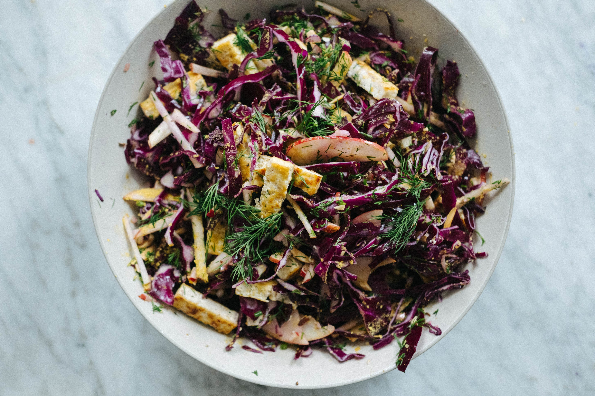

---
tags:
  - dish:main
  - protein:tofu
  - ingredient:cabbage
  - ingredient:apple
---
<!-- Tags can have colon, but no space around it -->

# Cabbage, apple and tofu salad with sweet caraway dressing

<!-- Serves has to be a single number, no dashes, but text is allowed after the
number (e.g., 24 cookies) -->
- Serves: 4
{ #serves }
<!-- Time is not parsed, so anything can be input here, and additional
values can be added (e.g., "active time", "cooking time", etc) -->
- Time: 
- Date added: 2024-01-24

## Description

In deep winter, my body craves salad that is hearty but fresh, with plenty of crunch. I crave heavily scented herbs like dill and I turn to bold spices like caraway to add earthiness.

With the cabbage in my fridge, I made this crisp salad with hints of anise. I added apple for tart sweetness, tofu for bulk, toasted almonds for crunch, and finished it with nutritional yeast for an unexpected hum of umami. The nutritional yeast is optional and you can substitute with any number of savoury, cheesy options - grated Parmesan or pecorino would work, while crumbled feta would add a nice salty creaminess. This is also a perfect prep ahead dish - I ate it over several days and the cabbage maintained its robust crunch.

The caraway brings in warm anise / licorice notes with hints of citrus. I also love adding seeds to dressings for a slight crunch. The texture is fun. If you don’t have caraway, you could substitute with fennel seeds.

## Ingredients { #ingredients }

<!-- Decimals are allowed, fractions are not. For ranges, use only a single dash
and no spaces between the numbers. -->

### Sweet caraway dressing
- 1 small shallot, finely chopped
- 1 clove garlic, grated
- 1 teaspoon caraway seeds (or sub with fennel seeds)
- 2 teaspoons grain or dijon mustard
- 2 tablespoons apple cider vinegar
- 4 tablespoons extra virgin olive oil
- 2 tablespoons maple syrup or honey
- .5 teaspoon sea salt
- Black pepper

### Salad
- extra virgin olive oil
- 450g - 500g (about 1 pound) extra firm tofu, sliced into 1.25 (1/2-inch) pieces
- sea salt and black pepper
- .5 small purple or green cabbage (about 600g or 1.33 pounds), halved and finely sliced
- 1 apple, core removed and cut into matchsticks
- 50g (.33 cup) toasted almonds 
- Large handful dill, chopped
- 2 tablespoons nutritional yeast or grated cheese such as parmesan or pecorino(optional)

## Directions

<!-- If you have a direction that refers to a number of some ingredient, wrap
the number in asterisks and add `{.ingredient-num}` afterwards. For example,
write `Add 2 Tbsp oil to pan` as `Add *2*{.ingredient-num} to pan`. This allows
us to properly change the number when changing the serves value. -->

1. To make the dressing: place the shallot, garlic, caraway seeds, mustard, apple cider vinegar, olive oil, maple syrup or honey, sea salt and a few turns of black pepper into a large bowl (large enough to fit the cabbage and apple) and whisk to combine. Set aside for 10 minutes while you prep the tofu (this time will soften the bite of the shallot and garlic and allow the flavors to meld). 
2. Meanwhile, heat a large skillet on medium high heat. When hot, drizzle with olive oil and add the tofu slices. Drizzle the top with olive oil, season with sea salt and black pepper, and panfry until the bottom is golden, about 2-3 minutes. Flip them over and panfry the other side. Set aside to cool, and then slice into 1.25 (1/2-inch) strips.
3. To the dressing, add the cabbage and apple and toss until well coated. Add the tofu, almonds, dill and nutritional yeast or grated cheese, if using, and toss again to combine. Taste and season with salt and pepper. The salad should be sweet and savoury.

## Source

[To Vegatables, with Love](https://tovegetableswithlove.substack.com/p/cabbage-apple-and-tofu-salad-with)

## Comments
