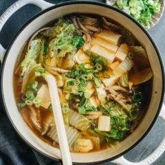

---
tags:
  - dish:soup
  - protein:tofu
  - ingredient:cabbage
  - cuisine:chinese
  - difficulty:easy
---
<!-- Tags can have colon, but no space around it -->

# Napa Cabbage Tofu Soup (白菜豆腐汤)

<!-- Serves has to be a single number, no dashes, but text is allowed after the
number (e.g., 24 cookies) -->
- Serves: 4
{ #serves }
<!-- Time is not parsed, so anything can be input here, and additional
values can be added (e.g., "active time", "cooking time", etc) -->
- Time: 20 min
- Date added: 2025-11-29

## Description
A super fast and easy napa cabbage tofu soup with mushrooms simmered in chicken broth for a comforting and hearty taste. It is a great side dish to add to your dinner table for extra color and nutrition. 

## Ingredients { #ingredients }

<!-- Decimals are allowed, fractions are not. For ranges, use only a single dash
and no spaces between the numbers. -->
- 4 cups chicken broth
- 4 slices ginger
- 2 green onions , sliced
- 2 cloves garlic , smashed
- 2 teaspoons light soy sauce
- 8 napa cabbage leaves , sliced to bite-size pieces (yield 8 cups after cutting)
- 5 oz mushrooms of your choice , sliced to bite-size pieces (Optional) 
- 1/2 block soft tofu , sliced to bite-size pieces 
- 1/2 teaspoon chicken bouillon powder (or salt to taste)
- 1/4 teaspoon white pepper
- 1 teaspoon sesame oil

## Directions

<!-- If you have a direction that refers to a number of some ingredient, wrap
the number in asterisks and add `{.ingredient-num}` afterwards. For example,
write `Add 2 Tbsp oil to pan` as `Add *2*{.ingredient-num} to pan`. This allows
us to properly change the number when changing the serves value. -->
1. Heat the chicken broth in a medium-size pot over medium-high heat. Add the ginger, green onion, garlic and light soy sauce.
2. When the broth starts to boil, add the white part of the napa cabbage and mushrooms (if using enoki mushrooms, add them later). Cook for 4 minutes, until the white part of the cabbage starts to soften.
3. Add the green part of the napa cabbage and tofu and continue cooking for another 2 to 3 minutes. If you are using enoki mushrooms, add them now.
4. Add the chicken bouillon powder (or salt), white pepper, and drizzle with sesame oil. Adjust seasoning by adding more salt if needed. Serve hot.

## Notes

<!-- Delete section if no additional notes -->

1. Many types of mushrooms work well in this soup. My favorites include oyster mushrooms, golden needle mushrooms (enoki), beech mushrooms (shimeji mushrooms) and regular white or brown mushrooms.
2. You can use firm or medium tofu as well. If using these types of tofu, add them during step 2, at the same time you add the napa cabbage whites.

## Source

[Omnivore's cookbook](https://omnivorescookbook.com/napa-cabbage-tofu-soup/)

## Comments
