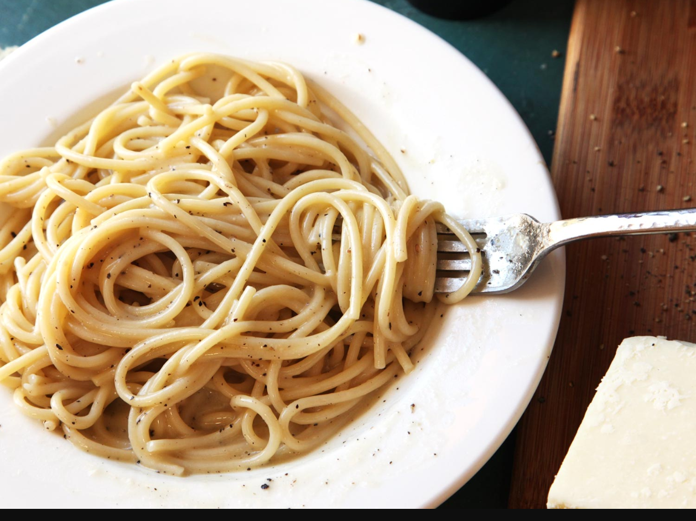

---
tags:
  - ingredient:pasta
  - difficulty:easy
  - cuisine:italian
---
# Cacio e pepe

- Serves: 2
{ #serves }
- Time: 15 minutes
- Date added: 2023-08-26

## Ingredients { #ingredients }

- 4 tablespoons (60ml) extra-virgin olive oil, divided
- Coarsely ground black pepper
- Kosher salt
- .5 pound (225g) spaghetti
- 2 tablespoons (30g) unsalted butter
- 2 ounces Pecorino Romano cheese (about 1 cup; 55g), very finely grated on a Microplane or the smallest holes of a box grater, plus more for serving

## Directions

1. Heat 3 tablespoons olive oil and about a teaspoon of black pepper in a medium skillet over medium-low heat until ingredients are fragrant and pepper is barely starting to sizzle, about 1 minute. Set aside.
2. Place spaghetti in a large skillet and cover with water. Season with a small pinch of salt, then bring to a boil over high heat, prodding spaghetti occasionally with a fork or wooden spoon to prevent it from clumping. Cook until spaghetti is al dente (typically about 1 minute less than the package recommends). Transfer 2 to 3 tablespoons of pasta cooking water to the skillet with the olive oil/pepper mixture. Stir in butter. Using tongs, lift spaghetti and transfer it to the oil/butter mixture.
3. Add cheese and remaining tablespoon olive oil to the skillet and stir with a fork until cheese is completely melted. Add a few more tablespoons of pasta water to the skillet to adjust consistency, reheating as necessary until the sauce is creamy and coats each strand of spaghetti. Season to taste with salt and more black pepper. Serve immediately, passing extra grated cheese and black pepper at the table.

## Source

[Serious Eats](https://www.seriouseats.com/recipes/2016/02/spaghetti-cacio-e-pepe-recipe.html)

## Comments

- Bill Broderick, Sept 7, 2020: According to [this article](https://www.seriouseats.com/2020/04/best-way-grate-cheese.html), you should use the finest holes on a box grater (rather than a Microplane) to make the emulsification as easy as possible
