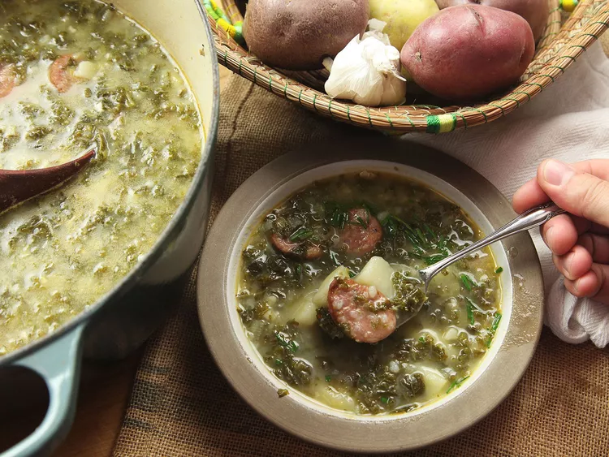

---
tags:
  - dish:main
  - protein:sausage
  - ingredient:sausage
  - ingredient:potato
  - ingredient:kale
  - cuisine:portuguese
  - difficulty:easy
---
<!-- Tags can have colon, but no space around it -->

# Caldo Verde

<!-- Serves has to be a single number, no dashes, but text is allowed after the
number (e.g., 24 cookies) -->
- Serves: 6 
{ #serves }
<!-- Time is not parsed, so anything can be input here, and additional
values can be added (e.g., "active time", "cooking time", etc) -->
- Time: 45 min
- Date added: 2024-02-11

## Description

Caldo verde, a potato and kale soup from northern Portugal, is one of those dishes that seem custom-made for lazy rainy days, when you want something hearty and comforting but don't feel like putting in a ton of effort. It's made with a few cheap and simple ingredients, it takes all of maybe 10 minutes of prep work, and it's ready to eat just half an hour later. Oh, and it's all made in a single pot, too. And did I mention delicious? It's delicious. 

### Why It Works

- Russet potatoes give the soup a thick, creamy texture, while Yukon Golds hold their shape to give you nice chunks.
- Finely chopped or shredded kale tenderizes rapidly and gives the soup a nice green color.

## Ingredients { #ingredients }

<!-- Decimals are allowed, fractions are not. For ranges, use only a single dash
and no spaces between the numbers. -->

- 2 tablespoons (30g) unsalted butter
- 1 medium yellow onion or large leek, finely diced (about 8 ounces; 225g)
- 3 medium cloves garlic, sliced (about 1 tablespoon; 15g)
- Kosher salt and freshly ground black pepper
- About 6 tablespoons (90ml) extra-virgin olive oil
- 1 large russet potato, peeled, quartered, and cut into 1/4-inch slices (about .5 pound; 225g)
- 2 medium Yukon Gold potatoes, peeled, quartered, and cut into 1/4-inch slices (about .5 pound; 225g)
- 6 cups (1.4L) homemade or store-bought low-sodium chicken stock (see note)
- 1 bunch curly or lacinato kale, tough stems removed, leaves finely chopped (about 3/4 pound; 340g)
- 12 ounces (340g) cooked linguiça or other garlicky pork sausage, cut into 1/4- to 1/2-inch slices (see note)
- Minced fresh chives, for garnish (optional)

## Directions

<!-- If you have a direction that refers to a number of some ingredient, wrap
the number in asterisks and add `{.ingredient-num}` afterwards. For example,
write `Add 2 Tbsp oil to pan` as `Add *2*{.ingredient-num} to pan`. This allows
us to properly change the number when changing the serves value. -->

1. Heat butter in a large Dutch oven or saucepan over medium heat until melted. Add onion (or leek) and garlic, season with salt and pepper, and cook, stirring frequently, until softened but not browned, about 5 minutes, adding olive oil as necessary to keep the mixture loose and moist.
2. Add potatoes and stock and bring to a simmer, stirring occasionally. Add kale and continue to cook until russet potato slices have completely broken down (you can press them with a spoon or potato masher for an even thicker texture), the Yukon Golds are tender, the greens have softened, and the soup has thickened to a creamy consistency, 25 to 30 minutes. Stir in sausage. Season soup to taste with salt and pepper and serve garnished with chives, if desired. 

## Source

[Serious Eats](https://www.seriouseats.com/caldo-verde-portuguese-potato-kale-soup-recipe)

## Comments

- 2024-02-12: Made this with beef sujuk and it worked really well.
