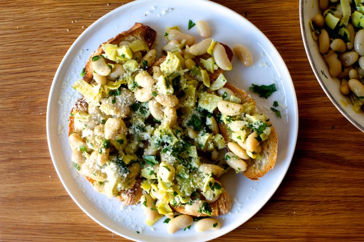

---
tags:
  - dish:main
  - protein:beans
  - difficulty:easy
---
<!-- Tags can have colon, but no space around it -->

# cannellini aglio e olio

<!-- Serves has to be a single number, no dashes, but text is allowed after the
number (e.g., 24 cookies) -->
- Serves: 2
{ #serves }
<!-- Time is not parsed, so anything can be input here, and additional
values can be added (e.g., "active time", "cooking time", etc) -->
- Time: 10 min
- Date added: 2026-04-08

## Description
Not hungry for anything in the fridge, I rummaged a can of beans from the cabinet and decided to pretend they were spaghetti, cooking them aglio e olio-style, i.e. in garlic and oil. Unquestionably simplest classic pasta preparation, aglio e olio hails not from New York (insert your best “all-ul” or Beastie Boys reference here) but Naples. Sliced or minced garlic is lightly sauteed in olive oil, often with dried red chili flakes (technically making it spaghetti aglio, olio e peperoncino), and finely chopped parsley and grated parmesan and pecorino are often added as garnishes, although cheese is verboten in some traditional recipes.

None of this matters on a Monday afternoon, however, when I added all of the above and then chopped artichoke hearts, one can over in the cabinet. The result was a warm, almost creamy bean salad that you can eat with a fork straight from the skillet a bowl, or ladle over a couple slices of baguette, toasted hard. It was so good, I did the only rational thing and ate it for lunch again today.

## Ingredients { #ingredients }

<!-- Decimals are allowed, fractions are not. For ranges, use only a single dash
and no spaces between the numbers. -->
- 3 tablespoons olive oil
- 4 garlic cloves, peeled and thinly sliced
- Salt and red pepper flakes
- 1 15-ounce can cannellini beans, drained and rinsed (about 1 3/4 cups)
- Half a 14-ounce can artichoke hearts, drained, chopped
- .25 cup chopped flat-leaf parsley
- Grated parmesan or pecorino romano

## Directions

<!-- If you have a direction that refers to a number of some ingredient, wrap
the number in asterisks and add `{.ingredient-num}` afterwards. For example,
write `Add 2 Tbsp oil to pan` as `Add *2*{.ingredient-num} to pan`. This allows
us to properly change the number when changing the serves value. -->
Heat oil, garlic, and a pinch or two of pepper flakes over medium-low in a medium skillet. Let cook for 3 to 5 minutes, until garlic is just barely golden at the edges. Add drained cannelini beans and stir to combine. Add salt, to taste. Cook beans in garlic oil for 3 to 4 minutes, adding a tablespoon of water if it looks dry. Stir in artichoke hearts and cook, stirring, for 1 minute, just to warm. Taste for seasoning and add more salt and/or pepper, if needed. Stir in parsley. Eat as-is, ladled over firm slices of toast, and/or finished with parmesan or pecorino cheese.

## Source

[smitten kitchen](https://smittenkitchen.com/2019/04/cannellini-aglio-e-olio/)

## Comments

- 2026-04-08: I made it with the full 14-oz can and that also worked.
