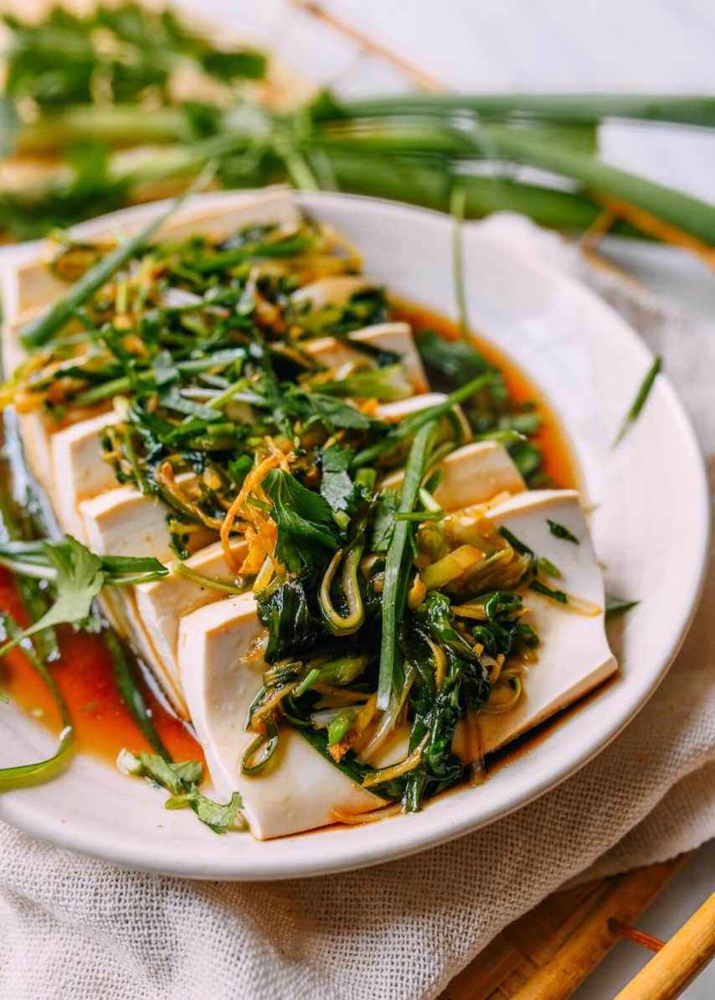

---
tags:
  - dish:main
  - protein:tofu
  - cuisine:chinese
  - difficulty:easy
---
# Cantonese-style steamed tofu

- Serves: 2
{ #serves }
- Prep Time: 10 minutes
- Cook Time: 15 minutes
- Total Time: 25 minutes
- Date added: 2023-08-26

## Ingredients { #ingredients }

- 1 pound silken tofu
- .125 teaspoon salt (a pinch)
- 2 tablespoons vegetable oil
- 2 tablespoons ginger (julienned)
- 2-3 scallions (cut into 3-inch lengths and julienned, white and green parts separated)
- .25 cup cilantro (chopped; or to taste)
- 2 tablespoons light soy sauce (or seasoned soy sauce)
- .25 teaspoon sugar
- 2 tablespoons water
- .25 teaspoon white pepper (or to taste; finely ground powder is ideal, rather than coarsely ground)

## Directions

1. Prepare your silken tofu by cutting it in half lengthwise and then slicing it crosswise into .5-inch slices. Use your knife or cleaver to transfer each half of the cut tofu to a large heatproof rimmed plate or shallow bowl. The dish should be deep enough to hold the steaming liquid and sauce.
2. Lay the tofu on the plate so the pieces are fanned out evenly, with as much tofu surface area exposed as possible. Sprinkle the salt evenly over the tofu.
3. Next, steam the tofu. Add 4 cups of cold water to a wok, place the tofu on a steaming rack inside, and cover the wok.
4. Turn on the heat to medium-high. The water should boil in about 7 minutes. After it has begun boiling, continue to steam for another 3 minutes––a total of 10 minutes.
5. Meanwhile, make the sauce. Heat a wok or small saucepan over medium high heat, and add the oil. Add the ginger, and fry for 1 minute. Add the white parts of the scallions and cook for 30 seconds. Then add the rest of the scallions and cilantro. The mixture should be sizzling.
6. Add the soy sauce, sugar, and water. Bring to a bubble, and cook until the scallions and cilantro are just wilted, about 30 seconds.
7. When the tofu is done, turn the heat off, and carefully pour off the liquid that has pooled at the bottom of the plate. Sprinkle the tofu evenly with the white pepper, and then pour the sauce over the top. Serve immediately!

## Source

[Woks of Life](https://thewoksoflife.com/steamed-tofu-cantonese-style)

## Comments
