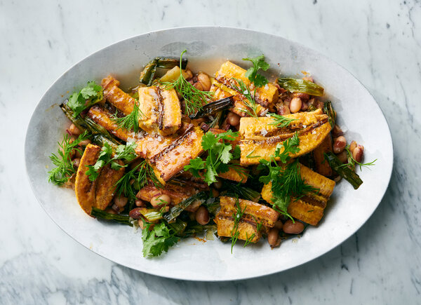

---
tags:
  - dish:sides
  - protein:beans
  - ingredient:plantain
---
# Caramelized plantains with beans

- Serves: 4
{ #serves }
- Time: 1 hour
- Date added: 2023-08-26

## Description

Bright and earthy flavors complement each another in this easy dish in which cooked beans are tossed with lemon zest, olive oil and cayenne, and roasted sweet plantains are coated in a brown sugar, ginger and lemon glaze. Go with ripe plantains for this recipe, yellow and spotted with large black dots. You’ll need your oven's broiler setting to help caramelize the sugary coating on the plantains, and to char the scallion garnish. This dish is the perfect breakfast topped with a jammy egg, a quick lunch over a bed of fresh greens, or a satisfying side to roast chicken.

## Ingredients { #ingredients }

- 2.25 pounds ripe plantains (about 4 medium), yellow and spotted with large black dots
- 6 tablespoons olive oil, plus more for drizzling
- 2 tablespoons dark brown sugar
- 1 tablespoon grated fresh ginger
- 1 lemon, zested and juiced, plus more as needed
- 1.75 cups or 1 (15-ounce) can drained cooked beans, such as navy, cannellini, black-eyed peas or butter beans
- .25 cup minced red onion
- .5 teaspoon ground cayenne
- 2 bunches scallions (about 10 to 12 scallions), trimmed
- Kosher salt
- .25 cup fresh dill fronds
- .25 cup fresh cilantro, leaves and tender stems

## Preparation

1. Heat the oven to 350 degrees. Leaving the plantain skin on, cut each plantain in half, lengthwise down the middle. Place the plantains cut-side up on a baking sheet. Drizzle with 1 tablespoon olive oil and bake until tender, and a skewer or knife inserted goes all the way through, about 40 minutes. Remove the plantains and set the broiler to high with a rack 6 to 8 inches from the heat source.
2. While the plantains are baking, in a small bowl, combine the brown sugar, ginger and 2 tablespoons of lemon juice. Whisk to dissolve the brown sugar, then stir in 2 tablespoons of olive oil.
3. In a large bowl, combine the beans, minced onion and cayenne with 2 tablespoons olive oil, 2 tablespoons lemon juice and 1 tablespoon lemon zest. Toss and set aside.
4. Once cool enough to handle, about 5 minutes, remove the plantain skins and discard. Break each plantain into pieces, about 2 to 3 inches long, and place back on the baking sheet. Drizzle the plantains with the brown sugar mixture and toss to coat. Move the plantains to one side of the baking sheet. Lay the trimmed scallions on the empty side of the sheet and drizzle with the remaining 1 tablespoon of olive oil. Rub the oil into the scallions to coat evenly. Season the entire sheet with salt.
5. Broil the plantains and scallions until the glaze is set and deeply caramelized in spots, and the scallions are charred along the length of each, about 5 to 12 minutes, rotating halfway through. If the plantains are at risk of burning, pull the plantains from the oven before the scallions have finished.
6. Move the scallions to a board, chop and add to the bowl with the beans. Season the beans with salt, toss to combine and transfer to a serving platter.
7. Top the beans with the glazed plantains. Garnish with fresh dill, cilantro and a drizzle of olive oil. Serve over a bed of greens, as a vegetarian side, or topped with a jammy egg.

## Source

[NYTimes](https://cooking.nytimes.com/recipes/1021805-caramelized-plantains-with-beans-scallions-and-lemon)

## Comments

