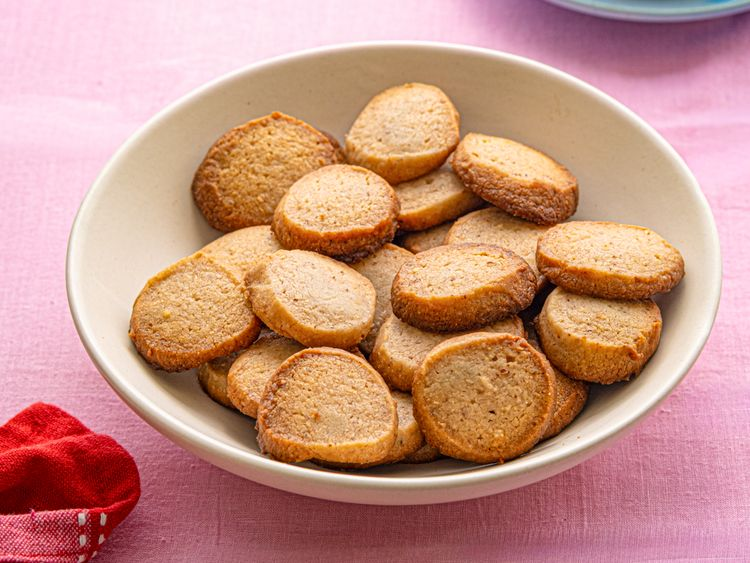

---
tags:
  - dish:dessert
  - ingredient:cardamom
  - ingredient:almond flour
---
<!-- Tags can have colon, but no space around it -->

# Cardamom rose shortbread

<!-- Serves has to be a single number, no dashes, but text is allowed after the
number (e.g., 24 cookies) -->
- Serves: 48 cookies
{ #serves }
<!-- Time is not parsed, so anything can be input here, and additional
values can be added (e.g., "active time", "cooking time", etc) -->
- Time: 35 min + chilling time
- Date added: 2026-02-18

## Description
These rose- and cardamom-scented shortbread cookies are fragrant and gently floral, with a tender, buttery crumb and restrained sweetness. A small amount of rose syrup gives the cookies their pale pink color, while rosewater and freshly ground cardamom add aroma and depth without overpowering the shortbread's richness. 

### Why It Works

- Using a combination of all-purpose flour and almond flour produces a tender crumb while maintaining enough structure for the cookies to slice cleanly and hold their shape once baked.
- Using powdered sugar instead of granulated sugar helps the dough come together smoothly and creates a fine, delicate crumb.
- Chilling the dough logs before slicing allows the butter to firm up, ensuring clean cuts and preventing the cookies from spreading excessively as they bake.

## Ingredients { #ingredients }

<!-- Decimals are allowed, fractions are not. For ranges, use only a single dash
and no spaces between the numbers. -->

- 255 g all-purpose flour (9 ounces; 2 cups)
- 2 ounces almond flour (57 g; about 1/2 cup, plus 1 tablespoon)
- 2 teaspoons freshly ground cardamom seeds (see notes)
- 1 teaspoon baking powder
- .5 teaspoon Diamond Crystal kosher salt; for table salt, use half as much by volume
- 227 g unsalted butter (8 ounces; 2 cups), softened
- 85 g powdered sugar (3 ounces; 3/4 cup)
- 1 tablespoon (15 ml) rose syrup (see notes)
- 2 teaspoons (10 ml) rosewater (see notes)

## Directions

<!-- If you have a direction that refers to a number of some ingredient, wrap
the number in asterisks and add `{.ingredient-num}` afterwards. For example,
write `Add 2 Tbsp oil to pan` as `Add *2*{.ingredient-num} to pan`. This allows
us to properly change the number when changing the serves value. -->

1. In a medium bowl, whisk all-purpose flour, almond flour, cardamom, baking powder, and salt. Set aside.
2. In the bowl of a stand mixer fitted with a paddle attachment, mix butter and powdered sugar on low speed until combined, then increase speed to medium and beat until light and fluffy, 30 to 60 seconds.
3. Reduce speed to low, add reserved flour mixture, rose syrup, and rosewater, and mix just until a soft, cohesive dough forms and no dry flour remains, 30 to 60 seconds. Stop mixer and scrape down bowl and paddle with a flexible spatula to ensure dough is evenly mixed.
4. Divide dough into four equal portions. Working with one portion at a time, transfer dough to a sheet of parchment paper and shape into a rough log about 12 inches long. Fold parchment over dough, then use a bench scraper to tuck parchment under the dough while gently pulling on the top sheet of parchment to tighten the log. Move the bench scraper down a few inches and repeat, tightening until the log is smooth and evenly shaped. Roll dough so it is fully wrapped in parchment and trim away excess parchment. Repeat with remaining dough portions.
5. Refrigerate logs until firm and well chilled, at least 2 hours and up to 1 week.
6. When ready to bake, adjust oven rack to middle position and preheat oven to 350°F (175°C). Line two rimmed baking sheets with parchment paper. Remove two dough logs from the refrigerator and let sit at room temperature until slightly softened, about 10 minutes.
7. Using a sharp chef's knife, slice logs into rounds just shy of 1/2-inch thick. Arrange cookies on prepared baking sheets, spacing them about 1/2 inch apart.
8. Bake until cookies are set and lightly golden at the edges and bottoms, 14 to 16 minutes, rotating pans back to front and top to bottom halfway through baking. Transfer baking sheets to wire racks to cool, about 10 minutes. Transfer cookies to wire racks to cool completely. Once baking sheets have fully cooled, repeat with remaining dough logs, if desired. (Alternatively, the remaining logs can be refrigerated or frozen for later use; see notes.)

### Variation: Cut-Out Cookies

If you prefer cut-out cookies, prepare recipe through step 3, then divide dough into four equal portions and wrap each tightly in parchment paper. Refrigerate until firm, at least 2 hours. Working with one portion at a time, let dough sit at room temperature until pliable, about 10 minutes, then roll between two sheets of parchment paper to about 1/4-inch thickness. Cut dough with 1- to 2-inch cookie cutters and transfer to parchment-lined rimmed baking sheets, spacing cookies about 1 inch apart.

Bake at 350°F (175°C) until cookies are set and just beginning to turn lightly golden at the edges and bottoms, 10 to 12 minutes, rotating baking sheets back to front and top to bottom halfway through baking. Transfer baking sheets to wire racks to cool, about 10 minutes. Transfer cookies to wire racks to cool completely. Allow baking sheets to cool fully before baking additional batches, lining with fresh parchment as needed. Gather scraps, reroll once, cut and bake as directed, discarding any remaining scraps. 

## Notes

<!-- Delete section if no additional notes -->
- For the most aromatic cookies, grind cardamom seeds in a mortar and pestle or spice grinder just before using. A good-quality pre-ground cardamom will work, but will be less fragrant.
- Rose syrups such as Rooh Afza or Calvert's are available at Indian grocery stores and can be ordered online.
- Rose water is available at Indian, Middle Eastern, and Armenian grocery stores, and can also be ordered online. 

## Source

[Serious Eats](https://www.seriouseats.com/cardamom-rosewater-shortbread-recipe-11903707)

## Comments

- 2026-02-18: made this without the rose syrup, but otherwise as written. wasn't very rosey, maybe add more rosewater to make up for it?
