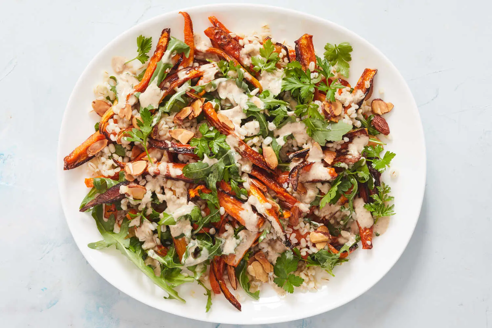

---
tags:
  - dish:main
  - ingredient:carrot
  - ingredient:barley
  - difficulty:easy
---
<!-- Tags can have colon, but no space around it -->

# Warm Roasted Carrot and Barley Salad

<!-- Serves has to be a single number, no dashes, but text is allowed after the
number (e.g., 24 cookies) -->
- Serves: 4
{ #serves }
<!-- Time is not parsed, so anything can be input here, and additional
values can be added (e.g., "active time", "cooking time", etc) -->
- Time: 35 min
- Date added: 2025-05-07

## Description

There is something very exciting about transforming a simple bunch of carrots into a deeply flavorful and satisfying weeknight meal. Carrots are given a lot of love here: Leaving the skin on adds texture, slicing them into thin batons ensures that they cook quickly and evenly, and drizzling them with honey right out of the oven amplifies their natural sweetness. A sprinkle of lemon zest adds brightness. Ras el hanout, a North African spice blend, means “head of the shop” in Arabic as it was often one of the best mixes a vendor had to offer. Its fragrant blend of coriander, cumin, ginger, clove and turmeric brings warmth and richness to the tahini. The perfect chew of pearl barley is so gratifying in this dish, but for even more flavor, cook your barley in stock.

## Ingredients { #ingredients }

<!-- Decimals are allowed, fractions are not. For ranges, use only a single dash
and no spaces between the numbers. -->
- 1 cup pearled barley
- Kosher salt and black pepper
- 2 pounds carrots, washed, trimmed and cut into 3-inch-long, a scant ½-inch-wide batons
- 2 tablespoons extra-virgin olive oil
- 2 teaspoons runny honey, such as clover honey
- .5 teaspoon fresh lemon zest (from ½ lemon)
- 2 cups arugula
- A handful of parsley
- .25 cup toasted sliced almonds

### For the Spiced Tahini

- .25 tahini
- 1 tablespoon fresh lemon juice (from ½ lemon)
- 1 teaspoon ras el hanout
- 1 small garlic clove, grated

## Directions

<!-- If you have a direction that refers to a number of some ingredient, wrap
the number in asterisks and add `{.ingredient-num}` afterwards. For example,
write `Add 2 Tbsp oil to pan` as `Add *2*{.ingredient-num} to pan`. This allows
us to properly change the number when changing the serves value. -->
1. Heat oven to 425 degrees and place a rack on the lowest shelf. In a medium saucepan, combine barley with 4 cups water; season with ½ teaspoon salt. Bring to a boil over medium-high heat. Reduce heat to low and simmer until tender, about 20 to 25 minutes. If the barley hasn’t absorbed all of the water, drain off the excess.
2. Meanwhile, place the carrots on a sheet pan, drizzle with the olive oil and toss to coat, spreading into an even layer. Season with salt and pepper. Place on the bottom oven rack and roast until tender and starting to turn golden, about 15 minutes. Remove from the oven, toss and return to the oven for 5 to 7 minutes until completely tender.
3. While the carrots roast, make the dressing: In a medium bowl, whisk together the tahini, lemon juice, ras el hanout, garlic and ½ teaspoon salt. Add 3 to 4 tablespoons water, 1 tablespoon at a time, until it is smooth and has a pourable consistency.
4. When the carrots are ready, remove them from the oven, drizzle with honey and sprinkle with lemon zest. Season with a pinch of salt and toss to coat.
5. In a serving bowl, combine the carrots with the barley, arugula and parsley. Drizzle with the spiced tahini and sprinkle with almonds.

## Source

[NYTimes](https://cooking.nytimes.com/recipes/1022122-warm-roasted-carrot-and-barley-salad)

## Comments

- 2025-05-07: replaced the honey with maple syrup and the ras al hanout with garam masala. roasted the carrots ahead of time and served at room temperature (barley was freshly cooked, but ran under cold water to cool it).
