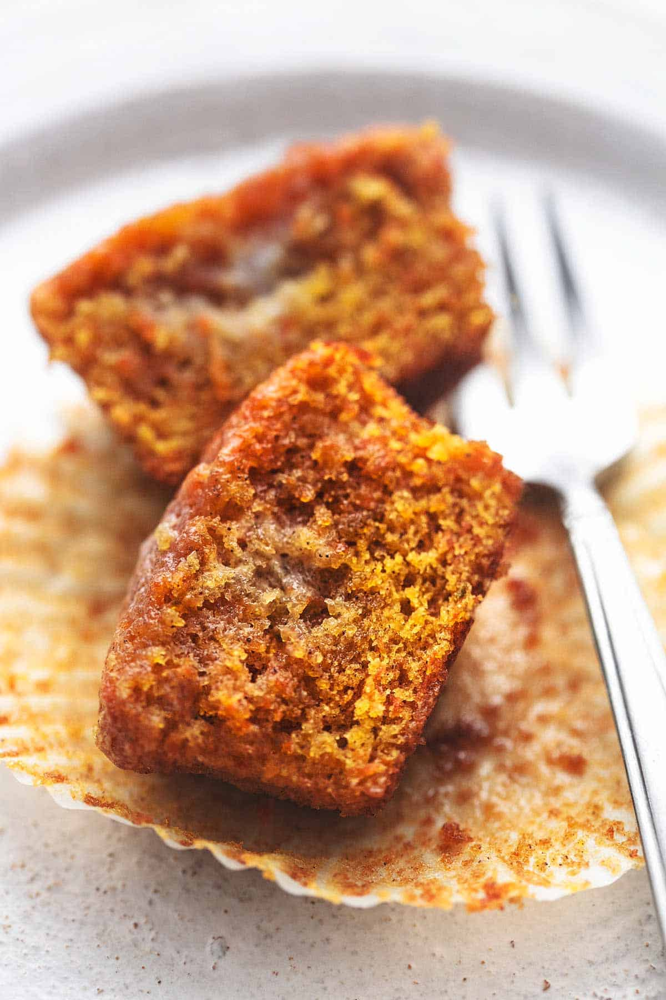

---
tags:
  - dish:baking
  - ingredient:carrot
---
<!-- Tags can have colon, but no space around it -->

# Carrot Cake Muffins

<!-- Serves has to be a single number, no dashes, but text is allowed after the
number (e.g., 24 cookies) -->
- Serves: 14 muffins
{ #serves }
<!-- Time is not parsed, so anything can be input here, and additional
values can be added (e.g., "active time", "cooking time", etc) -->
- Time: 35 min
- Date added: 2024-05-21

## Description

Carrot Cake Muffins have all the flavors of carrot cake that you love, but in muffin size. Sweet, ultra-moist, with a hint of cinnamon and perfectly fluffy texture. Great for breakfast, snack time, or grab-and-go meals on the fly! 

## Ingredients { #ingredients }

<!-- Decimals are allowed, fractions are not. For ranges, use only a single dash
and no spaces between the numbers. -->
- 1.5 cups flour
- 1 cup sugar
- .5 - 1 teaspoon cinnamon
- .5 teaspoon baking soda
- .5 teaspoon baking powder
- .5 teaspoon salt
- .5 cup vegetable oil
- .33 brown sugar
- 2 large eggs - at room temperature
- 2 teaspoons vanilla extract
- 2 cups finely grated carrots - not pre-shredded carrots, they should be freshly grated (biggest holes on box grater are fine)

## Directions

<!-- If you have a direction that refers to a number of some ingredient, wrap
the number in asterisks and add `{.ingredient-num}` afterwards. For example,
write `Add 2 Tbsp oil to pan` as `Add *2*{.ingredient-num} to pan`. This allows
us to properly change the number when changing the serves value. -->
1. Preheat oven to 350 degrees and line a muffin tin with paper or silicone cupcake liners (or grease well with cooking spray).
2. In a medium bowl whisk together flour, sugar, cinnamon, baking soda, baking powder, and salt.
3. In a large bowl combine oil, brown sugar, eggs, and vanilla and mix well. Stir in grated carrots.
4. Stir dry ingredients into wet ingredients until completely incorporated.
5. Fill muffin liners 2/3 full.
6. Bake in preheated oven for 20-22 minutes until a toothpick inserted in the center of the muffins comes out clean. Cool for 5 minutes before transferring to a cooling rack to continue cooling.
7. Serve fresh or store in airtight container at room temperature up to 3 days, or in the fridge up to 2 weeks. Optional: reheat them in the microwave for about 15 seconds and spread a little butter on top for the ultimate breakfast treat. 

## Source

[Creme de la Crumb](https://www.lecremedelacrumb.com/carrot-cake-muffins/)

## Comments

- 2024-05-21: these were really good! I'd use more cinnamon and maybe add some other baking spices.
