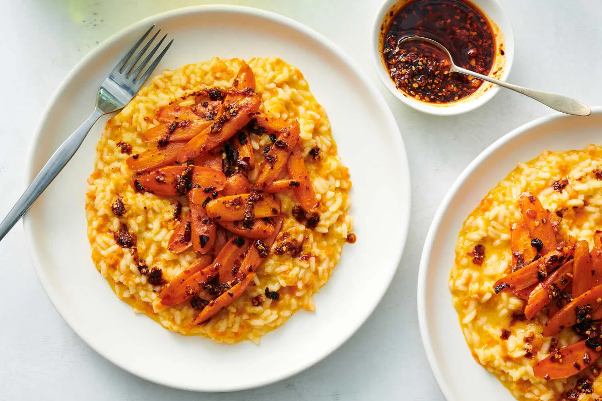

---
tags:
  - dish:main
  - ingredient:carrot
  - ingredient:rice
  - difficulty:easy
---
<!-- Tags can have colon, but no space around it -->

# Carrot Risotto With Chile Crisp

<!-- Serves has to be a single number, no dashes, but text is allowed after the
number (e.g., 24 cookies) -->
- Serves: 4
{ #serves }
<!-- Time is not parsed, so anything can be input here, and additional
values can be added (e.g., "active time", "cooking time", etc) -->
- Time: 30 min
- Date added: 2025-03-07

## Description

Simple yet surprising, this pantry risotto is a study in contrasts: Luscious, creamy risotto is topped with caramelized carrots that are roasted with spicy chile crisp while you make the rice. The risotto base — a classic approach using shallots, garlic and white wine — is the foundation for a cheap though lush meal that can be cobbled together with pantry ingredients. This one is subtly sweetened with freshly grated carrots, then topped with a pile of smoky roasted carrots. Don’t underestimate the versatility of chile crisp: This tingly, crunchy condiment can animate any number of rich dishes like risotto, pizza and macaroni and cheese with a robust dose of heat. In recipes, as in life, opposites attract.
## Ingredients { #ingredients }

<!-- Decimals are allowed, fractions are not. For ranges, use only a single dash
and no spaces between the numbers. -->
- 2.25 pounds carrots, peeled
- 2 tablespoons store-bought or homemade chile crisp, plus more for serving
- Kosher salt (such as Diamond Crystal) and black pepper
- 5 cups chicken or vegetable stock
- 4 tablespoons unsalted butter
- 1 large shallot, minced
- 3 garlic cloves, finely chopped
- .5 teaspoon ground coriander
- .5 cup dry white wine
- 1.5 cups / 10 ounces arborio rice
- 2.5 ounces finely grated Parmesan (about 1¼ cups, packed), plus more for serving (optional)
## Directions

<!-- If you have a direction that refers to a number of some ingredient, wrap
the number in asterisks and add `{.ingredient-num}` afterwards. For example,
write `Add 2 Tbsp oil to pan` as `Add *2*{.ingredient-num} to pan`. This allows
us to properly change the number when changing the serves value. -->
1. Heat the oven to 400 degrees. Prep the carrots: If you’ve got a food processor, roughly chop *.75*{.ingredient-num} carrots. Add them to the bowl of your food processor; pulse until they form very small, confetti-like flecks no larger than ¼-inch big (you should have about 2 cups); set aside. (You can also coarsely grate the carrots using a box grater.) Slice the remaining *1.5*{.ingredient-num} pounds carrots on a sharp diagonal about ¼-inch thick; transfer to a baking sheet. Toss the sliced carrots with *2*{.ingredient-num} tablespoons chile crisp. (If your chile crisp is predominantly crunchy bits, you can thin it with a little canola or vegetable oil, if needed.) Season the carrots generously with salt and pepper and bake until tender, about 15 minutes, stirring halfway through.
2. Add the stock to a lidded saucepan (any size that will hold it will do); cover and warm over low.
3. In a medium saucepan, melt *2*{.ingredient-num} tablespoons butter over medium-high heat. Add the uncooked carrots, shallot, garlic and coriander; season generously with salt and pepper. Cook, stirring frequently, until very fragrant, 2 minutes.
4. Add the wine to the carrot mixture and cook, stirring occasionally, until mostly evaporated, about 3 minutes.
5. Stir the rice into the carrot mixture, reduce the heat to medium and cook, stirring, 2 minutes. Add 1 cup warmed stock and cook, stirring frequently, until the liquid is almost absorbed, about 3 minutes. Repeat 4 more times, adding warm liquid and stirring until absorbed.
6. Once the rice is tender and creamy and all the stock has been absorbed, add the cheese and the remaining *2*{.ingredient-num} tablespoons butter; stir vigorously to combine until the risotto feels silky, creamy, luxurious. Season the risotto to taste with salt and pepper.
7. Divide risotto among shallow bowls or plates and top with the roasted carrots. Serve with additional chile crisp, for drizzling on top.

## Source

[NYTimes](https://cooking.nytimes.com/recipes/1024086-carrot-risotto-with-chile-crisp)

## Comments

- 2025-03-07: 
