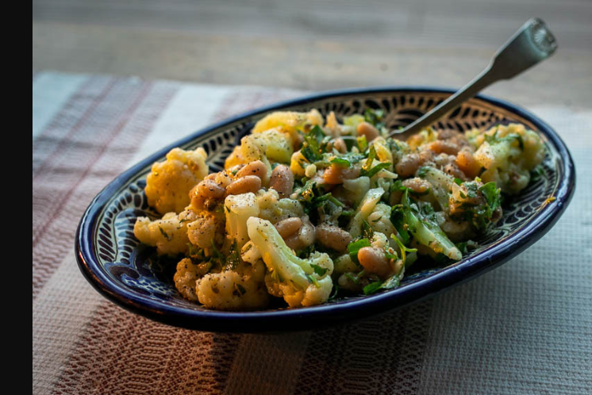

---
tags:
  - dish:main
  - protein:beans
  - ingredient:cauliflower
  - difficulty:easy
---
# Cauliflower and bean picatta

- Serves: 2 (as a main course, more as a side)
{ #serves }
- Date added: 2023-08-26

## Ingredients { #ingredients }

- 1 small cauliflower, broken up into bite-sized florets
- 2 anchovy filets, chopped
- .5 to 1 cup fresh flat-leaf parsley, roughly chopped
- 1 garlic clove, minced
- 1 tablespoon capers, chopped
- Zest from 1 lemon (preferably organic)
- Juice from 1 lemon
- .5 cup extra-virgin olive oil
- Pepper
- Salt to taste (optional)
- 1 cup cooked drained Rancho Gordo Marcella beans (or Alubia Blanca or Garbanzo beans)

## Directions

1. Bring a pot of salted water to a simmer. Add the cauliflower florets and simmer gently for about 8 minutes or until just done, watching carefully not to overcook.  Could also roast them.
2. Place the chopped anchovies on a cutting board and, using the blade of a large chef's knife, smash them up by mashing them against the board until you have a rough paste, or use a mortar and pestle. Add them to a mixing bowl along with the parsley, garlic, capers, lemon zest, lemon juice, olive oil, and pepper. Gentle mix and test for seasoning. Add salt if necessary. The mix should be strong and aggressive as it will be tossed with mild cauliflower and beans. Depending on your tastes, you may want to add some more lemon juice. 
3. Toss the sauce over the cauliflower pieces until well-coated. Add the cooked Marcellas, gently folding them in. (If using Garbanzos, Alubia Blanca, to another firmer bean, you don't need to be as gentle.) Serve warm or at room temperature. 

## Source

Rancho Gordo newsletter

## Comments

Total comments: 0

