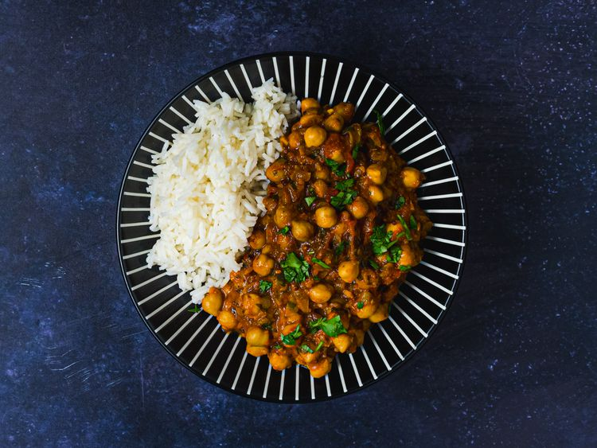

---
tags:
  - dish:main
  - protein:chickpeas
  - cuisine:indian
---
<!-- Tags can have colon, but no space around it -->

# Channa Masala

<!-- Serves has to be a single number, no dashes, but text is allowed after the
number (e.g., 24 cookies) -->
- Serves: 4
{ #serves }
<!-- Time is not parsed, so anything can be input here, and additional
values can be added (e.g., "active time", "cooking time", etc) -->
- Time: 55 min
- Date added: 2025-09-07

## Description

Plump chickpeas bathed in a spicy and tangy tomato sauce.

### Why it works

- Adding baking soda to the onions helps them break down and caramelize faster.
- Doctoring up store-bought garam masala with additional spices produces a flavor that's both complex and suited to the dish.
- Simmering canned chickpeas lends them plenty of flavor.
- Grinding the garlic in lemon juice helps prevent it from turning too sharp and pungent, while still allowing its aroma to shine.

## Ingredients { #ingredients }

<!-- Decimals are allowed, fractions are not. For ranges, use only a single dash
and no spaces between the numbers. -->

- 4 medium cloves garlic, roughly chopped
- 1 (1-inch) knob ginger, peeled, roughly chopped
- 1 to 6 green Thai chiles (to taste), roughly chopped
- 2 tablespoons (30 ml) juice from 1 lemon, divided
- Kosher salt
- 2 tablespoons (30 ml) vegetable oil or ghee
- 2 teaspoons (8 g) black mustard seeds
- 1 teaspoon (4 g) whole cumin seeds
- 1 large onion, finely diced (about 1.5 cups; 300 g)
- .25 teaspoon (1 g) baking soda
- 2 teaspoons (8 g) ground coriander
- .5 teaspoon (2 g) freshly ground black pepper
- .5 teaspoon (2 g) ground turmeric
- 1.5 teaspoons (6 g) store-bought or homemade garam masala, divided
- 1 (14-ounce) can whole peeled tomatoes
- 2 (14-ounce) cans chickpeas, drained and rinsed
- 1 cup cilantro leaves, roughly chopped (1 ounce; 25 g)

## Directions

<!-- If you have a direction that refers to a number of some ingredient, wrap
the number in asterisks and add `{.ingredient-num}` afterwards. For example,
write `Add 2 Tbsp oil to pan` as `Add *2*{.ingredient-num} to pan`. This allows
us to properly change the number when changing the serves value. -->

1. Combine garlic, ginger, chiles, 1 tablespoon lemon juice, and 1/2 teaspoon kosher salt in a mortar and pestle or in the small work bowl of a food processor and pound or process until a fine paste is produced. Set aside.
2. Heat oil or ghee in a large saucepan or Dutch oven over medium-high heat until shimmering. All at once, add mustard seeds and cumin. They will sputter and spit for a few seconds. As soon as they are aromatic (about 15 seconds), add onion all at once, along with baking soda. Cook, stirring frequently, until onions start to leave a brown coating on bottom of pan, 3 to 4 minutes. Add 1 tablespoon water, scrape up browned bits from pan, and continue cooking. Repeat this process until onions are a deep brown, about 10 minutes total.
3. Immediately add garlic/ginger/chile paste all at once and stir to combine. Add coriander, black pepper, turmeric, and 1 teaspoon garam masala. Stir until fragrant, about 30 seconds. Add tomatoes and crush them using a whisk or potato masher. Add drained, rinsed chickpeas and cilantro, reserving a little cilantro for garnish. Add 1/2 cup water.
4. Bring to a simmer, cover with lid slightly cracked, and reduce heat to maintain a gentle bubbling. Cook, stirring occasionally, until liquid has reduced into a thick stew and spices have melded, about 30 minutes.
5. Stir in remaining garam masala and lemon juice. Season to taste with salt. Serve with rice and/or naan, sprinkling additional cilantro on top. 

## Source

[Serious Eats](https://www.seriouseats.com/channa-masala-recipe)

## Comments

- 2025-09-07: delicious, both Anna and Nora really liked it!
