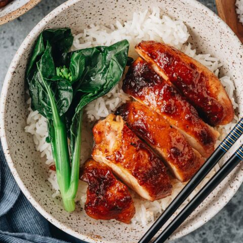

---
tags:
  - dish:main
  - protein:chicken
  - cuisine:chinese
  - difficulty:easy
---
<!-- Tags can have colon, but no space around it -->

# Char Siu Chicken

<!-- Serves has to be a single number, no dashes, but text is allowed after the
number (e.g., 24 cookies) -->
- Serves: 4
{ #serves }
<!-- Time is not parsed, so anything can be input here, and additional
values can be added (e.g., "active time", "cooking time", etc) -->
- Time: 40 min cooking, 4 hours marinade
- Date added: 2025-06-02

## Description
This char siu chicken is moist and tender, with glossy sticky skin, flavorful meat, and a char siu glaze packed with umami. Learn to use this one secret ingredient to make the best tasting char siu sauce that is naturally red without food coloring.
## Ingredients { #ingredients }

<!-- Decimals are allowed, fractions are not. For ranges, use only a single dash
and no spaces between the numbers. -->

- 2 lbs bone-in skin-on chicken thighs 

### Marinade

- 2 pieces red fermented tofu 
- 2 tablespoons liquid from fermented tofu (or 3/4 teaspoon salt)
- 2 tablespoons Shaoxing wine (or dry sherry)
- 2 tablespoons hoisin sauce
- 2 tablespoons oyster sauce
- 2 tablespoons sugar
- 2 tablespoons honey
- 2 teaspoons grated ginger
- 2 teaspoons garlic, grated
- 1/2 teaspoon five spice powder
- 5 drops red food coloring 
## Directions

<!-- If you have a direction that refers to a number of some ingredient, wrap
the number in asterisks and add `{.ingredient-num}` afterwards. For example,
write `Add 2 Tbsp oil to pan` as `Add *2*{.ingredient-num} to pan`. This allows
us to properly change the number when changing the serves value. -->

1. Combine all the sauce ingredients in a large bowl. Stir to mix well.
2. Transfer the chicken into a large ziplock bag. Reserve *1/4*{.ingredient-num} cup of the mixed sauce for glazing. Pour the rest into the bag. Squeeze out as much air as possible and seal the bag. Massage the bag a few times so the chicken pieces are covered evenly with the sauce. Transfer to the fridge and marinate overnight (highly recommended), or for at least 4 hours.

### Roasting

1. When the chicken is marinated and the glaze is chilled, you’re ready to cook.
2. Preheat the oven to 375°F (190°C). Line a large baking tray with aluminum foil. Place the chicken onto the tray without overlapping. Bake for 30 minutes.
3. Turn on the broiler. Baste the top side of the chicken. Broil for 2 to 3 minutes. Baste again. Broil for another 2 to 3 minutes. The chicken should look glossy, lightly charred, and cooked through. You can test the doneness by inserting a thermometer into the thickest part of the chicken. It should read 165°F (74°C).
4. Once done, cover loosely with aluminum foil. Let rest for 10 minutes before serving. Serve the chicken hot over rice as a main dish.

## Notes
1. Chicken skin is important in this recipe because it holds the glaze better and creates a great texture once baked. I like to use thighs, because they come out juicy and are less likely to dry out. The next best alternative is bone-in chicken on chicken breast. If you prefer using skinless pieces, consider using maltose instead of honey, so the sauce holds onto the meat better. If using skinless pieces, the other option is: Reserve 1/2 cup sauce; gently simmer the sauce (to cook off the raw garlic taste) for 2 to 3 minutes; then serve the chicken with the reserved sauce.
2. Fermented tofu is the secret ingredient in this recipe, creating a sauce with more umami and giving the char siu a natural red color without food coloring. If you do not have this ingredient, you can use the alternatives instead (soy sauce + salt + red food coloring). That will make a pretty tasty char siu sauce as well.
3. To make it Gluten-Free: replace Shaoxing wine with dry sherry. Be sure to use a gluten-free oyster sauce.

## Source

[Omnivore's Cookbook](https://omnivorescookbook.com/char-siu-chicken/)

## Comments

- 2025-06-02: delicious (especially the skin), though I think the marinade didn't penetrate into the large thighs too far. maybe use the leftover marinade to glaze and pour over the reserved marinade when serving.
