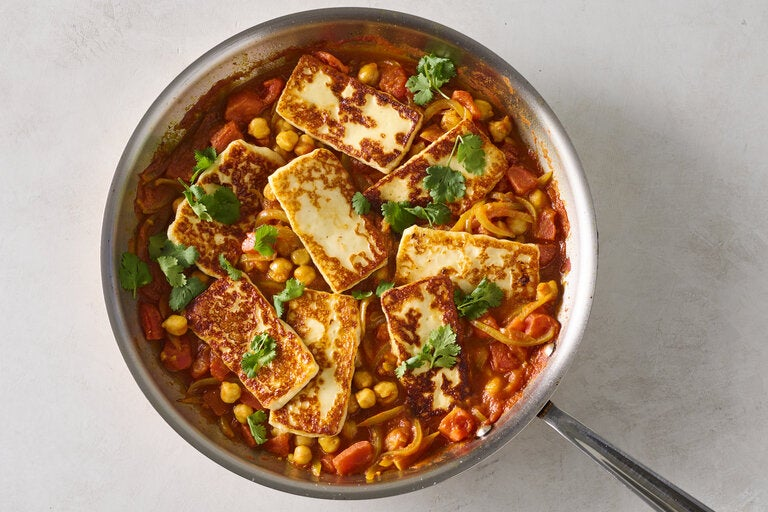

---
tags:
  - dish:main
  - protein:beans
  - ingredient:halloumi
  - difficulty:easy
---
<!-- Tags can have colon, but no space around it -->

# Fried Cheese and Chickpeas in Spicy Tomato Gravy

<!-- Serves has to be a single number, no dashes, but text is allowed after the
number (e.g., 24 cookies) -->
- Serves: 4
{ #serves }
<!-- Time is not parsed, so anything can be input here, and additional
values can be added (e.g., "active time", "cooking time", etc) -->
- Time: 30 min
- Date added: 2023-11-05

## Description

Fried cheese becomes a main meal in this pantry-reliant dish. Make it with your choice of ‘fry-able’ cheese, one with a high melting point that retains its shape after cooking. Halloumi and paneer are excellent choices, but queso blanco and queso de freir are often less expensive, but just as delicious. (Note: Halloumi is saltier than most frying cheeses so use less salt.) The trick to frying cheese without it sticking is to use a hot skillet, but if you’re not confident, opt for non-stick. This dish can easily be adapted for vegans by substituting the cheese with extra-firm tofu.

## Ingredients { #ingredients }

<!-- Decimals are allowed, fractions are not. For ranges, use only a single dash
and no spaces between the numbers. -->

- Extra virgin olive oil or ghee
- 10 ounces frying cheese (such as queso de freir, queso blanco, halloumi or paneer), cut into ¼ inch slices and patted dry
- 1 yellow onion, thinly sliced
- 4 garlic cloves, finely chopped
- 1 teaspoon ground cayenne
- 1 teaspoon ground turmeric
- 1 teaspoon ground ginger
- 1 teaspoon ground cumin
- 1 cinnamon stick or .5 teaspoon ground cinnamon
- 1 teaspoon kosher salt, such as Diamond Crystal (use .5 teaspoon if using halloumi)
- .5 teaspoon granulated sugar
- 1 (28-ounce) can diced, puréed or crushed tomatoes
- 1 (15-ounce) can chickpeas, drained
- Handful of cilantro leaves
- Flatbread or rice, to serve

## Directions

<!-- If you have a direction that refers to a number of some ingredient, wrap
the number in asterisks and add `{.ingredient-num}` afterwards. For example,
write `Add 2 Tbsp oil to pan` as `Add *2*{.ingredient-num} to pan`. This allows
us to properly change the number when changing the serves value. -->

## Notes

<!-- Delete section if no additional notes -->
1. Heat a large (12-inch skillet) on medium-high until very hot, 2 to 3 minutes. Add 1 to 2 tablespoons of olive oil or ghee and swirl it around to coat the base. Add the cheese and fry until golden, 1 to 1½ minutes. Flip and cook the other side. Transfer the cooked cheese to a plate and set aside.
2. Place the same pan over medium heat. Add 1 tablespoon of olive oil or ghee, along with the onions and stir until slightly softened, about 2 minutes. Add the garlic, cayenne, turmeric, ginger, cumin and cinnamon and stir until fragrant, about 30 seconds. Add the salt, sugar, tomatoes and chickpeas and stir well to combine.
3. Cover and cook on medium, stirring occasionally and reducing the heat as necessary, until the tomatoes have thickened up, 8 to 10 minutes. Taste and season with more salt if required.
4. Place the cheese on top of the sauce, and cook just until warmed through, 2 minutes.
5. To serve, top with cilantro and serve with flatbread or rice.

## Source

[NYTimes](https://cooking.nytimes.com/recipes/1024010-fried-cheese-and-chickpeas-in-spicy-tomato-gravy)

## Comments

- 2023-11-05: this was great! I used some leftover buckeye beans instead of chickpeas, which worked very well. I think it could've been more spiced.
