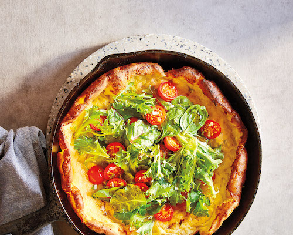

---
tags:
  - vegetarian mains
---
# Cheesy Dutch baby with salad

- Serves: 2
{ #serves }

- Date added: 2023-08-26

## Ingredients { #ingredients }

- 4 eggs
- .666 cup all-purpose flour
- .666 cup milk
- .25 teaspoon salt
- .666 cup grated old cheddar, divided
- 3 tablespoons butter
- 2 tablespoons extra-virgin olive oil
- 1 tablespoon balsamic vinegar
- .125 teaspoon salt
- 4 cups mixed greens
- .5 cup cherry tomatoes, cut in half
- 1 green onion, minced

## Directions

1. Preheat the oven to 450°F. Whisk the eggs and flour together in a large bowl. Whisk in the milk and salt. Whisk in about half of the cheese.
2. Melt the butter in a 10-inch, oven-safe frying pan (such as cast iron—the pan cannot be non-stick) over medium. Swirl so it coats the entire bottom of the pan. Pour the egg mixture into the melted butter. Sprinkle with the remaining cheese. Transfer the pan to the oven and bake 12 to 15 minutes, or until the mixture puffs up and browns across the top.
3. While the Dutch baby cooks, whisk the oil, vinegar and salt in a large bowl until combined. Add the greens, tomatoes and onions and toss to coat. Pile the salad into the centre of the hot Dutch baby and serve immediately, cut into wedges.

## Source

Stained Page News (email newsletter)

## Comments

Total comments: 0

