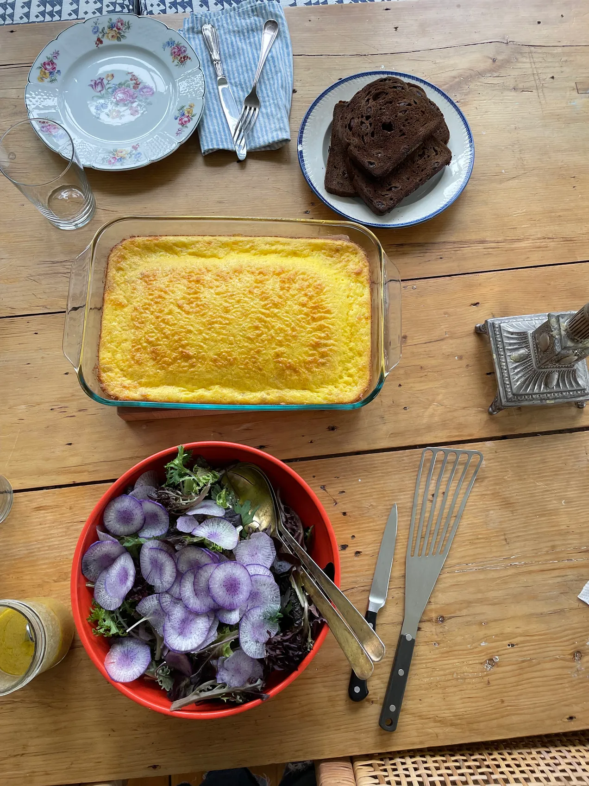

---
tags:
  - dish:breakfast
  - protein:eggs
  - difficulty:easy
---
<!-- Tags can have colon, but no space around it -->

# Cheesy egg bake souffle thing

<!-- Serves has to be a single number, no dashes, but text is allowed after the
number (e.g., 24 cookies) -->
- Serves: 1 loaf
{ #serves }
<!-- Time is not parsed, so anything can be input here, and additional
values can be added (e.g., "active time", "cooking time", etc) -->
- Time: 1 hour
- Date added: 2024-05-02

## Description

If you’re looking for an easy brunch dish, this is it. If you’re looking for a protein-packed vegetarian dish, this is it. Looking for something adults and kids both enjoy? Something you can make on Sunday afternoon and microwave a square of every morning before work? …this is it. 

## Ingredients { #ingredients }

<!-- Decimals are allowed, fractions are not. For ranges, use only a single dash
and no spaces between the numbers. -->

- 1 dozen large eggs
- 1 sixteen-ounce container cottage cheese
- .5 cup (1 stick) butter, melted
- .5 cup all-purpose flour (I bet it would work just fine with gluten-free flour!)
- 2 tablespoons sugar
- 1 teaspoon baking soda
- 1 teaspoon kosher salt
- 1 pound finely grated cheese (I used sharp cheddar and recommend it!)
- Baking spray (or extra melted butter) for the dish

## Directions

<!-- If you have a direction that refers to a number of some ingredient, wrap
the number in asterisks and add `{.ingredient-num}` afterwards. For example,
write `Add 2 Tbsp oil to pan` as `Add *2*{.ingredient-num} to pan`. This allows
us to properly change the number when changing the serves value. -->

1. Preheat oven to 350ºF.
2. Whisk together the eggs in a large bowl, then whisk in the cottage cheese and the melted butter. Place the flour, sugar, baking soda, and salt in a small bowl and whisk well to combine. Whisk the flour mixture into the egg mixture and then stir in the grated cheese.
3. GREASE* a 9-inch x 13-inch (23x33cm) baking dish (*I put it in all caps because it’s important). Pour the egg mixture into the dish and bake until slightly puffed, barely golden brown, and it all seems just firm when you give the dish a shake (there should be no loose egg when you shake the dish), about 30 - 35 minutes. I think it’s good to let it cool for about 10 minutes before slicing and serving.
  - *No matter how well you grease the dish, it will likely have some stuck-on egg. Just soak it for a while and then cleanup is no biggie. 

## Source

[Julia Turshen](https://juliaturshen.substack.com/p/an-excellent-cheesy-egg-bake-souffle)

## Comments

- 2024-05-02: Delicious! I halved this recipe and it still took about the same amount of time to bake
