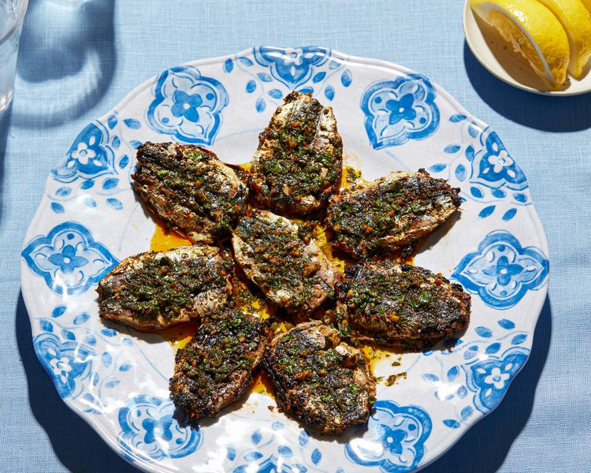

---
tags:
  - dish:main
  - protein:fish
  - cuisine:moroccan
---
<!-- Tags can have colon, but no space around it -->

# Chermoula Sardines

<!-- Serves has to be a single number, no dashes, but text is allowed after the
number (e.g., 24 cookies) -->
- Serves: 2
{ #serves }
<!-- Time is not parsed, so anything can be input here, and additional
values can be added (e.g., "active time", "cooking time", etc) -->
- Time: 70 min
- Date added: 2025-09-07

## Description
In Morocco, grilled sardines like these are often served with simple sides such as bread for scooping, lemon wedges for squeezing, perhaps a tomato and cucumber salad, or a plate of roasted peppers. The dish is rustic and meant to be eaten with your fingers, shared, and savored. It's casual food with serious flavor that brings people together around the table, or even just the grill.

### Why It Works

- Chermoula clings to the sardines, coating them with bold, bright flavor that holds up through high-heat grilling.
- High-heat grilling quickly crisps the fish's skin while preserving its moisture on the interior.

## Ingredients { #ingredients }

<!-- Decimals are allowed, fractions are not. For ranges, use only a single dash
and no spaces between the numbers. -->

- 5 tablespoons (75 ml) extra-virgin olive oil, plus more for the grill
- 1 cup (18 g) cilantro leaves and tender stems, finely chopped 
- 1 cup (18 g) flat-leaf parsley leaves and tender stems, finely chopped
- 2 tablespoons (30 ml) fresh lemon juice
- 3 cloves garlic, minced or pressed
- 2 teaspoons sweet paprika
- 2 teaspoons ground cumin
- 1 teaspoon harissa (optional)
- 1.25 teaspoon Diamond Crystal kosher salt; for table salt, use half as much by volume
- 1.25 pounds fresh sardines, cleaned, butterflied, and deboned (see notes)
- Lemon wedges, for serving

## Directions

<!-- If you have a direction that refers to a number of some ingredient, wrap
the number in asterisks and add `{.ingredient-num}` afterwards. For example,
write `Add 2 Tbsp oil to pan` as `Add *2*{.ingredient-num} to pan`. This allows
us to properly change the number when changing the serves value. -->

1. In a large bowl, whisk together olive oil, cilantro, parsley, lemon juice, garlic, paprika, cumin, harissa (if using), and salt until well combined. In a separate small bowl, set aside et 1/4 cup chermoula for serving.
2. Add sardines to large bowl and gently toss to coat in marinade.
3. On a large plate, lay 1 sardine flat, skin-side down. Spread 1 or 2 teaspoons of marinade on top (enough to cover the surface of the fish), then place another sardine on top, skin-side up, to form a sardine "sandwich." Repeat with remaining sardines and marinade. Cover plate loosely with plastic wrap and refrigerate for at least 30 minutes or up to 24 hours before grilling.
4. For a Charcoal Grill: Open bottom vent completely. Light large chimney starter filled 3/4 with charcoal briquettes (4 quarts). When top coals are partially covered with ash, pour evenly over bottom of grill grate. Set cooking grate in place, cover, and open lid vent completely. Heat grill until hot, about 5 minutes.
5. For a Gas Grill: Turn all burners to high; cover; and heat grill until hot, about 15 minutes. Leave all burners on high.
6. Lightly oil a grill basket to prevent sticking. Arrange prepared sardines in grill basket. Grill, flipping once, until skin is crisp and lightly charred and flesh is cooked through but still moist, 2 to 4 minutes per side, depending on size.
7. For an Oven: Adjust oven rack to middle position and heat oven to 425°F (220°F). Arrange stuffed sardines in an even layer on a parchment paper–lined sheet tray and bake until cooked through and skin is crisp, 10 to 14 minutes.
8. Transfer cooked sardines to a serving platter. Drizzle reserved 1/4 cup chermoula on top, and serve immediately with lemon wedges. 

## Source

[Serious Eats](https://www.seriouseats.com/grilled-chermoula-sardines-recipe-11777827)

## Comments

- 2025-09-07: I just made the chermoula and then topped regular canned sardines, which was great.
