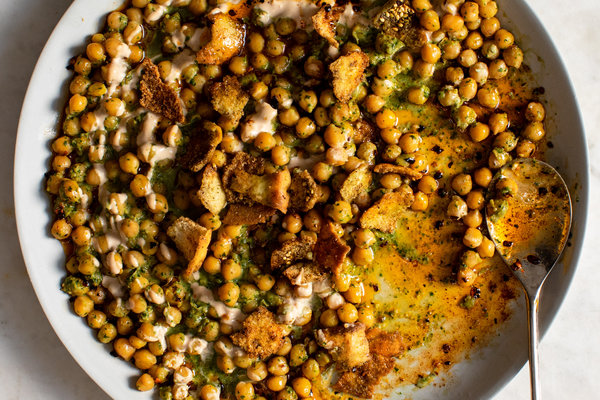

---
tags:
  - dish:main
  - protein:beans 
  - cuisine:middle eastern
---
# Chickpea and herb fatteh

- Serves: 6 servings
{ #serves }
- Time: 1.5 hours, plus at least 8 hours’ soaking
- Date added: 2023-08-26

## Description

Fatteh is a popular Middle Eastern dish made with stale bread and accompanied by a host of hearty ingredients. Serve it for brunch, with eggs, or as a vegetarian main course with cooked seasonal vegetables — simply be sure to plan ahead and soak the chickpeas the night before. You can cook the chickpeas and prepare all the toppings in advance, but you'll want to assemble the herb paste and toss everything together just before serving to ensure that it all stays green and vibrant, and that the fatteh is the right consistency.

## Ingredients { #ingredients }

### For the Salad:

- 12 ounces/350 grams dried chickpeas
- 2.5 teaspoons baking soda (bicarbonate of soda)
- Kosher salt and black pepper
- 1 round white or whole-wheat pita (about 3.5 ounces/100 grams), pocket opened up, roughly torn into small 1-inch/2-to-3-centimeter pieces
- 5 tablespoons/75 milliliters olive oil
- 1 tablespoon za’atar
- .75 packed cup/30 grams roughly chopped fresh cilantro (coriander) leaves and tender stems
- .66 packed cup/30 grams roughly chopped fresh parsley leaves and tender stems
- .66 cup/30 grams roughly chopped fresh chives
- 2.5 tablespoons fresh lemon juice
- 2 garlic cloves, crushed using a garlic press
- 1 teaspoon cumin seeds, toasted, then roughly crushed

### For the Tahini Sauce:

- .33 cups/80 grams tahini
- 1.5 tablespoons fresh lemon juice
- 1 garlic clove, crushed using a garlic press

### For the Chile Oil:

- 2.5 tablespoons olive oil
- .5 teaspoon red-pepper flakes
- .25 teaspoon sweet paprika
- Kosher salt and black pepper

## Preparation

1. Place the dried chickpeas and *1.5*{.ingredient-num} teaspoons baking soda in a large bowl. Top with enough cold water to cover by about 1 inch/3 centimeters, and let soak at room temperature for at least 8 hours or up to overnight.
2. Heat the oven to 375 degrees Fahrenheit/190 degrees Celsius.
3. Drain the chickpeas well and add them to a large saucepan along with the remaining 1 teaspoon baking soda. Add *6*{.ingredient-num} cups/*1.5*{.ingredient-num} liters water. Bring to a simmer over medium-high heat, then lower the heat to medium and let cook until chickpeas are soft but retain a slight bite, 30 to 35 minutes. (The cook time can vary greatly depending on your chickpeas, so check them at the 20-minute mark to determine how long you need.)
4. Add *1.25*{.ingredient-num} teaspoons salt and continue cooking until the chickpeas are supertender, 5 to 10 minutes more. Use a slotted spoon to set aside *.666*{.ingredient-num} cup/*100*{.ingredient-num} grams strained cooked chickpeas. Keep the rest warm on a low heat until ready to serve.
5. While the chickpeas are cooking, prepare the toppings: Toss the pita with *2*{.ingredient-num} tablespoons oil, the za’atar, *.25*{.ingredient-num} teaspoon salt and a good grind of pepper, and spread out on a parchment-lined baking sheet. Bake until golden and crisp, tossing halfway through, about 12 minutes. Set aside to cool.
6. Make the tahini sauce: In a medium bowl, whisk the tahini, lemon juice and garlic with *.333*{.ingredient-num} cup/*70*{.ingredient-num} milliliters water and *.25*{.ingredient-num} teaspoon salt until smooth and pourable. The tahini sauce will thicken as it sits.
7. Make the chile oil: Add the oil and red-pepper flakes to a small frying pan. Heat over medium until gently bubbling and fragrant, about 4 minutes, then add the paprika and remove from heat. Set aside.
8. When ready to serve, add the reserved *.666*{.ingredient-num} cup/*100*{.ingredient-num} grams chickpeas to a food processor along with the fresh herbs, *2.5*{.ingredient-num} tablespoons lemon juice, the garlic, cumin, *.25*{.ingredient-num} teaspoon salt, a good grind of pepper and the remaining *3*{.ingredient-num} tablespoons oil. Blitz until smooth, then transfer to a large mixing bowl.
9. Drain the warm chickpeas using a sieve set over a bowl. Add the chickpeas and *.75*{.ingredient-num} cup/*170*{.ingredient-num} milliliters of their liquid to the herb mixture, mixing well to combine. You want the chickpeas to be well coated and the whole mixture to be saucy (but not overly wet), so add a couple more tablespoons of chickpea liquid if you wish (discard the remaining).
10. Transfer to a large platter with a lip. Drizzle lightly with some of the tahini sauce, then all of the chile oil. Sprinkle with half of the pita and serve warm, with the extra tahini and toasted pita alongside.

## Source

[NYTimes](https://cooking.nytimes.com/recipes/1020727-chickpea-and-herb-fatteh)

## Comments
