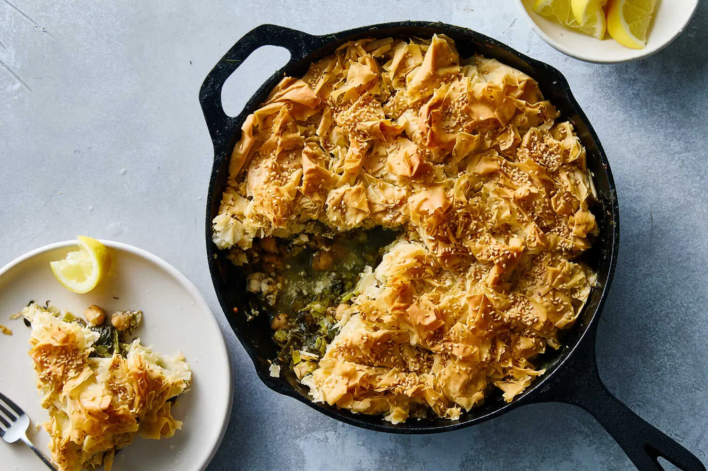

---
tags:
  - dish:main
  - protein:chickpeas
---
<!-- Tags can have colon, but no space around it -->

# Chickpea, spinach, and feta pie

<!-- Serves has to be a single number, no dashes, but text is allowed after the
number (e.g., 24 cookies) -->
- Serves: 4
{ #serves }
<!-- Time is not parsed, so anything can be input here, and additional
values can be added (e.g., "active time", "cooking time", etc) -->
- Time: 50 min
- Date added: 2025-07-08

## Description

Bringing together inspiration from two great Greek pies, spanakopita (spinach and feta) and prasopita (leek), this one-skillet dish also incorporates chickpeas for extra heartiness. Don’t let looks deceive you, as this elegant pie couldn’t be easier to make. There’s no need to stress about torn or dry phyllo sheets here; in fact, the pastry is deliberately broken and scrunched up into jagged, clumpy pieces that are then simply plopped on top of the pie. When baked, the craggy pastry becomes extra shattery and crisp — and visually arresting. (This forgiving recipe also welcomes any leftover pastry that may seem dry or past its prime.) A pie for all occasions, it’s easy enough for weeknight cooking but also special enough for entertaining.

## Ingredients { #ingredients }

<!-- Decimals are allowed, fractions are not. For ranges, use only a single dash
and no spaces between the numbers. -->
- 2 large leeks (about 1 pound), roots and wilted tops trimmed, stalks halved lengthwise and thinly sliced
- 9 tablespoons extra-virgin olive oil, divided 
- S alt and pepper
- 3 garlic cloves, finely chopped
- 5 ounces baby spinach
- 1 (15-ounce) can chickpeas, drained
- 7 ounces crumbled feta
- 1 lemon, zested and juiced (3 to 4 tablespoons), plus 1 more lemon for serving 
- 1 cup chopped dill
- 8 to 10 phyllo pastry sheets (about 10 ounces), thawed
- Toasted white sesame or nigella seeds (optional), for topping

## Directions

<!-- If you have a direction that refers to a number of some ingredient, wrap
the number in asterisks and add `{.ingredient-num}` afterwards. For example,
write `Add 2 Tbsp oil to pan` as `Add *2*{.ingredient-num} to pan`. This allows
us to properly change the number when changing the serves value. -->
1. Heat the oven to 375 degrees.
2. Prepare the leeks: Place the sliced leeks into a colander and rinse them well, rubbing to loosen any dirt. Rinse again and drain well. (There is no need to dry them, as the residual water is useful in cooking the leeks.)
3. Heat a 10-inch ovenproof skillet on medium-high for 1 to 2 minutes. Add 2 tablespoons of olive oil along with the leeks (the skillet will look overfilled, but it cooks down a lot). Season generously with salt and pepper and cook, stirring occasionally, until the leeks are wilted, 3 to 5 minutes.
4. Add the garlic and the spinach, a few handfuls at a time, adding in more as it wilts, and toss until the leaves have all softened. Turn off the heat and add the chickpeas, feta, lemon zest, lemon juice and dill. Taste and season generously with salt and pepper.
5. Place the phyllo sheets into a large bowl and drizzle with 5 tablespoons of olive oil. Scrunch and massage the oil into the sheets; the sheets will crumble, break up and clump up and that is fine. Scrunch the pastry, and transfer in clumps, arranging them on top of the leeks and spinach, until completely covered. Drizzle the top with the remaining 2 tablespoons of olive oil and scatter over the sesame or nigella seeds, if using.
6. Bake until the top is golden and crispy, 30 to 35 minutes, or until the top is golden and crispy. Allow to cool for 5 to 10 minutes. Serve with lemon on the side.

## Source

[NYTimes](https://cooking.nytimes.com/recipes/1026707-chickpea-spinach-and-feta-pie)

## Comments

- 2025-07-08: delicious, and Nora liked it too. I made it in the enameled Dutch oven, which I think was a bit too small, but still worked.
