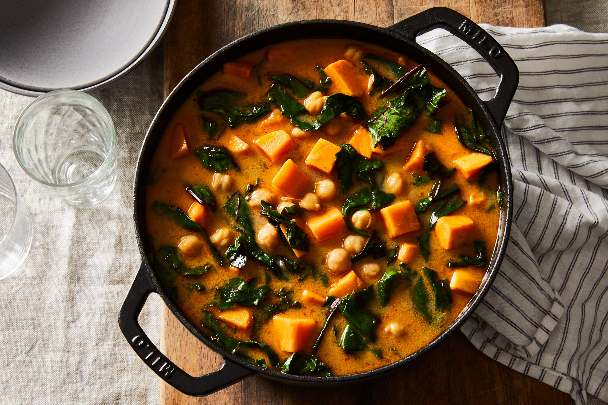

---
tags:
  - dish:main
  - protein:chickpeas
  - ingredient:sweet potatoes
  - difficulty:easy
---
<!-- Tags can have colon, but no space around it -->

# Sweet Potato Stew With Chickpeas & Hardy Greens

<!-- Serves has to be a single number, no dashes, but text is allowed after the
number (e.g., 24 cookies) -->
- Serves: 4
{ #serves }
<!-- Time is not parsed, so anything can be input here, and additional
values can be added (e.g., "active time", "cooking time", etc) -->
- Time: 30 min
- Date added: 2025-10-26

## Description

This autumnal stew is warming and cozy, ready in under 30 minutes, and layered with rich, vivid flavors. It features one of my favorite trios: sweet potatoes, chickpeas, and hardy greens. But the unexpected star of the stew is the vibrant broth, which is delicious enough to slurp on its own. Inspired by the flavors of Carla Lalli Music’s Sweet Potatoes With Tahini Butter, the broth is rich from butter, a little spicy from Aleppo pepper, and spiked with maple syrup, soy sauce, and lime juice. Because the broth is so essential to the deliciousness of this stew, reach for the best stock or broth you have: homemade chicken stock is great here, or a store-bought, low-sodium variety. If using vegetable broth, opt for homemade or a brand you know and like that’s more savory than sweet for the best balance of flavors. The first time I made this stew, I fully intended to swirl some tahini in at the end to thicken the broth. But then I remembered the opened container of hummus in my fridge and reached for it instead, reasoning that hummus (an ultra silky-smooth mix of chickpeas, tahini, garlic, and lemon juice) would not only lend sheen and body, it’d boost the rich, chickpea flavor of the stew. It worked a charm, enlivening and enriching the entire pot. It’s a simple trick that has so many possibilities beyond this recipe.

## Ingredients { #ingredients }

<!-- Decimals are allowed, fractions are not. For ranges, use only a single dash
and no spaces between the numbers. -->
- 4 tablespoon unsalted butter
- 1 yellow onion, finely chopped
- 2 pound sweet potatoes (about 2 large or 3 small), peeled and chopped into 3/4-inch chunks
- 1 teaspoon kosher salt, plus more to taste
- .5 teaspoon Aleppo pepper or .25 teaspoon red pepper flakes
- 1 tablespoon maple syrup
- 4 cup chicken broth or stock, homemade or low-sodium store-bought (see author notes)
- 1 tablespoon soy sauce, or to taste (regular or low sodium)
- 1 15.5-ounce can chickpeas, drained and rinsed
- 3 cup to 4 cups (packed) kale, Swiss chard, collard or turnip greens, or mature (not baby) spinach
- 1 tablespoon lime juice, plus the finely grated zest, from 1 lime (Note: zest the lime before juicing)
- 3 tablespoon to 4 tablespoons plain hummus, homemade or store-bought

## Directions

<!-- If you have a direction that refers to a number of some ingredient, wrap
the number in asterisks and add `{.ingredient-num}` afterwards. For example,
write `Add 2 Tbsp oil to pan` as `Add *2*{.ingredient-num} to pan`. This allows
us to properly change the number when changing the serves value. -->
1. Heat butter in a large pot or Dutch oven over medium heat. Add onion and cook for about 5 minutes until softened. Add sweet potatoes, 1/2 teaspoon kosher salt, and Aleppo pepper. Cook for another 5 minutes (stirring occasionally), or until the outsides lose their firmness.
2. Add maple syrup, stirring so it evenly coats the sweet potatoes. Cook for 1 to 2 more minutes, stirring constantly, to lightly caramelize the syrup.
3. Add broth, soy sauce, chickpeas, greens, and lime zest. Simmer gently for about 15 minutes, or until the sweet potatoes are tender.
4. Lower heat, and stir in the lime juice and hummus, starting with 3 tablespoons hummus; stir until well integrated. Taste, and add another tablespoon of hummus, if desired, for extra richness and body. Taste for seasoning and balance, adding a bit more soy, lime juice, and/or salt to your liking. Turn off the heat. Divide the stew amongst bowls, and serve right away. (Any leftovers will keep well, tightly covered, for several days in the refrigerator. Reheat before serving.)

## Source

[Food52](https://food52.com/recipes/84040-sweet-potato-stew-recipe-with-chickpeas-hardy-greens)

## Comments
