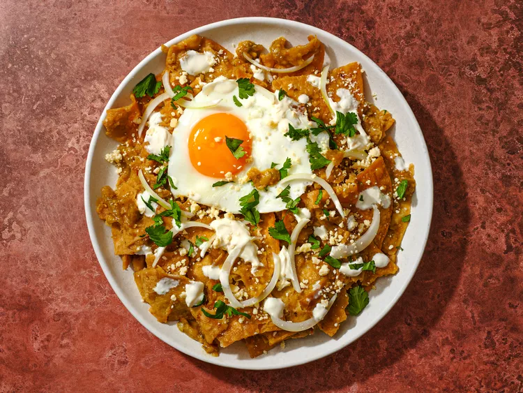

---
tags:
  - dish:main
  - protein:eggs
  - cuisine:mexican
  - difficulty:easy
---
<!-- Tags can have colon, but no space around it -->

# Chilaquiles Verdes With Fried Eggs Recipe

<!-- Serves has to be a single number, no dashes, but text is allowed after the
number (e.g., 24 cookies) -->
- Serves: 4
{ #serves }
<!-- Time is not parsed, so anything can be input here, and additional
values can be added (e.g., "active time", "cooking time", etc) -->
- Time: 15 min
- Date added: 2024-01-10

## Description

It's a super-simple dish to make once you have the basic ingredients ready. All you've got to do is heat up some salsa in a pan, thin it out with a little water or chicken stock, fold in some chips, and top it all with a few garnishes: Mexican crema, crumbled cheese, sliced onions, chopped cilantro, and fried or scrambled eggs are my go-to. But there's some finesse in perfecting them.

First and foremost, you must use freshly-fried tortilla chips. I've yet to find a brand of store-bought chips that have the heft and crunch required to stand up to being simmered in salsa. I make my chips by cutting whole soft corn tortillas into wedges, then deep frying them in a wok until they're puffy and crisp but not yet deeply browned. Frying the chips just before adding them to the salsa will give you the best possible results.

As for the salsa, you can use a doctored-up store-bought salsa verde or even a couple of cans of enchilada sauce with some fresh cilantro and lime juice if you'd like. But if you go through the trouble of making your own, you'll be rewarded with a breakfast fit for a jefe. Especially when it's topped with a runny egg. 

### Why It Works

- Freshly-fried tortilla chips provide the heft and crunch required to stand up to being simmered in salsa.
- Cut wedges of soft corn tortillas are deep-fried until puffy and crisp, yet still pale golden.
- Frying the chips just before adding them to the salsa yields the best results.

## Ingredients { #ingredients }

<!-- Decimals are allowed, fractions are not. For ranges, use only a single dash
and no spaces between the numbers. -->

- 2 quarts vegetable, canola, or peanut oil
- 16 soft corn tortillas, cut into 6 wedges each
- Kosher salt
- 2 cups salsa verde
- 1 cup homemade or store-bought low-sodium chicken broth or water
- 4 eggs
- .5 cup Mexican crema or sour cream
- .5 small white onion, thinly sliced
- .25 cup chopped fresh cilantro leaves
- .25 cup crumbled cotija cheese

## Directions

<!-- If you have a direction that refers to a number of some ingredient, wrap
the number in asterisks and add `{.ingredient-num}` afterwards. For example,
write `Add 2 Tbsp oil to pan` as `Add *2*{.ingredient-num} to pan`. This allows
us to properly change the number when changing the serves value. -->

1. Heat vegetable oil to 375°F (191°C) in a large wok, Dutch oven, or deep fryer. Adjust flame to maintain temperature. Line a large rimmed baking sheet with paper towels. Fry 1/3 of tortilla wedges, using a metal spider to agitate them as they cook. Cook until bubbling slows to a trickle, chips are pale golden brown, and are very crisp, about 3 minutes. Transfer to baking sheet and immediately season with kosher salt. Repeat with remaining batches.
2. Heat salsa verde and chicken broth (or water, if using) in a large straight-sided sauté over medium heat until simmering. Add chips and turn to coat. Cover and set aside.
3. Transfer 2 tablespoons of oil to a large non-stick or cast iron skillet. Heat over medium-high heat until shimmering. Add 4 eggs and cook until whites are set but yolks are still runny, about 3 minutes. Season with salt. Transfer to a large plate.
4. Stir tortilla chips again and season to taste with salt if necessary. Divide between 4 warmed serving plates. Top each with a fried egg. Drizzle with crema, sprinkle with onions, cilantro, and cheese, and serve immediately. 

## Source

[Serious Eats](https://www.seriouseats.com/chilaquiles-verdes-fried-eggs)

## Comments
