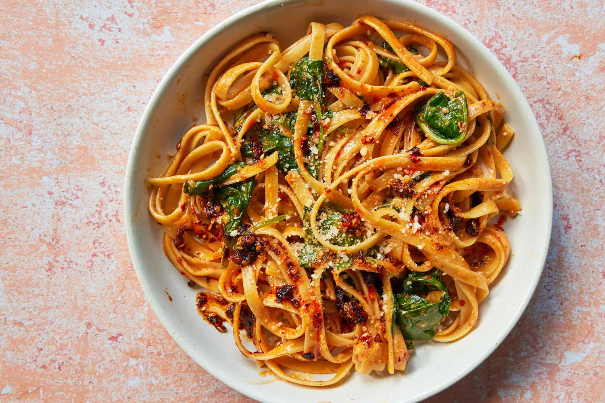

---
tags:
  - dish:main
  - ingredient:pasta
  - difficulty:easy
---
<!-- Tags can have colon, but no space around it -->

# Chile Crisp Fettuccine Alfredo With Spinach

<!-- Serves has to be a single number, no dashes, but text is allowed after the
number (e.g., 24 cookies) -->
- Serves: 6
{ #serves }
<!-- Time is not parsed, so anything can be input here, and additional
values can be added (e.g., "active time", "cooking time", etc) -->
- Time: 25 minutes
- Date added: 2024-10-22

## Description
Swirling chile crisp, a popular Chinese condiment, and spinach into fettuccine Alfredo gives you an immensely satisfying meatless one-dish dinner. The firecracker crunch of chile crisp intensifies when sizzled in butter before cream tempers its heat. Parmesan heightens the sauce’s savory umami, and pregrated cheese works just fine here. This astoundingly simple meal — it doesn’t even require any chopping — comes together in under 30 minutes but tastes as complex as anything you’d get at a restaurant.

## Ingredients { #ingredients }

<!-- Decimals are allowed, fractions are not. For ranges, use only a single dash
and no spaces between the numbers. -->
- Salt
- 4 tablespoons butter
- 1 to 2 tablespoons chile crisp, plus more to taste (try to add more of the solids than the oil to the suce for the most flavorful dish)
- 1 cup heavy cream
- 1 pound dried fettuccine
- 1 (5-ounce) package baby spinach
- .75 cup finely grated Parmesan (2.25 oz), plus more for serving

## Directions

<!-- If you have a direction that refers to a number of some ingredient, wrap
the number in asterisks and add `{.ingredient-num}` afterwards. For example,
write `Add 2 Tbsp oil to pan` as `Add *2*{.ingredient-num} to pan`. This allows
us to properly change the number when changing the serves value. -->

1. Bring a large pot of salted water to a boil. While the water heats, melt the butter with the chile crisp in a very large skillet or Dutch oven over low heat.
2. Whisk in the cream and keep warm over low. (It should steam, not bubble.)
3. Cook the fettuccine until al dente according to the package directions. Use tongs to transfer the noodles to the cream mixture, reserving the pasta water.
4. Add the spinach and turn with tongs until the noodles are well coated.
5. Add the Parmesan and toss, still over low heat, until the noodles are slicked with a creamy sauce, adding a spoonful or two of pasta water if needed to loosen the sauce. Divide among serving dishes and top with Parmesan and more chile crisp, if you’d like. Serve immediately.

## Source

[NYTimes](https://cooking.nytimes.com/recipes/1023609-chile-crisp-fettuccine-alfredo-with-spinach)

## Comments

- 2024-10-22: Anna really liked this, I thought it was a bit heavy, and so could try replacing the heavy cream with half-and-half. Lots of comments said this worked.
