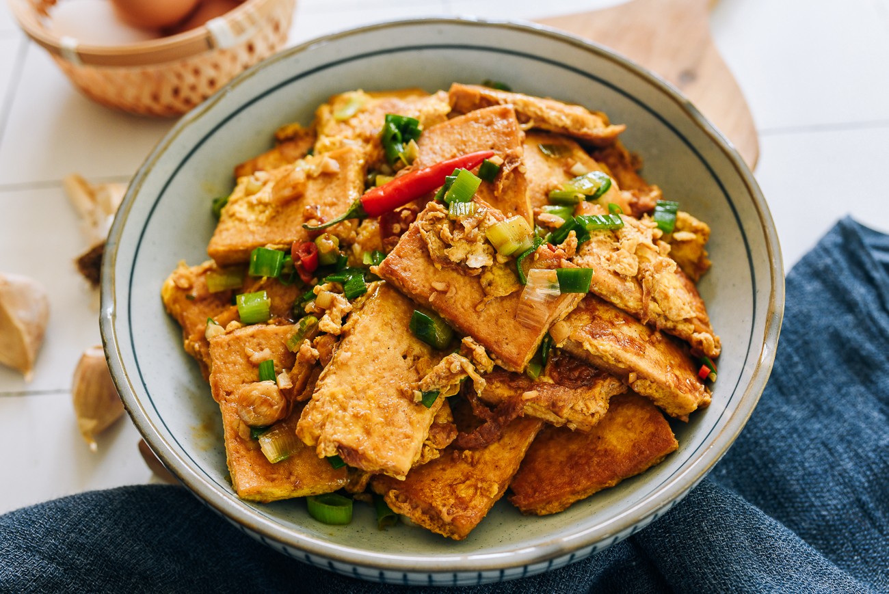

---
tags:
  - dish:main
  - protein:tofu
  - protein:eggs
  - cuisine:chinese
  - difficulty:easy
---
<!-- Tags can have colon, but no space around it -->

# Chinese Tofu & Eggs

<!-- Serves has to be a single number, no dashes, but text is allowed after the
number (e.g., 24 cookies) -->
- Serves: 4
{ #serves }
<!-- Time is not parsed, so anything can be input here, and additional
values can be added (e.g., "active time", "cooking time", etc) -->
- Time: 30 min
- Date added: 2025-07-18

## Description
In tofu and eggs recipe, pan-fry soft or firm tofu, cover it in egg, and simmer in a delicious sauce for a vegetarian satisfying meal! 
## Ingredients { #ingredients }

<!-- Decimals are allowed, fractions are not. For ranges, use only a single dash
and no spaces between the numbers. -->
- 1 pound soft or firm tofu
- 2 tablespoons light soy sauce
- 1 teaspoons Shaoxing Wine
- 1 tablespoon vegetarian oyster sauce (or regular oyster sauce)
- .125 white pepper
- 1 pinch five spice powder
- .66 cup water
- 3 tablespoons oil
- 3 large eggs (beaten)
- 1 tablespoon garlic (minced)
- 2 scallions (chopped, white and green parts separated)
- 2 red chilies (chopped; optional)

## Directions

<!-- If you have a direction that refers to a number of some ingredient, wrap
the number in asterisks and add `{.ingredient-num}` afterwards. For example,
write `Add 2 Tbsp oil to pan` as `Add *2*{.ingredient-num} to pan`. This allows
us to properly change the number when changing the serves value. -->
1. Slice the block of tofu in half lengthwise. Then slice it crosswise into ¼-inch (6-7mm) thick pieces. Lightly pat the pieces on both sides with a paper towel.
2. Prepare sauce by mixing together the light soy sauce, Shaoxing Wine, oyster sauce, white pepper, five spice powder, and water. Set aside.
3. Heat a large flat-bottomed cast iron or non-stick pan over medium-high heat (if using cast iron, heat until it just starts to smoke; learn why this prevents sticking). Once thoroughly heated, coat the bottom of the pan with oil. Add the tofu slices in a single layer, and pan-fry them for 2 minutes per side, until lightly golden. Do this in batches if needed.
4. When all the tofu has been pan-fried, add it all to the pan at the same time in a thin layer. Pour half of the beaten eggs evenly over the tofu. Once the egg starts to set at the bottom, flip the tofu pieces and pour the rest of the beaten egg evenly over the other side. Cook until the eggs are set.
5. Add the sauce mixture along with the minced garlic, white part of the scallions, and chilies, if using. Reduce the heat to medium, cover, and cook for 8-10 minutes.
6. Uncover, give everything a toss, and reduce the sauce further if needed. Garnish with the chopped green parts of the scallion, and serve.

## Source

[Woks of Life](https://thewoksoflife.com/chinese-tofu-and-eggs/)

## Comments
