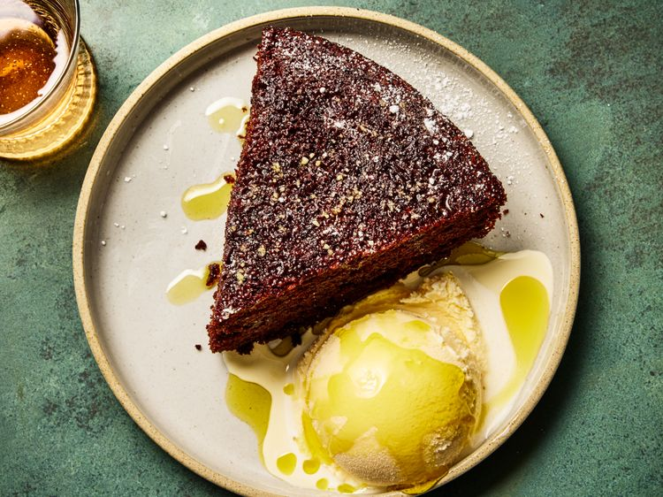

---
tags:
  - dish:dessert
  - difficulty:easy
---
<!-- Tags can have colon, but no space around it -->

# Chocolate Olive Oil Cake

<!-- Serves has to be a single number, no dashes, but text is allowed after the
number (e.g., 24 cookies) -->
- Serves: 8
{ #serves }
<!-- Time is not parsed, so anything can be input here, and additional
values can be added (e.g., "active time", "cooking time", etc) -->
- Time: 1.5 hr
- Date added: 2025-10-26

## Description

Olive oil cake has earned a reputation for its moist, tender crumb and distinct flavor. Where butter quietly disappears into the background, olive oil brings its own character to the table, adding notes that range from fruity and floral to grassy and peppery, depending on the oil you use.

While classic olive oil cake is understated and elegant, chocolate olive oil cake is bold and brooding in the best of ways. This chocolate version, developed by our colleague Melissa Gray-Streett in our Birmingham, Alabama, test kitchen, builds on this foundation. Dutch-process cocoa and a touch of instant espresso powder build that bittersweet intensity, while olive oil keeps the crumb tender and moist. Buttermilk plays two key roles here: Its acidity reacts with the baking soda to provide lift and structure, and its mild tang offsets the richness of the oil and chocolate.  

Because cake batters rarely bake above 200°F (93°C), the process is gentle enough to preserve olive oil's volatile aromatic compounds. This means that the flavor of the oil you start with is the flavor you'll taste in the final cake. A light, neutral olive oil will fade quietly into the background, giving you moisture with subtle character. But a robust extra-virgin oil—whether fruity and floral, grassy and green, or peppery and sharp—defines the cake's flavor and makes it more memorable. Either way, you'll end up with a tender, flavorful cake—it's just a matter of what kind of flavor profile you want from the oil. Whether you reach for a subtle or stronger oil, make sure you choose a high-quality olive oil; the investment pays off in a cake that's fragrant and multi-layered. 
### Why It Works

- Buttermilk contributes structure to the batter with its thick texture, while its acidity reacts with the baking soda to lift the crumb and give the cake a tangy flavor.
- Using high-quality olive oil brings bold, distinctive flavors to the cake while keeping it rich and moist.
## Ingredients { #ingredients }

<!-- Decimals are allowed, fractions are not. For ranges, use only a single dash
and no spaces between the numbers. -->

- Cooking spray
- .75 cup (180 ml) water
- 1.5 teaspoons fine instant espresso powder (such as Delallo)
- 298 g granulated sugar (about 10 1/2 ounces; 1.5 cups)
- 170 g all-purpose flour (about 6 ounces; 1.33 cups)
- 42 g Dutch-process cocoa powder (about 1.5 ounces; .5 cup) (such as Guittard Cocoa Rouge)
- 1 teaspoon Diamond Crystal kosher salt; for table salt, use half as much by volume or the same weight
- .75 teaspoon baking powder
- .5 teaspoon baking soda
- 2 large eggs, at room temperature
- .5 cup (120 ml) whole buttermilk
- .5 cup (120 ml) extra-virgin olive oil, plus more for drizzling (see notes)
- 1 tablespoon (15 ml) vanilla extract
- Confectioners' sugar, for dusting 

## Directions

<!-- If you have a direction that refers to a number of some ingredient, wrap
the number in asterisks and add `{.ingredient-num}` afterwards. For example,
write `Add 2 Tbsp oil to pan` as `Add *2*{.ingredient-num} to pan`. This allows
us to properly change the number when changing the serves value. -->

1. Adjust oven rack to middle position and preheat oven 350°F (175°F). Lightly spray a 9-inch round cake pan with cooking spray. Line bottom of pan with parchment paper, and set aside.
2. In a small bowl, whisk 3/4 cup water and espresso powder until fully dissolved, about 30 seconds. Set aside.
3. In a large bowl, whisk granulated sugar, flour, cocoa, salt, baking powder, and baking soda. Add eggs, buttermilk, olive oil, vanilla, and reserved dissolved espresso powder. Stir until combined. Pour batter into prepared pan.
4. Bake until a wooden pick inserted into center of cake comes out with just a few moist crumbs, 40 to 45 minutes. Transfer cake to a wire rack and let it cool in the pan for 15 minutes. Using a butter knife or offset spatula, gently loosen edges of cake from pan. Invert cake onto wire rack and return cake right side up. Let cake cool to room temperature, about 1 hour. Transfer cake to a serving plate, carefully peeling off parchment paper. Drizzle with additional olive oil, dust with confectioners' sugar, and serve with vanilla ice cream, if using. 

## Notes

Since olive oil is a prominent flavor in chocolate olive oil cake, use a high-quality, fruity variety. 

## Source

[Serious Eats](https://www.seriouseats.com/chocolate-olive-oil-cake-recipe-11834116)

## Comments

- 2025-10-26: I used regular cocoa for this and it still works.
