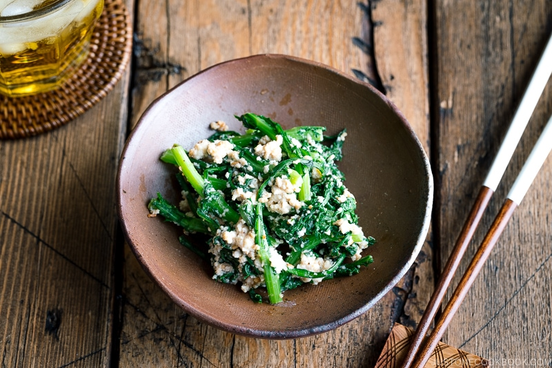

---
tags:
  - dish:sides
  - protein:tofu
  - ingredient:greens
  - cuisine:japanese
---
<!-- Tags can have colon, but no space around it -->

# Chrysanthemum Greens and Tofu Salad (Shungiku Shiraae)

<!-- Serves has to be a single number, no dashes, but text is allowed after the
number (e.g., 24 cookies) -->
- Serves: 6
{ #serves }
<!-- Time is not parsed, so anything can be input here, and additional
values can be added (e.g., "active time", "cooking time", etc) -->
- Time: 45 min (most inactive)
- Date added: 2025-06-26

## Description
Brighten your Japanese meal with this lovely Chrysanthemum Greens and Tofu Salad (Shungiku Shiraae). It is my absolute favorite side dish to enjoy with in-season vegetables. The nutty, savory, and creamy sesame tofu sauce brings it all together.

## Ingredients { #ingredients }

<!-- Decimals are allowed, fractions are not. For ranges, use only a single dash
and no spaces between the numbers. -->
- .5 shungiku (chrysanthemum greens)
- 7 oz medium-firm tofu (momen dofu) (.5 block)

## For the Seasonings

- 4 Tbsp toasted white sesame seeds
- 1 Tbsp sugar
- 2 tsp miso 
- 1 tsp mirin
- 1 tsp soy sauce
- .125 Diamond Crystal kosher salt (plus more, to taste)

## Directions

<!-- If you have a direction that refers to a number of some ingredient, wrap
the number in asterisks and add `{.ingredient-num}` afterwards. For example,
write `Add 2 Tbsp oil to pan` as `Add *2*{.ingredient-num} to pan`. This allows
us to properly change the number when changing the serves value. -->

1. Gather all the ingredients. To store the leftover tofu, keep it in an airtight container and pour water until it covers the tofu. Keep in the refrigerator (change the water every day) and use it within a few days.
2. Do not skip this step. You don’t want to drain the water from tofu completely, but it’s important to remove some moisture so the dressing doesn’t get too wet. Wrap 7 oz medium-firm tofu (momen dofu) with paper towels. Put the wrapped tofu on a tray or plate. Add another tray or plate on top of the tofu and put a heavy object on top to facilitate draining. Set aside for 20–30 minutes. Alternatively, you can microwave paper towel-wrapped tofu for 1 minute (1200W).
3. Toast 4 Tbsp toasted white sesame seeds in a dry frying pan, shaking the pan frequently, until they are fragrant and start to pop.
4. Transfer the to a Japanese mortar (suribachi) and grind the sesame seeds with a pestle (surikogi).
5. Cut off and discard the ends of shungiku (chrysanthemum greens). Then, cut them into 2-inch (5-cm) pieces. Keep the stems and leafy parts separate.
6. Now, blanch the greens. Bring a big pot of water to a boil. Boil the stem pieces for 10–15 seconds to give them a head start on cooking.
7. Then, add the stem/leafy middle parts and continue to cook for 5 seconds.
8. Finally, add the leafy greens and submerge to cook for 5 seconds.
9. Drain or pick up the leaves quickly and shock the greens in ice water. This will bring out the bright green color and stop the leaves from cooking further.
10. Once cooled, squeeze the water out and set it aside.
11. Remove the weight from the tofu and unwrap the paper towel.
12. Add the tofu to the sesame seeds in the mortar. Using the pestle, mash and grind the tofu until smooth.
13. Add miso, sugar, mirin, and soy sauce. Mix it all together until incorporated into the tofu. Taste the tofu mixture now and add Diamond Crystal kosher salt. Make sure it’s a bit more on the saltier side as adding the greens will dilute the flavor slightly.
14. Add the greens to the tofu mixture and combine well. Once combined, you can chill in the refrigerator for 30 minutes before serving, or serve immediately.
15. You can keep it for 24 hours in the refrigerator; however, I recommend consuming it soon.

## Source

[Just One Cookbook](https://www.justonecookbook.com/chrysanthemum-greens-and-tofu-salad/)

## Comments

- 2025-06-26: the tofu sauce was really nice, not sure I'd use it with the blanched greens. I kept the sauce and the greens separate and they kept well in the fridge for several days.
