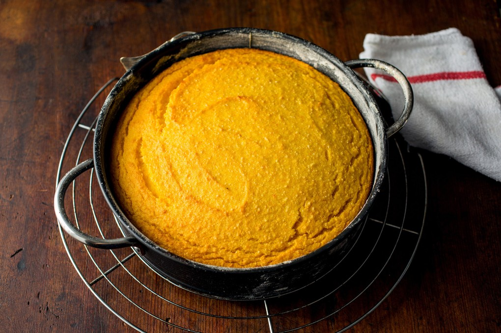

---
tags:
 - dish:dessert
---

# Claudia Roden’s Orange and Almond Cake

- Serves: 10 servings
{ #serves }
- Time: 180
- Date added: 2024-04-26

## Description

Moira Hodgson rooted this classic out of Claudia Roden’s terrific cookbook, “Everything Tastes Better Outdoors,” and brought it to The Times in 1987: a flourless orange and almond cake that goes beautifully with blueberries or peaches, and is the perfect thing to carry along on a picnic. Extremely moist, it consists of two seeded oranges (peel and all), ground almonds, sugar and eggs – and no flour. Baked in a hot oven, it will be done in just about an hour or so, longer if the orange pulp is extremely wet. Opening the oven door to check will not harm it.

## Ingredients { #ingredients }

- 2.0 large oranges 
- 6.0 eggs 
- 0.5 pound ground almonds 
- 0.5 pound sugar 
- 1.0 teaspoon baking powder 

## Directions

1. Wash the oranges and simmer them, unpeeled, in water to cover for 2 hours. Cool, cut them open and remove the seeds. Puree the oranges, including the peel, in a food processor.
2. Heat oven to 400 degrees. Beat the eggs in a food processor or large bowl. Add the remaining ingredients, including the orange puree, and mix thoroughly. Pour into a buttered and floured cake tin, with a removable base if possible.
3. Bake for 45 minutes to 1 hour, or until a knife inserted in the center comes out clean. Cool in the pan before turning out.

## Notes

Tip: This is a very moist cake and goes especially well with blueberries, raspberries, strawberries, peaches, plums, apricots and nectarines.

## Source

[NYTimes](https://cooking.nytimes.com/recipes/3251-claudia-rodens-orange-and-almond-cake)

## Comments
