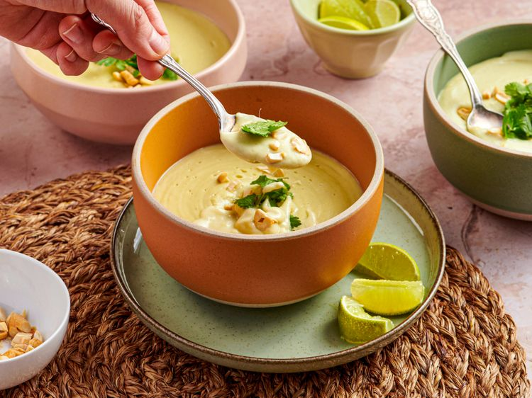

---
tags:
  - dish:soup
  - ingredient:parsnip
  - cuisine:thai
---
<!-- Tags can have colon, but no space around it -->

# Coconut-Parsnip Soup with Lemongrass and Ginger

<!-- Serves has to be a single number, no dashes, but text is allowed after the
number (e.g., 24 cookies) -->
- Serves:
{ #serves }
<!-- Time is not parsed, so anything can be input here, and additional
values can be added (e.g., "active time", "cooking time", etc) -->
- Time: 
- Date added: 

## Description
In this comforting but bright soup, sweet parsnips are simmered in a creamy coconut broth scented with lemongrass, galangal (or ginger), and makrut lime leaves.

The great thing about a long winter is an equally long soup season. With countless soups to sample, savor, and cook on cold nights, I sometimes feel like a witch over a bubbling cauldron, stirring up something to chase the cold away. But with so many options, it’s easy to feel overwhelmed. When I can’t decide between a simple, creamy root-vegetable purée and a herby, piquant soup with more complexity, I turn to this creamy parsnip soup inspired by Thai tom kha—it delivers the best of both worlds.

Tom kha is a Thai coconut soup infused with galangal, lemongrass, and makrut lime leaves, typically simmered with chicken or mushrooms and finished bright with lime. Here, those same aromatics form the backbone of this blended parsnip soup. The citrusy, herbal notes pair well with the parsnips’ natural sweetness. 

### Why It Works

- Galangal (or ginger), lemongrass, and makrut lime leaves infuse the broth with bright citrusy and herbal notes that balance the sweetness of the parsnips and the richness of coconut milk.
- Finishing the soup with lime juice sharpens the flavors.

## Ingredients { #ingredients }

<!-- Decimals are allowed, fractions are not. For ranges, use only a single dash
and no spaces between the numbers. -->

- 3 tablespoons (45 ml) unrefined coconut oil
- 3 medium parsnips (about 5 ounces; 142 g each), peeled and roughly chopped
- .5 large yellow or white onion (5 ounces; 142 g), chopped
- 1 ounce (30 g) galangal or ginger, peeled and finely chopped, plus 1 ounce (30 g) galangal or ginger, cut into 2 pieces, divided (see notes)
- .25 cup (10 g) chopped fresh cilantro leaves and tender stems
- 3 large cloves garlic, minced
- 1 jalapeño pepper (about 25 g), stemmed, seeded, and finely chopped
- 2 (13.5-ounce each) cans full-fat coconut milk, shaken in the can 
- 1.25 cups (300 ml) homemade chicken stock or store-bought unsalted chicken or vegetable broth
- 1 lemongrass stalk, pale white part only (about 10 g), cut into 4 segments (see notes)
- 2 fresh, frozen, or dried makrut lime leaves (see notes)
- 2.5 teaspoons (7.5 g) Diamond Crystal kosher salt, plus more to taste; for table salt, use half as much by volume or the same weight

### For Serving:
- Fresh cilantro leaves
- Chopped toasted cashews
- Lime wedges

## Directions

<!-- If you have a direction that refers to a number of some ingredient, wrap
the number in asterisks and add `{.ingredient-num}` afterwards. For example,
write `Add 2 Tbsp oil to pan` as `Add *2*{.ingredient-num} to pan`. This allows
us to properly change the number when changing the serves value. -->

1. In a large pot, heat coconut oil over medium heat until shimmering. Add parsnips and onion. Cook, stirring occasionally, until onions soften, about 5 minutes. Stir in chopped galangal or ginger, cilantro, garlic, and jalapeño, and cook until fragrant, about 30 seconds.
2. Stir in coconut milk, broth, galangal or ginger pieces, lemongrass, makrut lime leaves, and salt. Bring mixture to a boil, then reduce heat to a simmer. Cook, covered, until parsnips are tender, about 20 minutes.
3. Off-heat, use a slotted spoon to remove and discard galangal or ginger pieces, lemongrass, and makrut lime leaves. Carefully transfer parsnip mixture to a blender. Blend, in batches if necessary, on medium-high speed until smooth, about 1 minute. (Alternatively, blend soup in pot with an immersion blender until smooth.) Season soup with additional salt to taste. Divide soup between serving bowls. Top with cilantro leaves and cashews. Serve with lime wedges on the side. 

## Source

[Serious Eats](https://www.seriouseats.com/coconut-parsnip-soup-recipe-11920018)

## Comments
