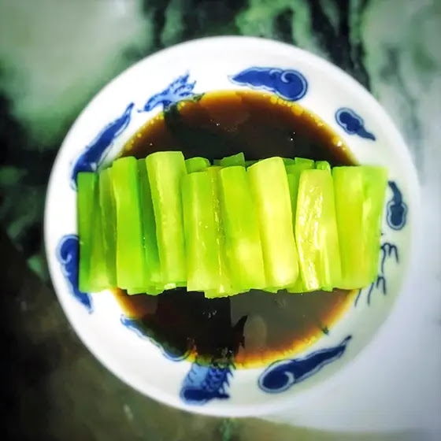

---
tags:
  - dish:main
  - ingredient:celtuce
  - cuisine:chinese
---
<!-- Tags can have colon, but no space around it -->

# Cold celtuce dish

<!-- Serves has to be a single number, no dashes, but text is allowed after the
number (e.g., 24 cookies) -->
- Serves: 4
{ #serves }
<!-- Time is not parsed, so anything can be input here, and additional
values can be added (e.g., "active time", "cooking time", etc) -->
- Time: 10 min
- Date added: 2025-06-26

## Description
This Chinese Celtuce Vegetable Cold Dish 薑汁萵筍 is a simple yet elegant salad cold dish featuring the unusual crisp yet tender jade hued celtuce vegetable drizzled with a tasty tart and gingery dressing.

## Ingredients { #ingredients }

<!-- Decimals are allowed, fractions are not. For ranges, use only a single dash
and no spaces between the numbers. -->
- 2 celtuce stalks 萵筍
- 1.5 tsp salt
- 2 tbsp sugar
- 2 tbsp Zhenjiang black vinegar 鎭江香醋
- 3 tbsp ginger juice
- 1 tbsp sesame oil

## Directions

<!-- If you have a direction that refers to a number of some ingredient, wrap
the number in asterisks and add `{.ingredient-num}` afterwards. For example,
write `Add 2 Tbsp oil to pan` as `Add *2*{.ingredient-num} to pan`. This allows
us to properly change the number when changing the serves value. -->
1. Wash celtuce stalks.  Strip off leaves.  Use veggie peeler to peel the skin off the stalk until all fiberous material removed.  Cut stem into 2 inch lengths, then further slice into 1/2 inch lengths.  Place into strainer and add 1 tsp salt, turning gently with fingers to spread salt evenly.  Let sit for 10 mins.
2. Use paper towel to soak up water before placing onto serving dish.  Place celtuce in fridge while preparing the sauce.
3. To make the sauce, first finely grate a 2 inch piece of ginger into a dish.  The ginger will release its juice into the dish.  Continue to grate until the ginger becomes a mass of fibers in your hand.  Squeeze the fibers to release the rest of the ginger juice.  Discard fibers.
4. Add 1/2 tsp salt, sugar, vinegar and sesame oil into the ginger juice, stirring to combine.  When ready to serve, remove celtuce from fridge and drizzle sauce over.  Enjoy your veggies!

## Notes
Try preparing this dish a bit early so that it has enough time to chill cuz it tastes best cold

## Source

[The Hong Kong Cookery](https://www.thehongkongcookery.com/2021/05/chinese-celtuce-vegetable-cold-dish.html)

## Comments

- 2025-06-26: delicious. would probably be good with broccoli stems or similar too. I tossed the leftover sauce with some peanuts and they were excellent.
