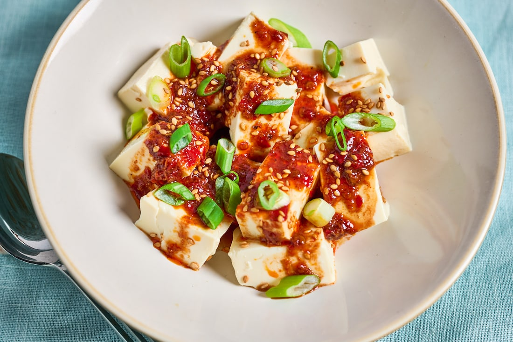

---
tags:
 - dish:main
 - difficulty:easy
 - cuisine:chinese
 - protein:tofu
---

# Cold Mapo Tofu

- Serves: 4 
{ #serves }
- Working time: 25
- Waiting time: 0
- Date added: 2023-09-09

## Description

Mapo tofu, the beloved Sichuan dish, traditionally comes bathed in a bold, spicy, deeply umami sauce.

## Ingredients { #ingredients }

- 32.0 oz silken (or soft) tofu (2 16-oz packages)
- 2.0 scallions (thinly sliced)
- toasted white sesame seeds (for serving)
- Cooked white rice, for serving (optional)
- 2.0 tablespoons hot water (or more as needed)
- 4.0 teaspoons doubanjiang, such as Juan Cheng brand, also labeled as broad bean chili sauce or fermented chili bean paste 
- 1.5 teaspoons granulated sugar 
- 1.0 clove garlic (minced or finely grated)
- 1.0 piece fresh ginger, peeled and grated (1-inch)
- 4.0 teaspoons untoasted sesame oil 
- 2.0 teaspoons rice vinegar 
- 0.5 to 1 teaspoon freshly ground Sichuan pepper, to taste 

## Directions

1. Drain the tofu: Carefully drain the liquid from the packages of tofu, and gently tip the blocks onto a kitchen towel and cover with a second towel. (Try to keep the blocks in one piece, if possible, but don’t worry if they fall apart.) Let drain while you prepare the sauce.
2. Make the mapo sauce: In a medium bowl, stir together the water, doubanjiang and sugar until the sugar is dissolved and the doubanjiang is broken up. Add the garlic, ginger, sesame oil, rice vinegar and Sichuan pepper, and stir until the mixture is uniform and pourable. If it’s too thick or spicy, stir in another *1*{.ingredient-num} to *2*{.ingredient-num} teaspoons of water; you should have about *.5*{.ingredient-num} cup.
3. Assemble the dish: Uncover the tofu, slice into bite-size cubes and transfer to a rimmed platter. Pour the sauce over the tofu, and top with the scallions and sesame seeds. Eat as is, or with rice.

## Source

[Washington Post](https://www.washingtonpost.com/recipes/cold-mapo-tofu/)

## Comments
