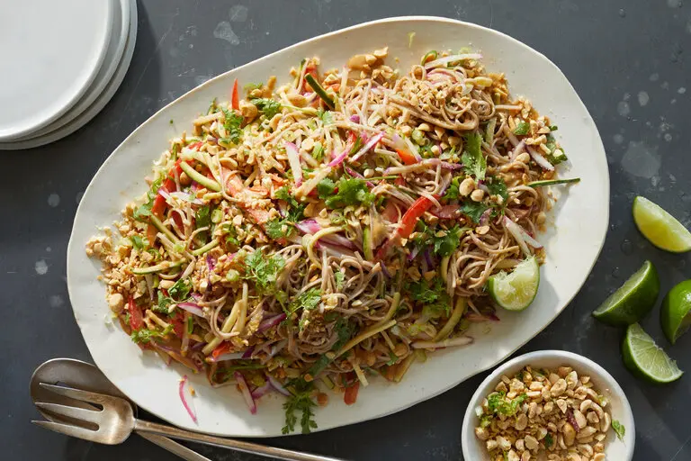

---
tags:
  - dish:main
  - ingredient:soba
  - difficulty:easy
---
<!-- Tags can have colon, but no space around it -->

# Cold Noodle Salad With Spicy Peanut Sauce

<!-- Serves has to be a single number, no dashes, but text is allowed after the
number (e.g., 24 cookies) -->
- Serves: 4
{ #serves }
<!-- Time is not parsed, so anything can be input here, and additional
values can be added (e.g., "active time", "cooking time", etc) -->
- Time: 20 min
- Date added: 2024-07-05

## Description

Soba, Japanese buckwheat noodles, are ideal for salads because they taste particularly great when served cold. Crunchy vegetables are highlighted here, adding lots of crisp, fresh texture. Substitute with any raw vegetables you have on hand, such as cabbage, carrot, fennel, asparagus, broccoli or cauliflower. The spicy peanut sauce is very adaptable: If you don’t want to use peanut butter, you can use any nut or seed butter, like cashew, almond, sunflower or even tahini. Both the soba and the peanut sauce can be prepared ahead of time and stored in the fridge overnight, but wait to combine them until you are ready to eat for the best texture and consistency. The peanut sauce thickens as it sits, so add a tablespoon or two of water to loosen it up, if necessary.

## Ingredients { #ingredients }

<!-- Decimals are allowed, fractions are not. For ranges, use only a single dash
and no spaces between the numbers. -->

### For the salad

- Kosher salt
- 10 ounces soba noodles
- 1 medium zucchini or cucumber (about 6 ounces)
- 5 radishes (about 4 ounces)
- 1 bell pepper (any color)
- 1 tablespoon sesame oil
- .5 cup roasted salted peanuts (about 2 ounces), roughly chopped
- 2 scallions, trimmed and finely chopped
- Handful of cilantro leaves
- 1 lime, cut into wedges for serving

### For the Spicy Peanut Sauce

- .5 cup smooth peanut butter (not natural)
- .25 cup soy sauce
- 2 tablespoons maple syrup
- 2 tablespoons lime juice (from 1 lime)
- 1 tablespoon sesame oil
- 2 teaspoons chile oil or hot sauce, plus more to taste
- 1 garlic clove, grated

## Directions

<!-- If you have a direction that refers to a number of some ingredient, wrap
the number in asterisks and add `{.ingredient-num}` afterwards. For example,
write `Add 2 Tbsp oil to pan` as `Add *2*{.ingredient-num} to pan`. This allows
us to properly change the number when changing the serves value. -->
1. Bring a pot of salted water to the boil. Add the soba, stir to prevent sticking, and cook according to package instructions until just tender. Rinse under cold water until the noodles are completely cold.
2. Meanwhile, make the sauce: In a medium bowl, combine the peanut butter, soy sauce, maple syrup, lime juice, sesame oil, chile oil or hot sauce, and garlic. Add ¼ to ½ cup water, 1 tablespoon at a time, and whisk until the sauce is a pourable consistency. Taste and add more chile oil or hot sauce as desired; set aside.
3. Cut the zucchini or cucumber and radishes into ⅛-inch thick slices, then cut into thin matchsticks. Slice the peppers into ⅛-inch pieces. Place them all in a large bowl.
4. Loosen the soba noodles by running them under some water, then allow to drain again. Add them to the vegetables, add the remaining 1 tablespoon sesame oil and toss to combine.
5. When you are ready to serve, drizzle with spicy peanut sauce and top with peanuts, scallions and cilantro. Serve immediately, with lime wedges alongside.

## Source

[NYTimes](https://cooking.nytimes.com/recipes/1022329-cold-noodle-salad-with-spicy-peanut-sauce)

## Comments

- 2024-07-05: This was delicious, but leftovers don't keep too well: noodles get a bit gummy and the veggies lose their crunch.
