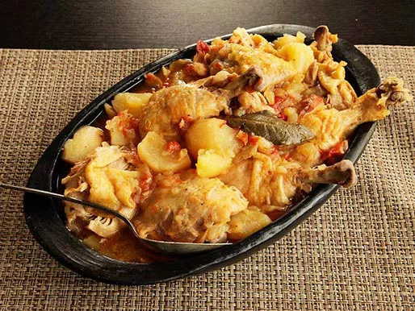

---
tags:
  - dish:main
  - protein:chicken
  - ingredient:potato
  - cuisine:colombian
  - difficulty:easy
---
<!-- Tags can have colon, but no space around it -->

# Colombian Chicken Stew With Potatoes, Tomato, and Onion Recipe

<!-- Serves has to be a single number, no dashes, but text is allowed after the
number (e.g., 24 cookies) -->
- Serves: 4
{ #serves }
<!-- Time is not parsed, so anything can be input here, and additional
values can be added (e.g., "active time", "cooking time", etc) -->
- Time: 35 min
- Date added: 2024-09-29

## Description

Over the course of its brief, high temperature, high pressure cook time, the tomatoes and onions will have nearly completely broken down, melting into the stew. Meanwhile, the potatoes get infused all the way to their core with flavorful chicken juice. They're arguably better than the chicken itself, which comes out buttery and tender, literally falling off the bone at the slightest touch. It's pretty easily alterable to suit your own taste. Prefer yuca to potato? Go ahead. Like the flavor of cilantro or parsley? Stir some in at the end. Olives, capers, orange zest? Be my guest. The basic technique is the same.

Fans of crisp skin won't get any of that here, but truth be told, I'm willing to give up some skin for the ridiculously tender meat. It's that good. 

### Why It Works
- The lack of water in the recipe leads to broth of concentrated chicken and tomato flavors.
- Pressure cooking ensures tender chicken meat that falls off the bone.

## Ingredients { #ingredients }

- 4 large Russet or Yukon Gold potatoes, peeled and cut into 1- to 2-inch chunks
- 1 large onion, sliced into 1/4-inch slices (about 1 1/2 cups)
- 4 medium beefsteak tomatoes, cut into 1- to 2-inch chunks (about 3 cups)
- 1 whole chicken, back removed, cut into 8 pieces (about 4 pounds), or 4 whole chicken legs, cut into thighs and drumsticks
- 2 bay leaves
- Kosher salt and freshly ground black pepper

## Directions

<!-- If you have a direction that refers to a number of some ingredient, wrap
the number in asterisks and add `{.ingredient-num}` afterwards. For example,
write `Add 2 Tbsp oil to pan` as `Add *2*{.ingredient-num} to pan`. This allows
us to properly change the number when changing the serves value. -->
1. Combine potatoes, onion, tomatoes, chicken pieces, bay leaves, and a large pinch of salt in a pressure cooker. Toss with hands to combine. Seal lid and cook under high pressure for 25 minutes. Release pressure, remove lid, season to taste, and serve. 

## Source

[Serious Eats](https://www.seriouseats.com/colombian-chicken-stew-with-potatoes-tomato-onion-recipe)

## Comments
