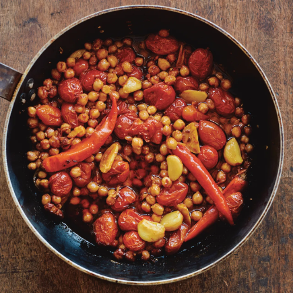

---
tags:
  - dish:main
  - protein:beans
  - difficulty:easy
---
# Confit tandoori chickpeas

- Serves: 8
{ #serves }
- Date added: 2023-08-26

## Description

Jarred or canned butter beans (lima beans) would be great here! No Kashmiri chile powder? Use an equal amount of paprika instead.

## Ingredients { #ingredients }

- 2 (15 oz/425 g) cans of chickpeas, drained (17 oz/480 g total)
- 11 garlic cloves, peeled, 10 left whole and 1 minced
- 1 oz (30 g) fresh ginger, peeled and julienned
- 14 oz (400 g) datterini or regular cherry tomatoes
- 3 small Fresno chiles, mild or spicy, with a slit cut down their length
- 1 Tbsp. tomato paste
- 2 tsp. cumin seeds, roughly crushed with a mortar and pestle
- 2 tsp. coriander seeds, roughly crushed with a mortar and pestle
- .5 tsp. ground turmeric
- .5 tsp. chile flakes
- 2 tsp. red Kashmiri chile powder
- 1 tsp. sugar
- .75 cup plus 2 Tbsp. (200 ml) olive oil
- .66 cup (180 g) Greek yogurt
- .75 cup (15 g) mint leaves
- 1.5 cups (30 g) cilantro, roughly chopped
- 2–3 limes (juiced to get 1 Tbsp. and the rest cut into wedges to serve)
- Salt

## Directions

1. Preheat the oven to 350° F.
2. Put the chickpeas, whole garlic cloves, ginger, tomatoes, chiles, tomato paste, spices, sugar, oil, and *1*{.ingredient-num} teaspoon of salt into a large, oven-safe sauté pan, for which you have a lid, and mix everything together to combine. 
3. Cover with the lid, transfer to the oven and cook for 75 minutes, stirring halfway through, until the aromatics have softened and the tomatoes have nicely broken down.
4. Meanwhile, put the yogurt, mint, cilantro, lime juice, minced garlic, and *.25*{.ingredient-num} teaspoon of salt into a food processor and blitz until smooth and the herbs are finely chopped.
5. Serve the chickpeas directly from the pan, with the yogurt and lime wedges alongside. Serve with rice.

## Source

Ottolenghi Test Kitchen: Shelf Love, via [Epicurious](https://www.epicurious.com/recipes/food/views/confit-tandoori-chickpeas)

## Comments
