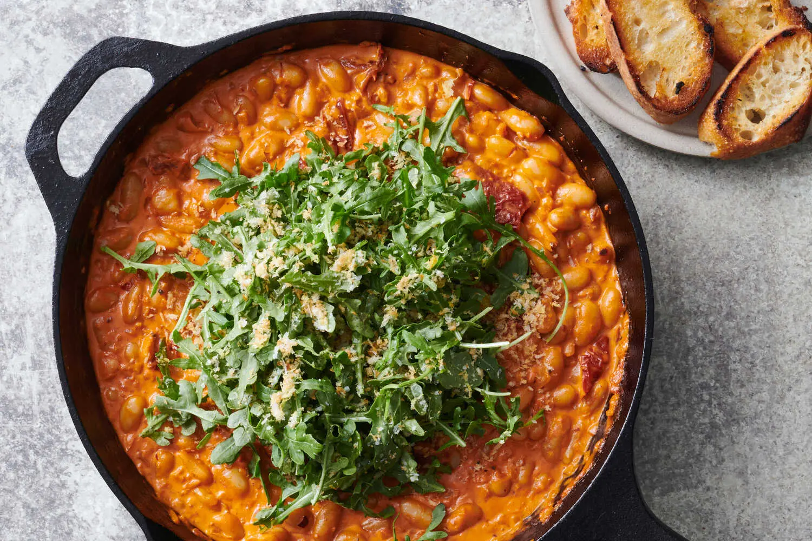

---
tags:
  - dish:main
  - protein:beans
  - difficulty:easy
---
<!-- Tags can have colon, but no space around it -->

# Creamy, Spicy Tomato Beans and Greens 

<!-- Serves has to be a single number, no dashes, but text is allowed after the
number (e.g., 24 cookies) -->
- Serves: 4
{ #serves }
<!-- Time is not parsed, so anything can be input here, and additional
values can be added (e.g., "active time", "cooking time", etc) -->
- Time: 40 min
- Date added: 2026-03-04

## Description

This weeknight wonder is for those who delight in turning a modest can of beans into a spectacular dinner. Inspired by the flavors of red pesto, this recipe calls for simmering cannellini beans with staple ingredients like onion, garlic, crushed red pepper, tomato paste and heavy cream, as well as sun-dried tomatoes and salty Pecorino, until the results taste complex and rich. Top the beans with a lemony arugula salad that is peppered with fried bread crumbs for a dish that is crunchy, chewy, crispy and creamy in every bite. 

## Ingredients { #ingredients }

<!-- Decimals are allowed, fractions are not. For ranges, use only a single dash
and no spaces between the numbers. -->
- 6 tablespoons olive oil
- .66 cup panko bread crumbs
- Salt and black pepper
- 1 medium yellow onion, minced
- 4 garlic cloves, minced
- .5 teaspoon crushed red pepper
- .33 cup tomato paste
- 2 (14-ounce) cans cannellini beans or other creamy white beans, rinsed
- 1 cup heavy cream
- .5 chopped jarred sun-dried tomatoes in oil
- .66 cup finely grated Pecorino or Parmesan 
- 4 (packed) cups/3 ounces baby arugula 
- 2 teaspoons finely grated lemon zest plus 4 teaspoons juice (from 1 lemon)
- Toasted bread (optional), for serving

## Directions

<!-- If you have a direction that refers to a number of some ingredient, wrap
the number in asterisks and add `{.ingredient-num}` afterwards. For example,
write `Add 2 Tbsp oil to pan` as `Add *2*{.ingredient-num} to pan`. This allows
us to properly change the number when changing the serves value. -->

1. In a medium skillet, heat 2 tablespoons olive oil over medium. Stir in the panko, season with salt and pepper, and cook, stirring frequently and shaking the pan, until toasted and golden, about 3 minutes. Transfer seasoned panko to a paper-towel lined plate, then wipe out the skillet.
2. Add another 2 tablespoons olive oil to the skillet and heat over medium. Add the onion, garlic and crushed red pepper, season with salt and pepper, and cook, stirring frequently, until softened, about 4 minutes.
3. Add the tomato paste and stir until darkened and mixture is combined, about 3 minutes.
4. Stir in beans, heavy cream, sun-dried tomatoes and ⅓ cup water, and simmer, stirring occasionally, until flavors meld, about 5 minutes. Stir in half the cheese, then season to taste with salt and pepper.
5. In a medium bowl, toss the arugula with the seasoned panko, lemon zest and juice, plus the remaining ⅓ cup cheese and 2 tablespoons olive oil; season with salt and pepper. Pile the greens at the center of the bean mixture. Serve with toasted bread, if desired.

## Notes

<!-- Delete section if no additional notes -->

- A lot of folks in the comment say they swapped out the cream for: 50/50 Greek yogurt and milk, half+half, milk

## Source

[NYTimes](https://cooking.nytimes.com/recipes/1025325-creamy-spicy-tomato-beans-and-greens)

## Comments
