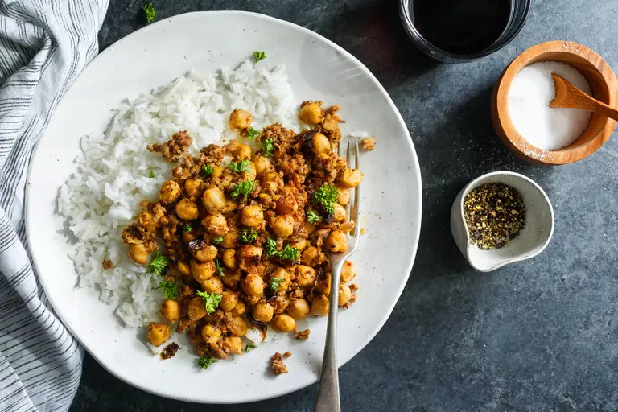

---
tags:
  - dish:main
  - protein:beef
  - protein:beans
  - ingredient:chickpeas
  - difficulty:easy
---
<!-- Tags can have colon, but no space around it -->

# Crispy Chickpeas With Beef

<!-- Serves has to be a single number, no dashes, but text is allowed after the
number (e.g., 24 cookies) -->
- Serves: 4
{ #serves }
<!-- Time is not parsed, so anything can be input here, and additional
values can be added (e.g., "active time", "cooking time", etc) -->
- Time: 30 min
- Date added: 2024-09-29

## Description
Related to a classic chili, this fast-cooking recipe combines legumes, meat and spices, with excellent results. This dish works equally well with canned or home-cooked chickpeas; if you like a bit more kick, double or triple the ancho chiles or chile powder. Turmeric or saffron also work well. Don't want to use ground beef? Ground turkey, chicken or pork would sub in well here; add a little oil to the pan first. For a bit more flavor, add a clove or two of chopped garlic to the browning meat. The point is: improvise.

## Ingredients { #ingredients }
- .5 to 1 pound ground beef or other meat
- 4 cups cooked chickpeas (about 1 28-ounce can), drained (reserve 1 cup liquid)
- 2 teaspoons ground cumin
- 1 ancho or chipotle chile, soaked, stemmed, seeded and minced; or 1 teaspoon good chile powder
- 2 teaspoons minced garlic
- Salt and pepper
- 1 tablespoon extra virgin olive oil
- Minced cilantro or parsley for garnish (optional)

<!-- Decimals are allowed, fractions are not. For ranges, use only a single dash
and no spaces between the numbers. -->

## Directions

<!-- If you have a direction that refers to a number of some ingredient, wrap
the number in asterisks and add `{.ingredient-num}` afterwards. For example,
write `Add 2 Tbsp oil to pan` as `Add *2*{.ingredient-num} to pan`. This allows
us to properly change the number when changing the serves value. -->
1. Turn heat to high under a large, deep skillet, and add meat a little at a time, breaking it into small pieces as you do. Stir and break up meat a bit more, then add chickpeas. Keep heat high, and continue to cook, stirring occasionally until chickpeas begin to brown and pop, 5 to 10 minutes. Don't worry if mixture sticks a bit, but if it begins to scorch, lower heat slightly.
2. Add cumin, chili or chili powder and garlic. Cook, stirring, for about a minute. Add reserved cooking liquid, and stir, scraping bottom of pan to loosen any browned bits. Season with salt and pepper, then turn heat to medium-low. Continue to cook until mixture is no longer soupy but not dry.
3. Stir in olive oil, then taste, and adjust seasoning if necessary. Garnish if you like, and serve immediately, with rice or pita bread.

## Source

[NYTimes](https://cooking.nytimes.com/recipes/8024-crispy-chickpeas-with-beef)

## Comments

- 2024-09-29: delicious! as suggested by the comments, fried onions with the beef and used garam masala / kashmiri chili instead of cumin / paprika. used chicken broth for the liquid 
