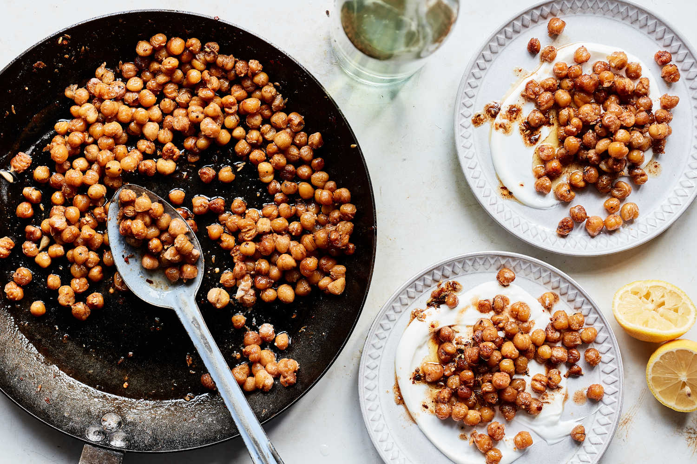

---
tags:
  - dish:sides
  - protein:chickpeas
  - difficulty:easy
---
<!-- Tags can have colon, but no space around it -->

# Crisped Chickpeas in Spicy Brown Butter

<!-- Serves has to be a single number, no dashes, but text is allowed after the
number (e.g., 24 cookies) -->
- Serves: 4
{ #serves }
<!-- Time is not parsed, so anything can be input here, and additional
values can be added (e.g., "active time", "cooking time", etc) -->
- Time: 15 min
- Date added: 2026-01-11

## Description
This recipe for crisped chickpeas dressed in spicy brown butter is your new, 15-minute way to turn a simple can of chickpeas into a satisfying dinner. Chickpeas are fried in a little olive oil, then butter is added, which turns browns and nutty. Crushed fennel seeds and red-pepper flakes season the brown butter, but feel free play around: Add a sprig of thyme or rosemary, a few tablespoons of olives or capers, some grated garlic and ginger, or a drizzle of tahini or honey. You can also toast some nuts or seeds, like cashews or sesame, in the browning butter. Just before serving, add a little lemon juice or vinegar to offset the richness. Serve over yogurt, orzo or rice, or top with a fried egg.

## Ingredients { #ingredients }

<!-- Decimals are allowed, fractions are not. For ranges, use only a single dash
and no spaces between the numbers. -->
- 3 tablespoons extra-virgin olive oil
- 2 (14-ounce) cans chickpeas
- Kosher salt and black pepper
- 8 tablespoons unsalted butter, cut into pieces
- 1 teaspoon crushed fennel seeds
- 1 teaspoon red-pepper flakes
- 2 tablespoons fresh lemon juice
- Greek yogurt, for serving

## Directions

<!-- If you have a direction that refers to a number of some ingredient, wrap
the number in asterisks and add `{.ingredient-num}` afterwards. For example,
write `Add 2 Tbsp oil to pan` as `Add *2*{.ingredient-num} to pan`. This allows
us to properly change the number when changing the serves value. -->
1. In a large (12-inch) skillet, heat the olive oil over medium. Drain and rinse the chickpeas, then dry them thoroughly using a kitchen towel. Add the chickpeas to the skillet and cook, stirring occasionally, until crisped, 15 to 18 minutes. Season with salt and pepper.
2. Increase the heat to medium-high. Add the butter, fennel seeds and red-pepper flakes, and cook until golden, nutty smelling and foaming, 1 or 2 minutes. Remove from heat, stir in the lemon juice, and season to taste with salt and pepper.
3. Spoon some yogurt onto serving plates or bowls, then spoon the chickpeas and spiced brown butter on top.

## Source

[NYTimes](https://cooking.nytimes.com/recipes/1020757-crisped-chickpeas-in-spicy-brown-butter)

## Comments

- 2026-01-11: served with labne, which was great.
