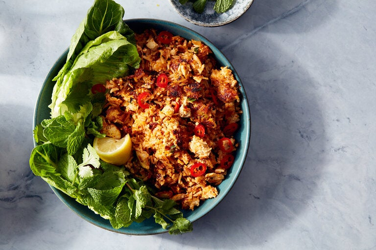

---
tags:
  - dish:sides
  - protein:tofu
  - ingredient:rice
  - difficulty:easy
---
<!-- Tags can have colon, but no space around it -->

# Crispy coconut rice with tofu

<!-- Serves has to be a single number, no dashes, but text is allowed after the
number (e.g., 24 cookies) -->
- Serves: 4
{ #serves }
<!-- Time is not parsed, so anything can be input here, and additional
values can be added (e.g., "active time", "cooking time", etc) -->
- Time: 30 min
- Date added: 2024-02-12

## Description

In many cultures, the crispy rice found at the bottom of the pot is the most prized mouthful, known as concón in the Dominican Republic, tahdig in Iran and nurungji in Korea (just to name a few). Inspired by the simple joys of scorched rice, this easy pantry-friendly recipe calls for seasoning a mixture of cooked rice, tofu and coconut with punchy store-bought Thai curry paste, then pan-frying it until a crispy layer forms. The coconut is a surprising addition, delivering a lingering aroma that surprises in each bite. Commercial curry pastes vary in saltiness and spice, so taste it and add accordingly, starting with three tablespoons and adding more if you need. The fresh elements are essential to this dish: lettuce, herbs and citrus bring a welcome contrast in texture and temperatures. Cold leftover rice works great in this dish. 

## Ingredients { #ingredients }

<!-- Decimals are allowed, fractions are not. For ranges, use only a single dash
and no spaces between the numbers. -->
- 4 heaped cups cold cooked white rice
- 3 to 4 tablespoons red or green Thai curry paste
- 2 tablespoons soy sauce or tamari
- 1 (14-ounce) package extra firm tofu, drained and crumbled
- .75 cup shredded unsweetened coconut
- 1 tablespoon toasted sesame oil
- 4 scallions, trimmed and thinly sliced
- 4 makrut lime leaves, finely sliced (optional)
- Kosher salt (such as Diamond Crystal)
- Neutral oil, such as vegetable or grapeseed
- 5 ounces lettuce leaves, such as Romaine or butterhead
- 1 lime or lemon, cut into 4 wedges
- 1 Handful of mint or cilantro leaves (or both)
- 1 long red chile, finely sliced

## Directions

<!-- If you have a direction that refers to a number of some ingredient, wrap
the number in asterisks and add `{.ingredient-num}` afterwards. For example,
write `Add 2 Tbsp oil to pan` as `Add *2*{.ingredient-num} to pan`. This allows
us to properly change the number when changing the serves value. -->

1. In a large bowl, mix together the rice, curry paste, soy sauce or tamari, tofu, coconut, sesame oil, scallions and makrut lime leaves (if using). Once it’s combined, taste and if it needs more seasoning, add more curry paste or a *1*{.ingredient-num} to *2*{.ingredient-num} pinches of salt, to your liking.
2. Heat a large (12-inch) well-seasoned cast iron or nonstick skillet on medium high for about 2 minutes. Add *2*{.ingredient-num} tablespoons of neutral oil and add half the rice mixture, pressing down firmly with a spatula, and leave to cook for 4 to 5 minutes, until a golden crispy crust has formed on the bottom. Drizzle the top of the rice with a little neutral oil. Now, using a spatula, break rice into large pieces and flip over, cooking the other side of the rice for 3 to 5 minutes until crispy. When ready, remove the first batch of crispy rice from the pan and repeat with the remaining rice.
3. To serve, add the rice to bowls and serve with lettuce, lime, herbs and red chile on the side.

## Source

[NYTimes](https://cooking.nytimes.com/recipes/1023924-crispy-coconut-rice-with-tofu)

## Comments

- 2024-02-10: I made this as a main, which was tasty, but Anna thought it would
  work better as a side, and I agree.
