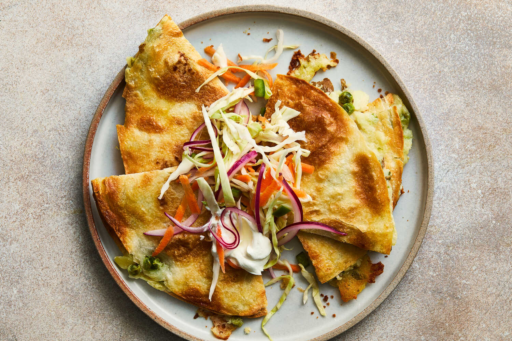

---
tags:
  - dish:main
  - protein:cheese
  - ingredient:potato
  - cuisine:mexican
  - difficulty:easy
---
<!-- Tags can have colon, but no space around it -->

# Crispy Potato Quesadillas

<!-- Serves has to be a single number, no dashes, but text is allowed after the
number (e.g., 24 cookies) -->
- Serves: 4
{ #serves }
<!-- Time is not parsed, so anything can be input here, and additional
values can be added (e.g., "active time", "cooking time", etc) -->
- Time: 35 min
- Date added: 2026-01-11

## Description
Despite what many people think, quesadillas don’t always have cheese. In Mexico City, you can order a “quesadilla sin queso” with a variety of fillings, highlighting the regional debate around what constitutes a true quesadilla. This version embraces both worlds: It contains cheese, but it’s melted into a hearty potato and pea filling that makes these quesadillas more satisfying as a complete meal. The quick slaw on top, inspired by curtido (a vinegary cabbage salad popular throughout Central America), balances the richness of the quesadillas and provides a nice spicy crunch. If you have any slaw left over, it keeps for up to four days in the refrigerator and is versatile enough to serve with plain rice or grilled meat or fish throughout the week.

## Ingredients { #ingredients }

<!-- Decimals are allowed, fractions are not. For ranges, use only a single dash
and no spaces between the numbers. -->
- Kosher salt
- 1 pound potatoes, unpeeled but scrubbed clean 
- 1 cup peas, frozen or fresh (6 ounces)
- 2 cups shredded semi-soft cheese, such as Monterey Jack or Cheddar
- 1.5 tablespoons avocado or vegetable oil
- 8 (seven- or eight-inch) flour tortillas
- .25 medium green cabbage, thinly sliced (about 4 cups)
- 2 carrots, grated 
- .5 red onion, thinly sliced
- 1 jalapeño or serrano, diced (seeded for less spice, if desired)
- 1 lime, juiced 
- 3 tablespoons white or apple cider vinegar
- 1.5 teaspoons sugar
- Sour cream or Mexican crema, optional, for serving 

## Directions

<!-- If you have a direction that refers to a number of some ingredient, wrap
the number in asterisks and add `{.ingredient-num}` afterwards. For example,
write `Add 2 Tbsp oil to pan` as `Add *2*{.ingredient-num} to pan`. This allows
us to properly change the number when changing the serves value. -->
1. Heat oven to 400 degrees.
2. Fill a medium pot with water; add 2 tablespoons salt and set it to boil on high. Cut potatoes into 1-inch chunks and place them in the pot as you go. Once the water is boiling, lower the heat slightly to maintain a rolling boil and cook potatoes for 5 to 7 minutes, until easily pierced with a fork. Add the peas and cook for 3 minutes more. Drain the vegetables, return them to the pot, add the cheese and mash until fully combined. Add more salt to your taste.
3. Add the oil to a baking sheet and spread it around evenly using one side of a flour tortilla, then repeat with another until you have 4 tortillas lightly oiled on one side, evenly arranged on the baking sheet (it’s OK if they overlap a bit).
4. Divide the mash among the tortillas. Top each with a second tortilla and press down until the filling almost spills out. Flip the quesadillas so the other side gets oiled.
5. Bake for 8 minutes, flip the quesadillas over, and bake for another 8 minutes until browned and crispy. They may puff up, which is great.
6. Meanwhile make the topping. Combine the cabbage, carrots, red onion, jalapeño, lime juice, vinegar, sugar and 1½ teaspoons salt. Toss the slaw with your hands and taste to adjust for vinegar, salt or sugar until the slaw is to your liking.
7. To serve, quarter the quesadillas with a sharp knife and top with slaw and a dollop of sour cream, if using.

## Source

[NYTimes](https://cooking.nytimes.com/recipes/1026918-crispy-potato-quesadillas)

## Comments

- 2026-01-11: unsurpriisngly, Nora loved this
