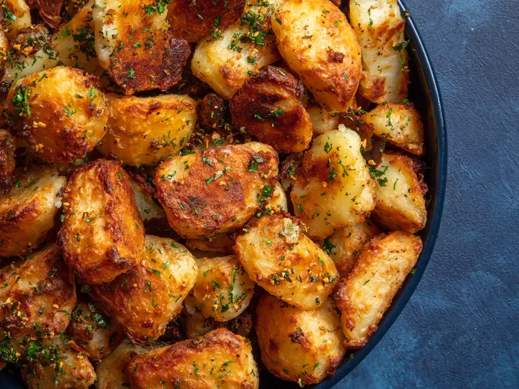

---
tags:
  - dish:sides
  - ingredient:potato
---
<!-- Tags can have colon, but no space around it -->

# Best Crispy Roast Potatoes

<!-- Serves has to be a single number, no dashes, but text is allowed after the
number (e.g., 24 cookies) -->
- Serves: 6
{ #serves }
<!-- Time is not parsed, so anything can be input here, and additional
values can be added (e.g., "active time", "cooking time", etc) -->
- Time: 100 min
- Date added: 2024-02-02

## Description

The Brits get a bad rap for their cuisine, and in some cases rightfully so—the beef cooked until gray and the gravy-made-from-granules that I ate every Sunday while staying in England were not the height of culinary greatness— but dang if there aren't a lot of things they do better than almost anyone else. I'm talking savory pies, fried fish, Yorkshire puddings, and roasted potatoes. The British method of roasting potatoes is one that I've taken a strong liking to. It's simple, and it produces amazing results. Boil chunks of potato until they're just tender, toss them none-too-gently with fat (ideally beef drippings) to rough up their surface, then roast them until they're crisp and crackling.

The boiling and roughing-up steps are the real keys. They create a thin slurry of mashed potato that clings to the surface of the potato chunks, which ends up crisping beautifully in the oven as the potatoes roast. It's the technique I use for the Ultra-Crispy Roast Potatoes recipe I published back in 2011, and the technique I use for pretty much every holiday. 

### Why It Works

- Large chunks of potato maximize the contrast between exterior and interior.
- Parboiling the potatoes in alkaline water breaks down their surfaces, creating tons of starchy slurry for added surface area and crunch.
- Offering you the choice of oil, duck fat, goose fat, or beef fat means you can get whichever flavor you want.
- Infusing the oil or fat with garlic and herbs gives the potato crust extra flavor.

## Ingredients { #ingredients }

<!-- Decimals are allowed, fractions are not. For ranges, use only a single dash
and no spaces between the numbers. -->

- Kosher salt
- 1/2 teaspoon (4g) baking soda
- 4 pounds (about 2 kg) russet or Yukon Gold potatoes, peeled and cut into quarters, sixths, or eighths, depending on size (see note)
- 5 tablespoons (75ml) extra-virgin olive oil, duck fat, goose fat, or beef fat
- Small handful picked fresh rosemary leaves, finely chopped
- 3 medium cloves garlic, minced
- Freshly ground black pepper
- Small handful fresh parsley leaves, minced

## Directions

<!-- If you have a direction that refers to a number of some ingredient, wrap
the number in asterisks and add `{.ingredient-num}` afterwards. For example,
write `Add 2 Tbsp oil to pan` as `Add *2*{.ingredient-num} to pan`. This allows
us to properly change the number when changing the serves value. -->

1. Adjust oven rack to center position and preheat oven to 450°F (230°C) (or 400°F (200°C) if using convection). Heat 2 quarts (2L) water in a large pot over high heat until boiling. Add 2 tablespoons kosher salt (about 1 ounce; 25g), baking soda, and potatoes and stir. Return to a boil, reduce to a simmer, and cook until a knife meets little resistance when inserted into a potato chunk, about 10 minutes after returning to a boil.
2. Meanwhile, combine olive oil, duck fat, or beef fat with rosemary, garlic, and a few grinds of black pepper in a small saucepan and heat over medium heat. Cook, stirring and shaking pan constantly, until garlic just begins to turn golden, about 3 minutes. Immediately strain oil through a fine-mesh strainer set in a large bowl. Set garlic/rosemary mixture aside and reserve separately.
3. When potatoes are cooked, drain carefully and let them rest in the pot for about 30 seconds to allow excess moisture to evaporate. Transfer to bowl with infused oil, season to taste with a little more salt and pepper, and toss to coat, shaking bowl roughly, until a thick layer of mashed potato–like paste has built up on the potato chunks.
4. Transfer potatoes to a large rimmed baking sheet and separate them, spreading them out evenly. Transfer to oven and roast, without moving, for 20 minutes. Using a thin, flexible metal spatula to release any stuck potatoes, shake pan and turn potatoes. Continue roasting until potatoes are deep brown and crisp all over, turning and shaking them a few times during cooking, 30 to 40 minutes longer.
5. Transfer potatoes to a large bowl and add garlic/rosemary mixture and minced parsley. Toss to coat and season with more salt and pepper to taste. Serve immediately. 

## Notes

<!-- Delete section if no additional notes -->

- Russet potatoes will produce crisper crusts and fluffier centers. Yukon Golds will be slightly less crisp and have creamier centers, with a darker color and deeper flavor. You can also use a mix of the two.
- The potatoes should be cut into very large chunks, at least 2 to 3 inches or so. For medium-sized Yukon Golds, this means cutting them in half crosswise, then splitting each half again to make quarters. For larger Yukon Golds or russets, you can cut the potatoes into chunky sixths or eighths.

## Source

[Serious Eats](https://www.seriouseats.com/the-best-roast-potatoes-ever-recipe)

## Comments
