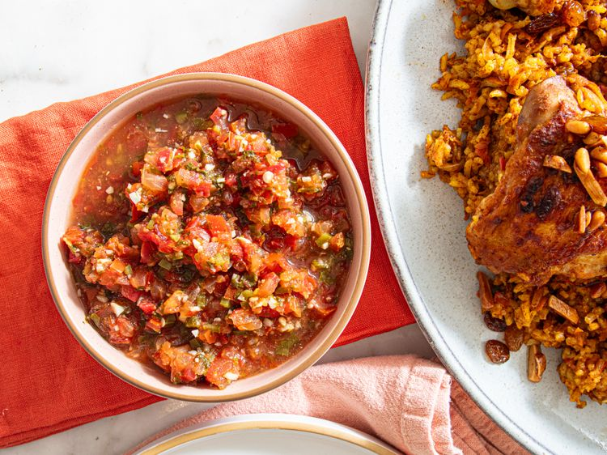

---
tags:
  - dish:pantry
  - cuisine:middle eastern
---
<!-- Tags can have colon, but no space around it -->

# Recipe title

<!-- Serves has to be a single number, no dashes, but text is allowed after the
number (e.g., 24 cookies) -->
- Serves: 1 cup
{ #serves }
<!-- Time is not parsed, so anything can be input here, and additional
values can be added (e.g., "active time", "cooking time", etc) -->
- Time: 30 min
- Date added: 2025-11-29

## Description
This quick, spicy tomato-chile condiment from the Arabian Peninsula transforms rice, meat, and seafood dishes with its bright, balanced flavor.

### Why It Works
- Simmering the mixture briefly lets the tomatoes, chiles, cilantro, garlic, and spices meld while keeping their flavors bright.
- Adding lemon juice and vinegar off heat preserves their brightness and acidity, giving the finished sauce a clean, sharp finish that balances the warmth of the spices.
## Ingredients { #ingredients }

<!-- Decimals are allowed, fractions are not. For ranges, use only a single dash
and no spaces between the numbers. -->

- 2 medium tomatoes (about 9 ounces; 255 g total), finely chopped
- 1 serrano pepper (about 15 g), stemmed and finely chopped (see notes)
- 2 tablespoons (about 9 g) finely chopped cilantro
- 2 clove garlic, minced
- 3/4 teaspoon Diamond Crystal kosher salt; for table salt, use half as much by volume or same weight
- 1/2 teaspoon ground cumin
- 1/4 teaspoon ground coriander
- 1/8 teaspoon freshly ground black pepper
- 2 tablespoons (30 ml) fresh lemon juice (from 1 lemon)
- 1/4 teaspoon (1 1/4 ml) white vinegar

## Directions

<!-- If you have a direction that refers to a number of some ingredient, wrap
the number in asterisks and add `{.ingredient-num}` afterwards. For example,
write `Add 2 Tbsp oil to pan` as `Add *2*{.ingredient-num} to pan`. This allows
us to properly change the number when changing the serves value. -->

1. In a small saucepan, combine tomatoes, serrano, cilantro, garlic, salt, cumin, coriander, and pepper. Bring to a simmer over medium-high heat. Reduce heat to medium-low and cook, uncovered, stirring occasionally, until flavors meld, about 5 minutes.
2. Off heat, stir in lemon juice and vinegar; set aside and allow to cool to room temperature, about 20 minutes. Serve immediately or refrigerate in an airtight container.

## Notes

<!-- Delete section if no additional notes -->
If a less spicy daqoos is desired, remove the seeds from the serrano before chopping. 

## Source

[Serious Eats](https://www.seriouseats.com/daqoos-recipe-11836421)

## Comments
