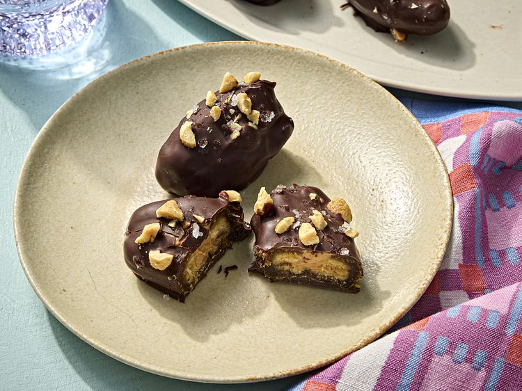

---
tags:
  - dish:dessert
  - ingredient:dates
  - difficulty:easy
---
<!-- Tags can have colon, but no space around it -->

# Date Dessert Bites

<!-- Serves has to be a single number, no dashes, but text is allowed after the
number (e.g., 24 cookies) -->
- Serves: 12 bites
{ #serves }
<!-- Time is not parsed, so anything can be input here, and additional
values can be added (e.g., "active time", "cooking time", etc) -->
- Time: 20 min
- Date added: 2026-07-07

## Description

Across the Arab world, decorated dates have long have long been prized both as confections and as gifts.. Stuffed with nuts, coated in chocolate, rolled in coconut or crushed pistachios, and arranged in golden, ornate boxes, they are a familiar sight at holidays, weddings, religious celebrations, and family gatherings. Recently, similarly adorned dates have surged in popularity in the United States, thanks to their rich flavor, natural sweetness, and nutrient-dense profile. 

Among the most popular variations are so-called "date Snickers": dates stuffed with peanut butter, coated in chocolate, and topped with peanuts and flaky salt. The combination works because Medjool dates already possess many of the qualities that make a Snickers so appealing. Their chewy texture and deep, toffee-like sweetness echo the candy bar's caramel layer, while peanuts and chocolate provide its familiar sweet-salty flavor profile. 

### Why it works

- Medjool dates' chewy texture and toffee-like sweetness mimic the caramel layer of a Snickers bar.
- A brief chill quickly sets the chocolate coating, creating a firm shell around the soft, peanut butter–filled dates.

## Ingredients { #ingredients }

<!-- Decimals are allowed, fractions are not. For ranges, use only a single dash
and no spaces between the numbers. -->
- 12 pitted Medjool dates (12 ounces; 340 g)
- .25 cup (60 ml) creamy natural peanut butter
- 57 g (2 ounces) bittersweet chocolate bar (70% cocoa), chopped (about 1/3 cup)
- 2 tablespoons (20 g) salted dry-roasted peanuts, finely chopped
- Flaky sea salt, such as Maldon

## Directions

<!-- If you have a direction that refers to a number of some ingredient, wrap
the number in asterisks and add `{.ingredient-num}` afterwards. For example,
write `Add 2 Tbsp oil to pan` as `Add *2*{.ingredient-num} to pan`. This allows
us to properly change the number when changing the serves value. -->

1. Line a small rimmed baking sheet with parchment paper; set aside.
2. Cut a slit down the length of each date. Spoon or pipe about 1 teaspoon (5 ml) peanut butter into the open cavity of each date and arrange on prepared baking sheet; set aside.
3. In a medium microwave-safe bowl, microwave chocolate on high in 30-second intervals, stirring occasionally, until melted, 1 to 2 minutes. Spoon 1 tablespoon melted chocolate over stuffed dates (dates don't need to be completely covered). Immediately sprinkle with chopped peanuts and flaky salt. Refrigerate, uncovered, until chocolate is set, about 10 minutes. Serve. 

## Notes
- Dates can be made up to 1 week in advance and refrigerated in an airtight container.
- For longer storage, freeze dates on a parchment-lined baking sheet until solid, then transfer to an airtight container or resealable freezer bag and freeze for up to 1 month. Thaw in the refrigerator before serving.
## Source

[Serious Eats](https://www.seriouseats.com/chocolate-peanut-butter-stuffed-dates-recipe-12000324)

## Comments
