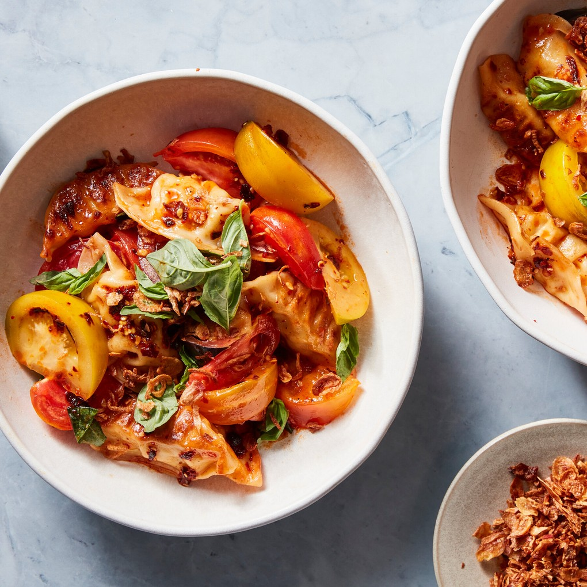

---
tags:
 - difficulty:easy
 - ingredient:tomato
 - context:summer vacation
 - dish:main
 - ingredient:dumplings
---

# Dumpling Tomato Salad With Chile Crisp Vinaigrette

- Serves: 4 servings
{ #serves }
- Working time: 20
- Waiting time: 0
- Date added: 2023-08-27

## Description

*Harness the crowd-pleasing power of dumplings in this hearty yet light main course salad. The base is simple and summery: Ripe tomatoes are lightly touched with salt, garlic and basil, providing a perfectly fragrant canvas for pan-fried potsticker dumplings. Salting intensifies the tanginess and fruitiness of tomatoes, while also coaxing out some of the juice, which becomes a light sauce for the dumplings.

## Ingredients { #ingredients }

- 2.5 pounds ripe tomatoes (any variety), cut into roughly 1-to 2-inch pieces (at room temperature)
- 1.0 garlic clove (grated)
- 0.5 cup basil leaves (torn)
- Kosher salt (such as Diamond Crystal brand) and black pepper 
- 1.0 pound frozen potsticker dumplings (not thawed)
- Neutral oil (such as canola or vegetable)
- 1-2 tablespoons store-bought crispy fried shallots (optional)
- 3.0 tablespoons chile crisp (or chile oil)
- 2.0 tablespoons rice vinegar 
- 1.0 tablespoon soy sauce (or more to taste)

## Directions

1. Place the tomatoes on a large serving plate or in a bowl. Add the garlic, half the basil leaves, *1*{.ingredient-num} teaspoon of salt and a big pinch of black pepper. Toss to combine and set aside.

2. To make the vinaigrette, combine the chile crisp, rice vinegar and soy sauce and whisk to combine. Taste and if it needs more saltiness, add *.5*{.ingredient-num} teaspoon more soy sauce.

3. Heat a large (12-inch) nonstick or well-seasoned cast-iron skillet over medium high for 1 to 2 minutes until very hot. Add *1-2*{.ingredient-num} tablespoons of oil and, working in batches, add the dumplings, flat-side down, and cook until the bottoms of the dumplings are lightly browned, 1 to 2 minutes. Immediately add about *.25*{.ingredient-num} cup of water to the pan, just enough to cover the base of the dumplings, then cover and cook until the water has evaporated, 3 to 4 minutes. (If your dumplings contain meat, cook for an extra 1 to 2 minutes, or according to packet instructions). Transfer the cooked dumplings to a plate and continue cooking the remaining dumplings. (If you prefer to steam the dumplings, see Tip.)

4. To serve, place the warm dumplings over the tomato salad and drizzle with the chile crisp vinaigrette. Toss very gently. Top with the crispy fried shallots (if using) and the remaining basil leaves. Serve either while the dumplings are still warm or at room temperature.

## Notes

- (Salting also works wonders for out-of-season tomatoes, meaning you could eat this salad all year round.) Use your favorite chile crisp as it is the dominant flavor in the dressing and will greatly impact the final dish; all brands of crisp will have different levels of saltiness and spice, so season accordingly.
- To steam, arrange the dumplings in a steaming basket lined with baking paper or cabbage leaves, place over a pan of boiling water and steam for 10 to 15 minutes.

## Source

[NYTimes](https://cooking.nytimes.com/recipes/1024075-dumpling-tomato-salad-with-chile-crisp-vinaigrette)

## Comments
