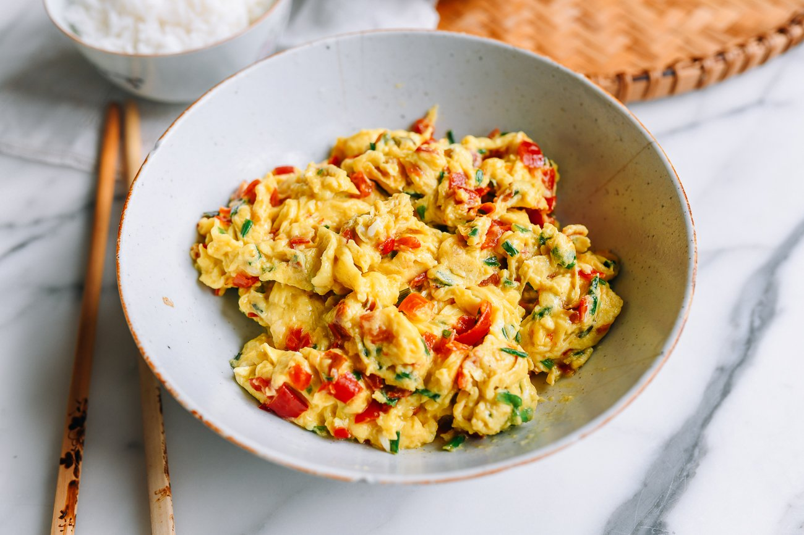

---
tags:
  - dish:main
  - protein:eggs
  - cuisine:chinese
  - difficulty:easy
---
<!-- Tags can have colon, but no space around it -->

# Fluffy Scrambled Eggs with Salted Chilies (Duo Jiao)

<!-- Serves has to be a single number, no dashes, but text is allowed after the
number (e.g., 24 cookies) -->
- Serves: 2
{ #serves }
<!-- Time is not parsed, so anything can be input here, and additional
values can be added (e.g., "active time", "cooking time", etc) -->
- Time: 10 min
- Date added: 2024-12-04

## Description

Make these fluffy Chinese scrambled eggs with salted chilies (Hunan-style duò jiāo – 剁椒) and garlic chives for breakfast, lunch, or dinner!

## Ingredients { #ingredients }

<!-- Decimals are allowed, fractions are not. For ranges, use only a single dash
and no spaces between the numbers. -->
- 6 large eggs
- .5 teaspoon sesame oil
- .125 teaspoon white pepper
- 1 teaspoon cornstarch (mixed into a slurry with 1 tablespoon water)
- 3 tablespoons neutral oil
- .33 cup Chinese garlic chives (chopped, about a handful; can also substitute 3 tablespoons finely chopped regular chives or scallion)
- .25 cup Hunan salted chilies (duò jiāo – 剁椒) (take care to not scoop out excess liquid) 

## Directions

<!-- If you have a direction that refers to a number of some ingredient, wrap
the number in asterisks and add `{.ingredient-num}` afterwards. For example,
write `Add 2 Tbsp oil to pan` as `Add *2*{.ingredient-num} to pan`. This allows
us to properly change the number when changing the serves value. -->
1. In a medium bowl, add the eggs, sesame oil, and white pepper. Beat with chopsticks, a fork, or small whisk for about 1 minute, or until you see some frothy bubbles on the surface of the egg. Mix the cornstarch into a slurry with 1 tablespoon of water, and beat into the eggs.
2. Heat a wok over high heat, or a nonstick skillet over medium-high heat. When it’s really hot, add the oil, followed by the garlic chives. Cook until they’re wilted but still bright green (you don’t want them to brown at all). Add the duo jiao salted chilies, taking care not to scoop the liquid with the peppers, which will make your eggs fry up less evenly. If you’re using regular chives, which are more delicate, reverse the order and add the duo jiao to the wok before the chives to avoid burning them.
3. When the wok is steaming again (i.e., really hot), pour in the eggs. They should immediately bubble at the edges. Stir with a wok spatula (or rubber spatula, if using a nonstick skillet) using wide scooping motions to fold the eggs towards the center, swirling any uncooked egg back onto the hot surface of the wok. There’s no need to be strictly uniform—just make sure you’re using big strokes to make fluffy large chunks and constantly moving the eggs to avoid overcooking them.
4. When the egg is just set (i.e., there may still be small pockets of runny bits), turn off the heat and plate immediately. The eggs will cook in their residual heat on the way to the dinner table.

## Source

[Woks of Life](https://thewoksoflife.com/fluffy-chinese-scrambled-eggs-salted-chilies-duo-jiao/)

## Comments
