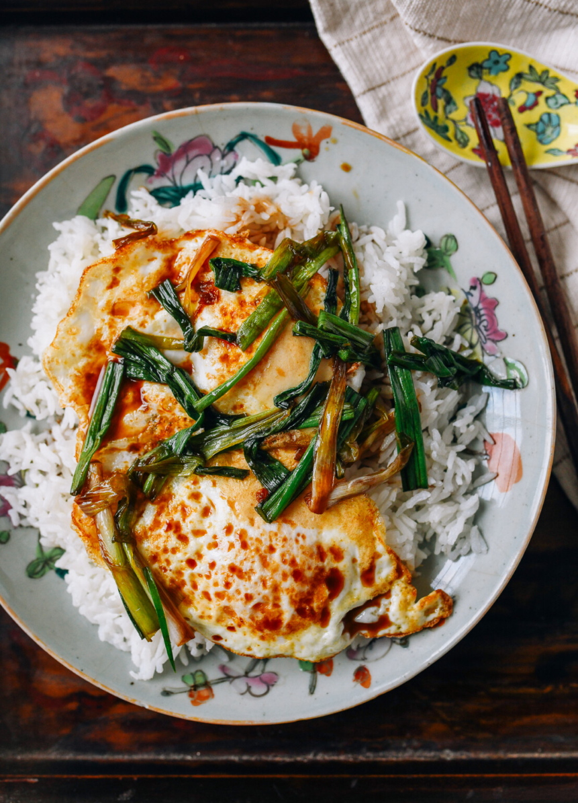

---
tags:
  - dish:main
  - protein:eggs
  - cuisine:chinese
  - difficulty:easy
---
# Eggs with soy sauce and scallions

- Serves: 1
{ #serves }
- Time: 5 minutes
- Date added: 2024-02-24

## Description
Eggs with Soy Sauce Sauce & Scallions is a 5-minute cheap, easy meal perfect for busy weeknights and days when the fridge is seemingly empty. It's also super delicious!

## Ingredients { #ingredients }

- 2 scallions
- 1 tablespoon oil
- 2 eggs
- 1 cup cooked white rice
- 1 tablespoon soy sauce (or to taste)
- 2 tablespoons water
- .25 teaspoon sugar
- 1 teaspoon shaoxing wine (optional)

## Directions

1. Prepare the scallions by cutting them into 2-inch lengths. Take the white part and halve or quarter them lengthwise.
2. Heat the oil in a nonstick or cast iron pan over medium high heat. Fry the eggs sunny-side up, over easy, or however you like them. Lay the eggs over a bed of hot cooked rice.
3. Add the scallions to the pan, and cook until just beginning to wilt. Add the soy sauce, water, sugar, and optional Shaoxing wine, if using. Simmer for 30 seconds, and pour over the eggs and rice. Serve!

## Source

[Woks of Life](https://thewoksoflife.com/eggs-easy-soy-sauce/)

## Comments

Total comments: 0

