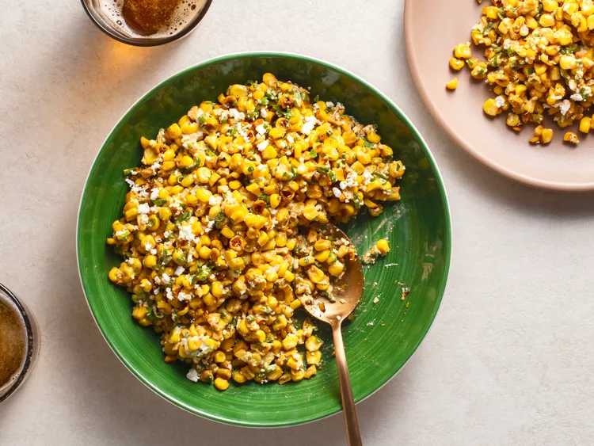

---
tags:
  - dish:sides
  - ingredient:corn
  - context:summer vacation
  - difficulty:easy
---
<!-- Tags can have colon, but no space around it -->

# Esquites

<!-- Serves has to be a single number, no dashes, but text is allowed after the
number (e.g., 24 cookies) -->
- Serves: 4
{ #serves }
<!-- Time is not parsed, so anything can be input here, and additional
values can be added (e.g., "active time", "cooking time", etc) -->
- Time: 20 min
- Date added: 2024-07-14

## Description

Personally, I tend to make esquites when I don't want to bother firing up the grill, because, truth be told, it's just as tasty and easy to make indoors as it is out. The key to cooking esquites indoors is to remove the corn kernels from the cob before you cook them. I cook the kernels in a ripping-hot wok (you can use a regular skillet, though it's a bit messier), letting them sit in place until the sugars caramelize and a deep, dark char develops, before tossing and letting them char again. 

### Why it works
- A combination of garlic, mayonnaise, cheese, lime, and chile in the sauce ensures the salad comes out incredibly flavorful.
- Cutting the kernels off the cob first, then cooking them over high heat, allows you to get a nice char on the corn without having to use the grill.

## Ingredients { #ingredients }

<!-- Decimals are allowed, fractions are not. For ranges, use only a single dash
and no spaces between the numbers. -->

- 2 tablespoons (30ml) vegetable oil
- 4 ears fresh corn, shucked, kernels removed (about 3 cups fresh corn kernels)
- Kosher salt
- 2 ounces (60g) feta or Cotija cheese, finely crumbled
- .5 cup finely sliced scallions, green parts only
- .5 cup (.5 ounce) fresh cilantro leaves, finely chopped
- 1 jalapeño pepper, seeded and stemmed, finely chopped
- 1 to 2 medium cloves garlic, pressed or minced on a Microplane grater (about 1 to 2 teaspoons)
- 2 tablespoons (30ml) mayonnaise
- 1 tablespoon (15ml) fresh lime juice from 1 lime
- Chile powder or hot chile flakes, to taste

## Directions

<!-- If you have a direction that refers to a number of some ingredient, wrap
the number in asterisks and add `{.ingredient-num}` afterwards. For example,
write `Add 2 Tbsp oil to pan` as `Add *2*{.ingredient-num} to pan`. This allows
us to properly change the number when changing the serves value. -->
1. Heat oil in a large nonstick skillet or wok over high heat until shimmering. Add corn kernels, season to taste with salt, toss once or twice, and cook without moving until charred on one side, about 2 minutes. Toss corn, stir, and repeat until charred on second side, about 2 minutes longer. Continue tossing and charring until corn is well charred all over, about 10 minutes total. Transfer to a large bowl. 
2. Add cheese, scallions, cilantro, jalapeño, garlic, mayonnaise, lime juice, and chile powder and toss to combine. Taste and adjust seasoning with salt and more chile powder to taste. Serve immediately. 

## Source

[Serious Eats](https://www.seriouseats.com/esquites-mexican-street-corn-salad-recipe)

## Comments
