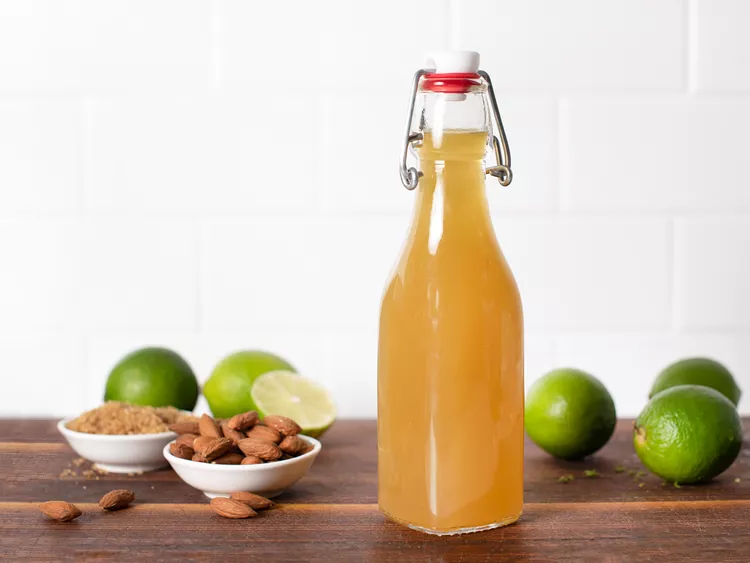

---
tags:
  - dish:drink
  - ingredient:almonds
---
<!-- Tags can have colon, but no space around it -->

# Falernum

<!-- Serves has to be a single number, no dashes, but text is allowed after the
number (e.g., 24 cookies) -->
- Serves: 2 cups
{ #serves }
<!-- Time is not parsed, so anything can be input here, and additional
values can be added (e.g., "active time", "cooking time", etc) -->
- Active time: 20 mins
- Total time: 3.5 days
- Date added: 2024-04-30

## Description
Blame the drinking, but cocktail history is often hazy. So it's no surprise that the origins of falernum—and even its exact ingredients—vary depending on whom you ask. Generally speaking, it's a sweetened lime and spice concoction that was (probably) created in Barbados somewhere between 1826 and 1930. You'll see both syrups and liqueurs referred to as falernum, but the key ingredients are always lime zest, cloves, and sugar—usually combined with ginger and almonds or almond extract.

Falernum is indispensable in Tiki drinks, brightening the sour notes of citrus and adding a hint of rich spice, but it also plays well with slightly bitter flavors. If you're at all interested in Tiki cocktails, this stuff is a must-have for your home bar.

## Ingredients { #ingredients }

<!-- Decimals are allowed, fractions are not. For ranges, use only a single dash
and no spaces between the numbers. -->

- .33 cup sliced, raw almonds
- 30 whole cloves
- .5 cup light rum
- 8 limes
- .66 cup water
- .5 cup sugar

## Directions

<!-- If you have a direction that refers to a number of some ingredient, wrap
the number in asterisks and add `{.ingredient-num}` afterwards. For example,
write `Add 2 Tbsp oil to pan` as `Add *2*{.ingredient-num} to pan`. This allows
us to properly change the number when changing the serves value. -->

1. Preheat oven to 400°F (200°C) and toast almonds on a rimmed baking sheet until slightly darkened and fragrant, about 5 minutes. Be careful not to let them burn. Let cool before using.
2. Place almonds and cloves in a sealable glass jar and pour in rum. Shake and let steep 2 days. (For a less intense clove flavor, steep 1 day.)
3. Zest limes, make sure no white pith is included. Set aside 4 of the limes for use in this recipe, and reserve the rest for another project. Add lime zest to jar. At this point, you can also add other spices, if desired. Shake and let steep for 1 day.
4. Strain mixture through cheesecloth, pressing to extract as much liquid as possible.
5. Juice *4*{.ingredient-num} limes, and strain juice into a sauce pot. Add water and sugar, then bring to a boil on medium heat. Cook until sugar is dissolved, about 5 minutes. Let syrup cool, then combine with the strained almond and clove infusion. Strain mixture through a coffee filter, if desired, then let it rest for an additional 12 hours before use. 

## Notes
<!-- Delete section if no additional notes -->
- I left the ginger out, because I think it takes over the flavor. However, many consider it a part of the traditional recipe. You can add a tablespoon of grated ginger with the lime zest, if desired.
- Falernum is best used within a month and does not need to be refrigerated.

## Source

[Serious Eats](https://www.seriouseats.com/homemade-falernum-for-tiki-drinks-almond-clove-lime-syrup-recipe)

## Comments
