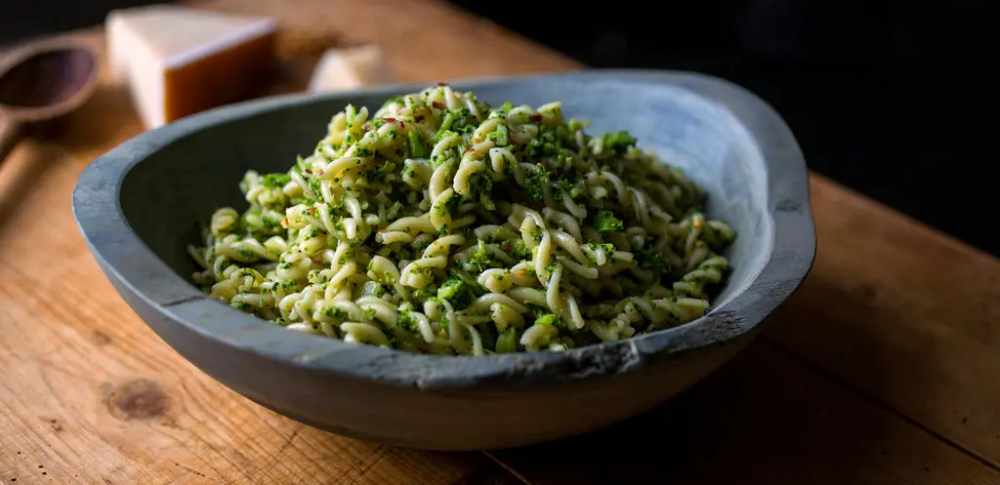

---
tags:
  - dish:main
  - ingredient:pasta
  - difficulty:easy
---
<!-- Tags can have colon, but no space around it -->

# Fusilli With Broccoli and Anchovies

<!-- Serves has to be a single number, no dashes, but text is allowed after the
number (e.g., 24 cookies) -->
- Serves: 4
{ #serves }
<!-- Time is not parsed, so anything can be input here, and additional
values can be added (e.g., "active time", "cooking time", etc) -->
- Time: 30 min
- Date added: 2025-01-15

## Description
This is Italian country cooking at its best, a simple dish that requires few ingredients and very little time. Use the same pot of water that you use to cook the broccoli for the pasta. Then finish the broccoli and anchovy mixture in a pan while the pasta is cooking, and toss the pasta with the sauce right in the pan.

## Ingredients { #ingredients }

<!-- Decimals are allowed, fractions are not. For ranges, use only a single dash
and no spaces between the numbers. -->
- 1 generous bunch broccoli (about 1.75 lb)
- Salt and black pepper
- 1 pound fusilli pasta
- 3 tablespoons extra-virgin olive oil
- 2 garlic cloves, minced
- 4 to 5 anchovy fillets (to taste), rinsed and chopped
- .5 tsp red pepper flakes (optional)
- Freshly grated Parmesan or pecorino, for serving

## Directions

<!-- If you have a direction that refers to a number of some ingredient, wrap
the number in asterisks and add `{.ingredient-num}` afterwards. For example,
write `Add 2 Tbsp oil to pan` as `Add *2*{.ingredient-num} to pan`. This allows
us to properly change the number when changing the serves value. -->
1. Bring a large pot of water to a rolling boil. Cut broccoli crowns from stems, leaving about 1 inch of stem at the base of each crown; set aside thick stems for another purpose.
2. Salt boiling water generously and add broccoli. Boil 5 to 6 minutes, until tender enough to break apart with a fork.
3. Using a skimmer, tongs or a slotted spoon, transfer broccoli crowns to a bowl of cold water (do not drain water from pot). Drain broccoli, then blot on paper towels. Chop fine.
4. Bring water in pot back to a boil and add fusilli.
5. While fusilli is cooking, heat 2 tablespoons olive oil over medium heat in a wide, heavy skillet and add garlic, anchovies and red pepper flakes, if using. Cook, stirring and mashing anchovies with the back of a wooden spoon, until fragrant, about 1 minute. Stir in chopped broccoli.
6. Add a ladle or two (about ½ cup) of the pasta water to the broccoli, season to taste with salt and pepper and stir over medium heat for 5 minutes. Broccoli should be very soft. Remove another ladle of pasta water and set aside.
7. Drain pasta and toss at once with broccoli and remaining olive oil. Add water you set aside if you think it needs more moisture. Serve at once, sprinkled with cheese.

## Source

[NYTimes](https://cooking.nytimes.com/recipes/1017909-fusilli-with-broccoli-and-anchovies)

## Comments
