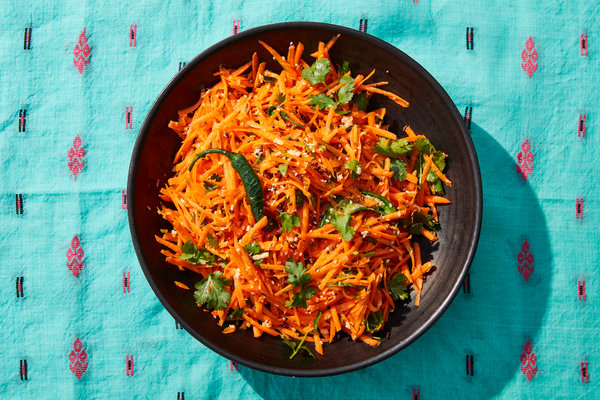

---
tags:
  - dish:sides
  - ingredient:carrots
  - cuisine:indian
  - difficulty:easy
---
# Gajjara Kosambari (Indian Carrot Salad)

<!-- Serves has to be a single number, no dashes, but text is allowed after the
number (e.g., 24 cookies) -->
- Serves: 2 cups
{ #serves }
<!-- Time is not parsed, so anything can be input here, and additional
values can be added (e.g., "active time", "cooking time", etc) -->
- Time: 5 minutes
- Date added: 2024-04-19

## Description

There are countless variations of this style of salad from Karnataka, but my favorite is a simple version made with crunchy raw carrots, dressed with a little tempered fat, coconut, citrus and chopped herbs. If fresh coconut isn’t available, keep a bag of frozen grated coconut in the freezer. It’s easy to find at most Indian grocery stores and, when you have it on hand, you can bring this salad together in less than five minutes.

## Ingredients { #ingredients }

- 1 tablespoon neutral oil, such as grapeseed or canola
- 1 green finger chile (or serrano chile), halved lengthwise
- .5 teaspoon cumin seeds
- .5 teaspoon white sesame seeds
- .25 teaspoon black mustard seeds
- .25 cup moong dal (split green gram), soaked for 1 hour, rinsed and drained (optional)
- 3 large carrots, peeled and roughly grated
- 2 tablespoons fresh or frozen grated coconut
- Handful of cilantro leaves and tender stems, chopped
- .5 teaspoon kosher salt
- .5 teaspoon granulated sugar
- .5 lemon, for squeezing

## Directions

1. In a small skillet, heat the oil over medium. Add the chile, cumin, sesame seeds, mustard seeds and moong dal, if using, and sauté for 1 minute.
2. Scrape out into a large bowl. Add the carrots, coconut, cilantro, salt and sugar. When ready to serve, squeeze lemon on top and mix to combine.

## Source

[NYTimes](https://cooking.nytimes.com/recipes/1020909-gajjara-kosambari-carrot-salad)

## Comments

- 2024-04-19: I make this generally with dried shredded (unsweetened) coconut, and it works well. I also typically make it without the dal.

