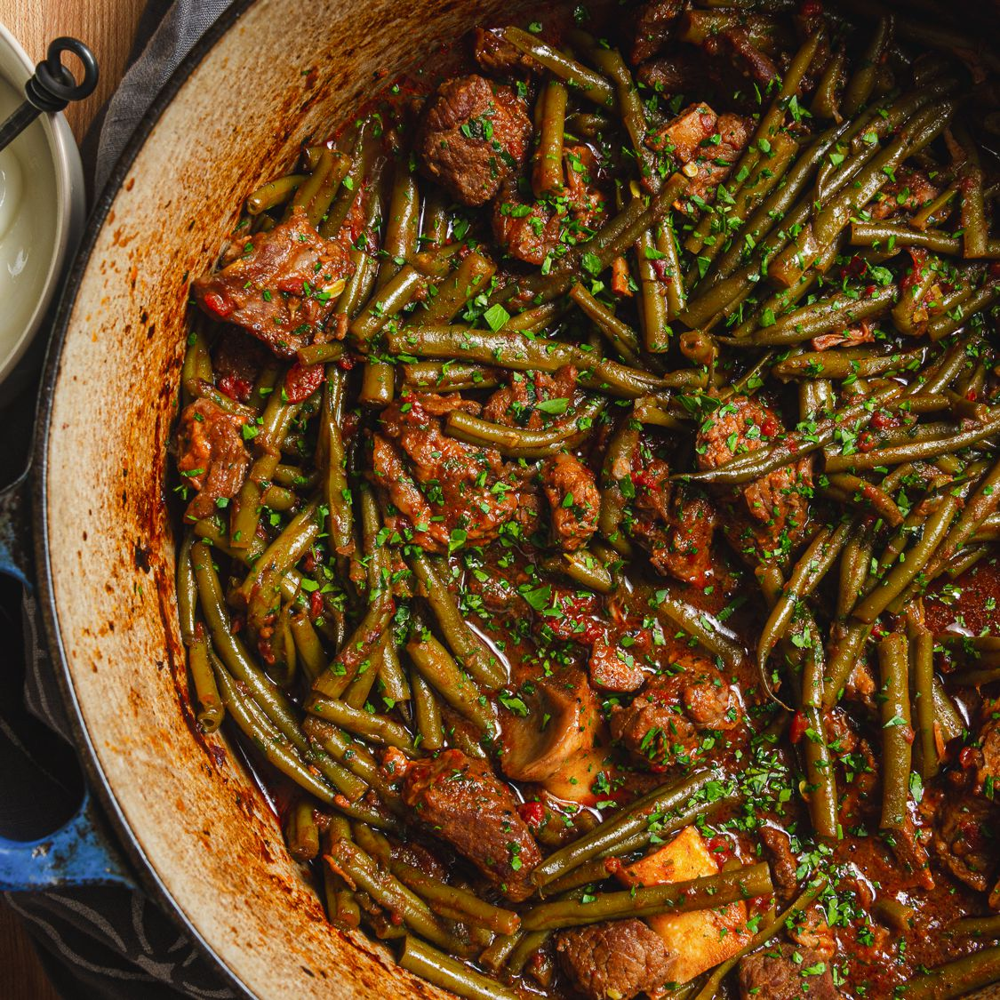

---
tags:
 - dish:mains
 - cuisine:middle eastern
 - context:holiday
 - protein:lamb
---

# Ganach Lupia (Armenian Braised Green Beans)

- Serves: 4
{ #serves }
- Salting time: 40 min
- Prep time: 35 min
- Cooking time: 60 min
- Date added: 2023-12-07

## Description

Meltingly tender green beans and lamb braised in a tomato-based sauce.

## Ingredients { #ingredients }

- 2.0 pounds bone-in lamb shoulder chops (1 to 1.5 in thick)
- 2.0 teaspoons Diamond crystal kosher salt (6g. if using table salt use half as much by volume or same weight)
- 0.5 teaspoon Black pepper 
- 1.0 can whole peeled plum tomatoes (14.5-ounce)
- 2.0 tablespoons (30ml) extra-virgin olive oil (divided)
- 1.0 small yellow onion (about 7 ounces; 200g) (finely chopped)
- 0.25 teaspoon baking soda 
- 4.0 garlic cloves (15g) (minced)
- 4.0 anchovy fillets (16g)
- 2.0 tablespoons (30g) mild or hot biber salçasi pepper paste (Biber salçasi can be found in Middle Eastern grocery stores or online. If unavailable, increase tomato paste to 3 tablespoons and add 1 teaspoon Aleppo pepper or .25 teaspoon cayenne and 1 teaspoon sweet paprika.)
- 1.0 tablespoon (16g) tomato paste 
- 1.0 teaspoon ground allspice 
- 1.5 cups (360ml) water 
- 2.0 pounds green beans (trimmed and halved lengthwise)
- 2.0 tablespoons chopped fresh parsley 
- 1.0 cup Greek yogurt (225g)
- Rice pilaf (for serving)

## Directions

### If Using a Dutch Oven:

1. Preheat oven with rack set in middle position to 325°F (160°C). While oven heats, using a sharp knife, remove bones from chops, leaving meat in large chunks and leaving behind any segments of meat clinging to bones. (Remove and discard any small shards of bone present.) Cut boneless pieces into 1-inch chunks and trim of excess fat. Place meat and bones in a bowl and toss with salt and pepper. Let stand at room temperature for at least 40 minutes and up to 2 hours. Meanwhile, place tomatoes and their juices in a second bowl, crush coarsely with a pastry cutter or chop with a pair of kitchen shears, and set aside.
2. Heat 1 tablespoon (15ml) oil in a Dutch oven over medium heat until shimmering. Add boneless lamb pieces and cook, turning occasionally, until lamb is well browned on 2 sides, about 10 minutes. Return lamb to bowl with bones and set aside.
3. Add onion and baking soda to Dutch oven and cook, stirring frequently, until softened but not browned, 5 to 7 minutes. Add garlic and anchovies and cook, stirring and breaking up anchovies occasionally with a wooden spoon or rubber spatula, until anchovies have dissolved, about 4 minutes. Add pepper paste, tomato paste, and allspice, stir to combine with allium-anchovy mixture, and continue to cook until mixture turns dark brick red, 2 to 4 minutes longer.
4. Add lamb, lamb bones, water, and tomatoes to Dutch oven and stir to combine. Cover, and transfer to oven. Bake for 45 minutes, stirring occasionally.
5. Stir in green beans, cover, and return to oven. Cook until meat is very tender, 1 .5 to 2 hours.
6. Stirring gently to avoid crushing beans, add 1 tablespoon parsley and season with additional salt to taste. Transfer to serving bowl, top with remaining parsley, and serve, with yogurt and rice pilaf on side.

### If using a stovetop or electric pressure cooker

1. Remove bones from chops, leaving meat in large chunks and leaving behind any segments of meat clinging to bones. (Remove and discard any small shards of bone present.) Cut boneless pieces into 1-inch chunks and trim of excess fat. Place meat and bones in a bowl and toss with salt and pepper. Let stand at room temperature for at least 40 minutes and up to 2 hours. Meanwhile, place tomatoes and their juices in a second bowl, crush coarsely with a pastry cutter or chop with a pair of kitchen shears, and set aside.
2. Heat 1 tablespoon (15ml) oil in a stovetop pressure cooker over medium heat until shimmering; alternatively, heat the oil in an electric pressure using its "sauté" setting. Add boneless lamb pieces and cook, turning occasionally, until lamb is well browned on 2 sides, about 10 minutes. If necessary, cook lamb pieces in batches to prevent overcrowding. Return lamb to bowl with bones and set aside.
3. Add onion and baking soda to pressure cooker and cook, stirring frequently, until softened but not browned, 5 to 7 minutes. Add garlic and anchovies and cook, stirring and breaking up anchovies occasionally with a wooden spoon or rubber spatula, until anchovies have dissolved, about 4 minutes. Add pepper paste, tomato paste, and allspice, stir to combine with allium-anchovy mixture, and continue to cook until mixture turns dark brick red, 2 to 4 minutes longer.
4. Add lamb, lamb bones, water, and tomatoes to Dutch oven and stir to combine. Place green beans on top, cover pressure cooker with lid, and bring to high pressure over medium-high heat, if using a stovetop model, or by setting to pressure-cooker mode on an electric pressure cooker, about 15 minutes, and cook for 12 minutes.
5. Remove pressure cooker from heat and allow to depressurize naturally; carefully remove lid, allowing steam to escape away from you.
6. Stirring gently to avoid crushing beans, add 1 tablespoon parsley and season with additional salt to taste. Transfer to serving bowl, top with remaining parsley, and serve, with yogurt and rice pilaf on side. 

## Source

[Serious Eats](https://www.seriouseats.com/fassoulia-armenian-braised-green-beans-5498678)

## Comments
