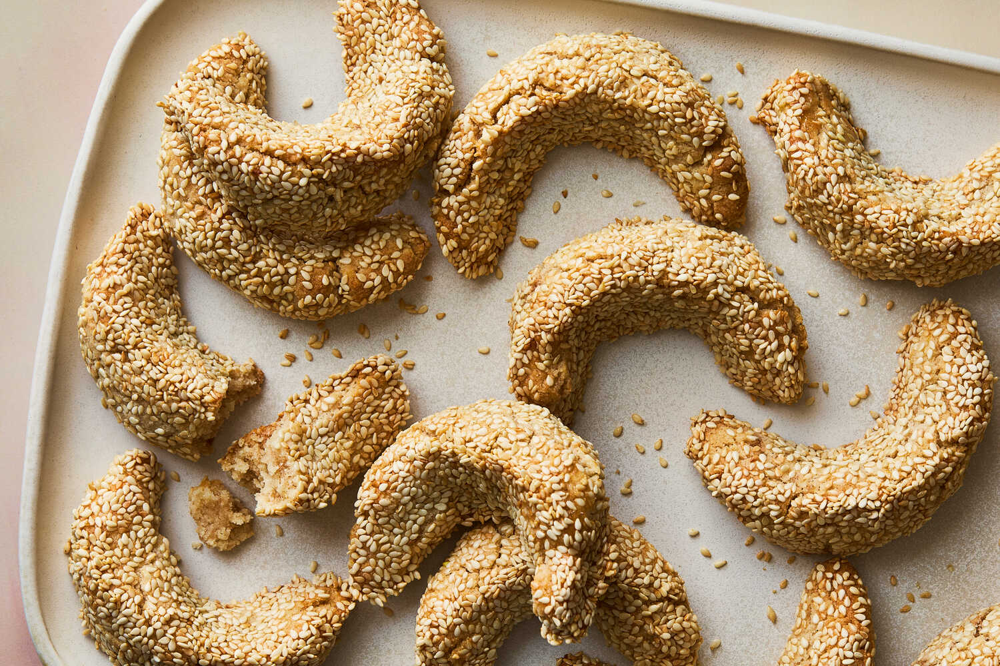

---
tags:
  - dish:dessert
  - ingredient:almond flour
---
<!-- Tags can have colon, but no space around it -->

# Kaab el Ghazal (Gazelle Horn Cookies)

<!-- Serves has to be a single number, no dashes, but text is allowed after the
number (e.g., 24 cookies) -->
- Serves: 18 cookies
{ #serves }
<!-- Time is not parsed, so anything can be input here, and additional
values can be added (e.g., "active time", "cooking time", etc) -->
- Time: 35 min
- Date added: 2026-03-22

## Description
Kaab el ghazal, also known as gazelle horns, are cookies beloved by many Moroccans and are typically shaped like a crescent, mimicking the curve of a gazelle's horn. They are made from a fragrant almond-based dough, flavored with orange blossom water and a hint of cinnamon. In this version, the dough is coated in sesame seeds before baking, giving these gluten-free cookies a distinctive nutty flavor and a subtle chewy texture that contrasts beautifully with the soft, aromatic filling inside. Often enjoyed with tea, these cookies are a staple during special occasions and celebrations such as Eid al Fitr, which marks the end of Ramadan. Traditionally, blanched almonds are ground at home in a food processor, but this recipe simplifies the process by calling for store-bought almond flour.

## Ingredients { #ingredients }

<!-- Decimals are allowed, fractions are not. For ranges, use only a single dash
and no spaces between the numbers. -->
- 1 cup/140 grams raw sesame seeds 
- 2 cups/250 grams almond flour (not super fine)
- 3 tablespoons/42 grams unsalted butter, softened
- .66 cup/133 grams sugar
- 2 tablespoons orange blossom water (see Tip) 
- .25 teaspoon ground cinnamon
- .25 teaspoon fine sea salt
- 1 large egg white

## Directions

<!-- If you have a direction that refers to a number of some ingredient, wrap
the number in asterisks and add `{.ingredient-num}` afterwards. For example,
write `Add 2 Tbsp oil to pan` as `Add *2*{.ingredient-num} to pan`. This allows
us to properly change the number when changing the serves value. -->
1. Heat oven to 375 degrees.
2. Spread the sesame seeds on a sheet pan and toast in oven until golden, about 10 minutes, stirring halfway through to make sure they toast evenly. Set aside to cool, keeping the oven at the same temperature. When cool, transfer the toasted seeds to a small, shallow, flat-bottomed bowl; set aside.
3. In a medium bowl, use your hands to mix the almond flour and butter together until thoroughly and evenly combined and the mixture is spreadable.
4. Add the sugar, orange blossom water, cinnamon and salt; mix to a moist, paste-like dough.
5. Divide the dough into 14 pieces, about 27 grams each, then shape each into a 3½-inch-long log.
6. Line a baking sheet with parchment paper. Place the egg white in a small, shallow, flat-bottomed bowl next to the bowl of toasted sesame seeds.
7. Lightly coat each dough log in egg white, then immediately coat in the roasted sesame seeds. Use your fingers to mold each sesame-coated log into a crescent shape, pinching gently to give the crescent a slightly tapered ridge, then place on the lined baking sheet. (The shape should mimic that of a crescent moon or gazelle horn, like an open C shape or boomerang. The shape should also have a tapered ridge, so that the ends are slightly narrower and shorter than the middle.)
8. Bake 10 to 12 minutes or until golden. Remove from the oven and cool on the baking sheet for 10 minutes, then transfer to a wire rack to cool completely. Store in an airtight container at room temperature for up to 7 days.

## Notes

If you don’t have orange blossom water on hand, you may swap in the zest of 1 orange or use another flavoring like 1 teaspoon vanilla extract or ¼ teaspoon ground cardamom.

## Source

[NYTimes](https://cooking.nytimes.com/recipes/1025920-kaab-el-ghazal-gazelle-horn-cookies)

## Comments

- 2026-03-22: made 18 instead of 14 (as original recipe called for) following suggestion in comment. also used a mix of superfine almond flour and whole almonds (with skin) ground in bullet for a bit. 
